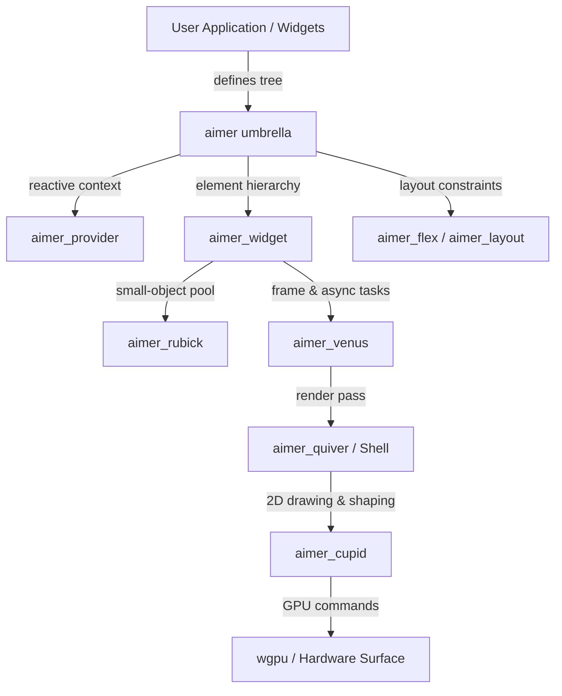

f# Aimer

<div align="center">

[](LICENSE-MIT)
[](https://www.rust-lang.org)
[](#platform-support)

**A high-performance, asynchronous, declarative GUI framework for Rust.**

[Getting Started](#getting-started) •
[Architecture](#architecture) •
[Features](#key-features) •
[Platform Support](#platform-support) •
[Showcase](#running-the-showcase) •
[Documentation](#documentation)

</div>

---

## Overview

**Aimer** is a cross-platform GUI framework inspired by the declarative, composable widget tree architecture, engineered from the ground up for Rust's zero-cost abstractions, strict ownership model, and concurrent execution guarantees.

Unlike web-wrapper frameworks or heavyweight browser runtimes, Aimer renders directly through its custom hardware-accelerated 2D vector and typography engine (**Cupid**) atop **wgpu**, driven by a frame-budget-aware async UI scheduler (**Venus**) and small-object optimized memory buffers (**Rubick**).

### Core Philosophy

- **Zero-Waste Ownership:** Widgets are consumed and moved directly into retained elements without unnecessary cloning or hidden reference cycles.
- **Microsecond Allocation Profile:** Dynamic widgets and elements utilize inline memory buffers and thread-local pooling (`Rubick`) to eliminate heap churn on frame rebuilds.
- **Frame-Budgeted Async Concurrency:** Long-running I/O and CPU tasks offload seamlessly to background threads, while frame-critical tasks, animations, and microtasks coordinate within strict 60/120 Hz render deadlines via `Venus`.
- **Self-Implemented Typography & 2D Vector Engine:** 100% self-contained text rendering and vector rasterization inside `Cupid` without any third-party dependencies—featuring an in-house TrueType/OpenType parser, complex script shaper (GSUB/GPOS), and subpixel curve rasterizer.

---

## Key Features

### Declarative Fluent Builders & Widget Model
Build expressive, composable user interfaces with chained, type-safe builder APIs designed for optimal IDE autocompletion and compiler type checking:
- **Stateless & Stateful:** Implement `StatelessWidget` for pure projections or `StatefulWidget` / `State` paired with a scoped `StateUpdater` for granular reactive updates.
- **Ergonomic Widget Derives:** Add `#[derive(StatelessWidget)]` or `#[derive(StatefulWidget)]` (or attribute syntax `#[widget(Stateless)]` / `#[widget(Stateful)]`) to automatically implement `Widget`, wire up element lifecycles, and handle key forwarding without manual boilerplate.

### Self-Implemented Text Rendering & Typography Engine
Aimer does **not** rely on third-party text shaping or rendering libraries such as HarfBuzz, FreeType, fontdue, or cosmic-text. Its typography engine inside `aimer_cupid` is engineered from scratch:
- **Zero Third-Party Text Dependencies:** Pure-Rust, self-contained implementation covering parsing, shaping, layout, and rasterization.
- **In-House Font Container Parser:** Full SFNT / TrueType / OpenType reader with table-level validation, bounded allocations, and fuzz-tested safety (`aimer_font`).
- **Complete OpenType Layout & Shaping:** Native implementation of GSUB, GPOS, and GDEF layout tables supporting complex scripts—including Latin ligatures and kerning, Arabic contextual joining and mark positioning, Indic syllable reordering and consonant conjuncts, CJK vertical layout, and Southeast Asian scripts.
- **Custom Subpixel Outline Rasterizer:** Scanline coverage rasterizer with curve flattening, supersampling sample grids, subpixel phase caching, and subpixel antialiasing.
- **Rich Font Formats:** Native support for TrueType quadratic B-splines, CFF/PostScript Type 2 cubic Bézier curves, color emoji (COLR/CPAL, CBDT/CBLC, Apple `sbix`), SVG-in-OpenType, and variable fonts (`fvar`/`gvar`).
- **Paragraph Layout & Text Pipeline:** Bidirectional text (Unicode Bidi), grapheme cluster segmentation, multiline wrapping, selection hit-testing, and dynamic GPU glyph atlas caching.

### Tailored Engine Subsystems

| Subsystem | Crate | Role & Capabilities |
| :--- | :--- | :--- |
| **Rendering & Typography** | `aimer_cupid` | Fully self-implemented 2D vector renderer and typography engine (pure-Rust font parser, complex script shaper, subpixel curve rasterizer, GPU glyph atlas; zero external text dependencies), gradients, shadow blurs, and glass backdrops atop `wgpu`. |
| **Async Scheduler** | `aimer_venus` | Frame-aligned async runtime managing microtasks, UI animation frame hooks, budgeted idle tasks (e.g. image decoding, background glyph rasterization), and threadpool task offloading (`spawn_blocking`). |
| **Memory & Pool** | `aimer_rubick` | Small-object optimization smart pointer (`Rubick<T, WORDS>`) providing inline storage (e.g. 8 words for `AnyWidget`) and thread-local element pooling to prevent heap allocations on hot rebuild paths. |
| **Window & Shell** | `aimer_quiver` | Cross-platform window lifecycle, multi-window surface management via `winit` and `wgpu`, dedicated raster thread synchronization, and native macOS custom titlebar integration. |
| **Security & IPC** | `aimer_anteros` | Capability boundary, host-guest IPC, sandboxed plugin execution, and WebAssembly hot-reload transport. |

### Ergonomic Macro Ecosystem
Aimer provides modern procedural and declarative macros focused on developer ergonomics and compile-time correctness:
- **`#[aimer::main]`:** Unified application entry point attribute for desktop, Android, and WebAssembly targets.
- **`#[derive(StatelessWidget)]` & `#[derive(StatefulWidget)]`:** Automatically implements the `Widget` trait, registers element lifecycle hooks, and manages element caching.
- **`#[derive(Router)]`:** Type-safe, declarative enum-based router with path route annotations (`#[route("/user/{id}")]`), route guards, and deep-link parsing.
- **`key!()`:** Generates compile-time unique callsite keys (`Key::Static`) for stable widget identity across rebuilds without runtime overhead.
- **`#[derive(Animatable)]` & `#[derive(Theme)]`:** Automated interpolation of custom data structures and ergonomic theme token derivation.

### Reactive State Management & Providers
- **Local Widget State:** Scoped `StateUpdater` queues state transitions and triggers single coalesced redraws.
- **Scoped Subtree Providers:** Share state with subtrees via `Provider`, `NotifierProvider`, or Redux-style `StoreProvider`.
- **Targeted Subscriptions:** Read snapshots with `read()`, watch entire state with `watch()`, or subscribe selectively with `select(|s| &s.value)` to only re-render when derived projections change.

### Type-Safe Declarative Router
Define URL-driven routes using enums and attributes:
```rust
#[derive(Clone, Debug, PartialEq, Router)]
enum AppRoute {
    #[route("/")]
    Home,
    #[route("/settings")]
    Settings,
    #[route("/user/{id}")]
    UserProfile { id: String },
}
```
Supports shell routes, nested route hierarchies, positional or named parameters, and declarative redirection.

### Comprehensive Widget Catalog
- **Layout & Positioning:** `Flex`, `Row`, `Column`, `Container`, `Grid`, `Stack`, `Positioned`, `SizedBox`, `ZeroSizedBox`, `Scrollable`, `Padding`, `Space`.
- **Text & Input:** Single-line `TextField`, multiline `TextArea`, `TextEditingController`, focus management (`FocusNode`, `FocusTrap`), IME composition, and clipboard integration.
- **Controls & Form Elements:** `Button`, `Checkbox`, `Radio`, `Switch`, `Slider`, `Picker`, `SegmentedControl`.
- **Overlays & Gestures:** `ModalHost`, `Dialog`, `ContextMenu`, `Tooltip`, `Dropdown`, `GestureDetector`, drag-and-drop (`Dnd`).
- **Rich Media & Content:** `MarkdownViewer` (with syntax highlighting), `SvgImage`, `Image`, custom `Canvas2D`.
- **Theming & Effects:** `ThemeData`, dark/light mode palette transitions, blurred backdrop glass materials (`BackdropFilter`), and spring animations.

---

## Platform Support

| Platform | Windowing / Host | Graphics Backend | Status |
| :--- | :--- | :--- | :---: |
| **macOS** | Native Cocoa / `winit` | Metal (`wgpu`) | ✅ Supported |
| **iOS** | UIKit / Native Bridge | Metal (`wgpu`) | ✅ Supported |
| **Android** | NDK / NativeActivity | Vulkan / OpenGL ES (`wgpu`) | ✅ Supported |
| **Web (WASM)** | `web-sys` / Canvas | Canvas 2D / WebGPU | ✅ Supported |
| **Windows** | Win32 / `winit` | Direct3D 12 / Vulkan (`wgpu`) | 🚧 In Progress |
| **Linux** | X11 / Wayland / `winit` | Vulkan (`wgpu`) | 🚧 In Progress |

---

## Getting Started

### Prerequisites

- **Rust:** Latest stable toolchain (Rust 2024 edition compatible, 1.98.1+ recommended).
  ```bash
  rustup update stable
  ```
- **macOS / iOS:** Xcode Command Line Tools.
- **Linux:** `libxkbcommon-dev`, `libwayland-dev`, and Vulkan drivers.
- **Web:** `wasm-pack` (`cargo install wasm-pack`).

### Installation

Add `aimer` to your `Cargo.toml`:

```toml
[dependencies]
aimer = { git = "https://github.com/Cottons29/aimer.git" }
```

Or configure optional features:

```toml
[dependencies]
aimer = { git = "https://github.com/Cottons29/aimer.git", features = ["markdown", "svg", "provider"] }
```

---

## Examples

### 1. Minimal Application

Mount a centered text container with the `AimerApp` runtime:

```rust
use aimer::{AimerApp, Colors, Container, Text, TextAlign, TextStyle};

#[aimer::main]
fn main() {
    AimerApp::start(
        Container::new()
            .child(
                Text::new("Hello, Aimer!")
                    .text_align(TextAlign::MidCenter)
                    .text_style(TextStyle::new().font_size(28.0).color(Colors::Black)),
            )
    );
}
```

### 2. Reactive Counter (`StatefulWidget`)

Manage encapsulated local state with `#[derive(StatefulWidget)]`, `State`, and `StateUpdater`:

```rust
use aimer::{
    AimerApp, BuildContext, Button, Container, Flex, FlexDirection,
    LayoutSpacing, Spacing, State, StateUpdater, StatefulWidget, Text, Widget,
};

#[derive(Default, StatefulWidget)]
pub struct CounterWidget {
    pub initial_count: i32,
}

pub struct CounterState {
    count: i32,
    updater: StateUpdater<Self>,
}

impl StatefulWidget for CounterWidget {
    type State = CounterState;

    fn create_state(self) -> Self::State {
        CounterState {
            count: self.initial_count,
            updater: StateUpdater::empty(),
        }
    }
}

impl State<CounterWidget> for CounterState {
    fn init_state(&mut self, updater: StateUpdater<Self>) {
        self.updater = updater;
    }

    fn build(&self, _ctx: &BuildContext) -> impl Widget {
        let updater = self.updater;

        Container::new()
            .padding(LayoutSpacing::all(Spacing::Px(24)))
            .child(
                Flex::new()
                    .direction(FlexDirection::Column)
                    .children([
                        Text::new(format!("Count: {}", self.count)).boxed(),
                        Button::new()
                            .child(Text::new("Increment"))
                            .on_press(move || {
                                updater.set_state(|state| {
                                    state.count += 1;
                                });
                            })
                            .boxed(),
                    ]),
            )
    }
}

#[aimer::main]
fn main() {
    AimerApp::start(CounterWidget::default());
}
```

### 3. Text Input & Controller

Single-line and multiline inputs share robust UTF-8 grapheme cursor manipulation, IME composition, and programmatic controllers:

```rust
use aimer::{AimerApp, FocusNode, InputType, TextEditingController, TextField};

#[aimer::main]
fn main() {
    let controller = TextEditingController::with_text("Aimer Framework");
    let focus_node = FocusNode::new();

    AimerApp::start(
        TextField::new()
            .controller(controller.clone())
            .focus_node(focus_node)
            .input_type(InputType::Text)
            .hint("Enter your message...")
            .max_length(Some(120))
            .on_changed(|text| println!("Current text: {text}"))
            .on_submitted(|text| println!("Submitted: {text}")),
    );
}
```

---

## Running the Showcase

Explore the interactive widget suite, components, and layout capabilities in the included desktop demo application (`jaime`):

```bash
# Clone the repository
git clone https://github.com/Cottons29/aimer.git
cd aimer

# Run the comprehensive desktop showcase
cargo run -p jaime
```

Run standalone example targets:

```bash
# Text field demo
cargo run --example text_field

# Multiline text area demo
cargo run --example text_area

# Web target (requires wasm-pack)
wasm-pack build --target web website
```

---

## Architecture



### Workspace Structure

```text
aimer/
├── src/                      # Top-level umbrella crate and unified re-exports
├── aimer_cupid/              # 2D vector renderer, GPU pipeline, self-implemented text shaper & glyph rasterizer
├── aimer_venus/              # UI-thread async runtime, frame scheduler, idle task budget
├── aimer_rubick/             # Small-object optimization smart pointer & thread-local pooling
├── aimer_quiver/             # Host application shell, winit event loop, frame stats
├── aimer_anteros/            # Capability model, sandbox IPC, WASM hot reload transport
├── crates/
│   ├── aimer_widget/         # Element tree, lifecycle, BuildContext, Widget trait
│   ├── aimer_flex/           # High-performance Flexbox layout engine
│   ├── aimer_provider/       # Scoped state dependency tracking and action dispatchers
│   ├── aimer_input/          # TextField, TextArea, focus trees, keyboard, IME handling
│   ├── aimer_router/         # Type-safe router macro and navigation stack
│   ├── aimer_animation/      # AnimationController, easing curves, transition primitives
│   ├── aimer_style/          # Color palettes, decoration, borders, typography styles
│   ├── aimer_modal/          # Modal host, dialogs, overlays, popup menus
│   ├── aimer_markdown/       # Declarative markdown parser and renderer
│   ├── aimer_svg/            # Vector SVG drawing integration
│   ├── aimer_dnd/            # Drag and drop subsystem
│   ├── aimer_a11y/           # Semantic accessibility tree integration
│   └── ...
├── jaime/                    # Complete desktop showcase application
├── aimer_book/               # Official mdBook documentation
└── examples/                 # Standalone sample applications
```

---

## Development & Verification

When contributing to Aimer, follow the project guidelines:

- **Correctness & Zero-Waste:** Prefer zero-copy ownership transfers over allocations on hot paths.
- **Debug Mode Optimization:** Write performant logic that runs smoothly in debug mode without relying solely on release compiler passes.
- **Test-Driven:** Implement changes using the red-green-refactor loop.
- **Formatting & Style:** Do not run broad reformatting tools (`cargo fmt`); preserve the surrounding formatting style. Keep source files below 2,000 lines.

### Running Tests

```bash
# Run a focused test
cargo test -p aimer_animation test_curve_linear

# Run crate-specific tests
cargo test -p aimer_animation
cargo test -p aimer_widget
cargo test -p aimer_flex

# Run the complete workspace test suite
cargo test --workspace
```

---

## Documentation

The project includes an mdBook guide in `aimer_book/`:

```bash
cd aimer_book
mdbook serve --open
```

---

## License

Distributed under the MIT License. See [LICENSE-MIT](LICENSE-MIT) for details.
