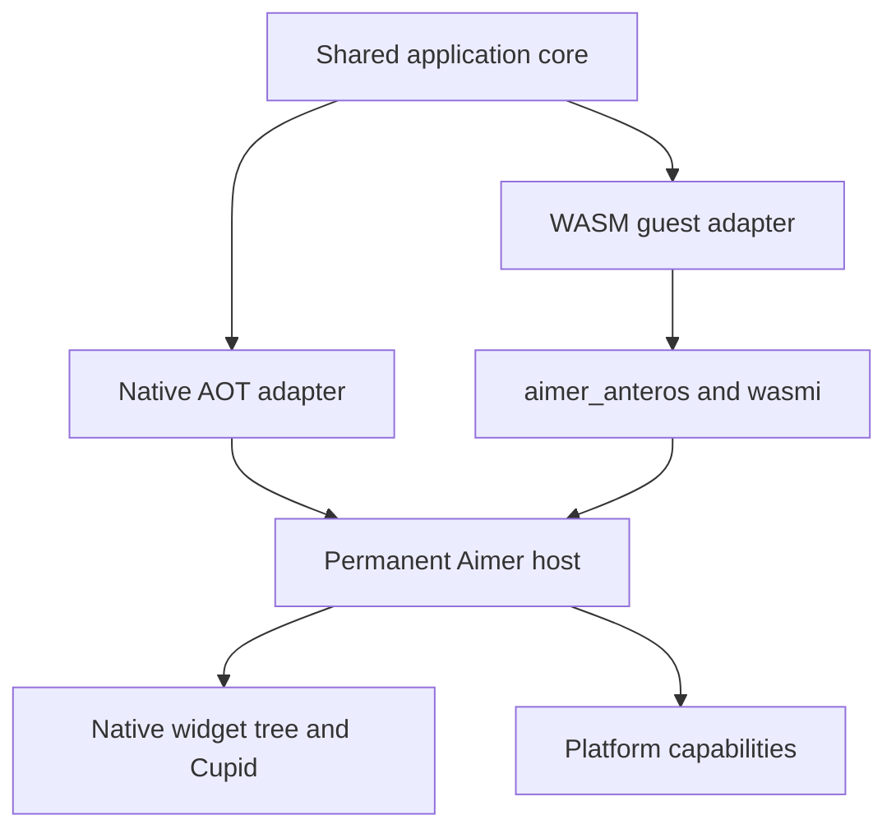
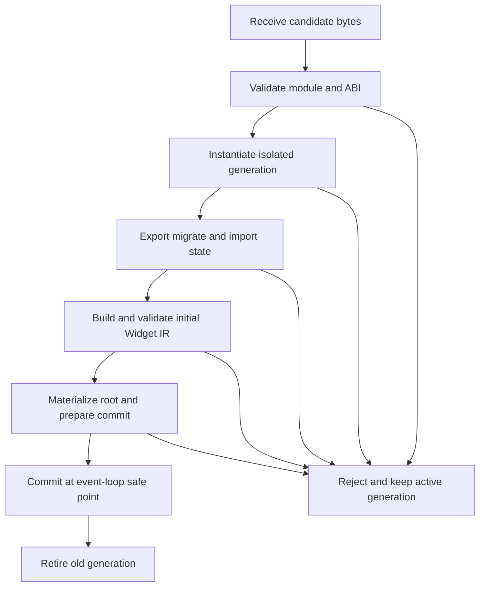

# Aimer WASM Hot Reload Requirements and Implementation Roadmap

## 1. Status and decision record

This document is the authoritative design and delivery contract for Flutter-style hot reload in Aimer. It describes a
development-only interpreted WebAssembly path while preserving native ahead-of-time compilation for non-hot-reload
builds.

The complete runtime feature is **not implemented yet**. The CLI policy foundation, feature-gated interpreter,
executable build/callback/state/manifest ABI proofs, generated capability contracts and host linking, initial structural
runtime limits, authenticated/encrypted module-transfer proof, owned Android route, and physical-iOS Bonjour proof are
implemented. The remaining host/guest operations, production build pipeline, complete resource lifecycle, reload
transaction, benchmark-backed production defaults, and later implementation phases remain subject to their stated tests
and exit gates.

### Accepted decisions

| Decision                 | Requirement                                                                                                                                                                         | Rationale                                                                                                                                              |
|--------------------------|-------------------------------------------------------------------------------------------------------------------------------------------------------------------------------------|--------------------------------------------------------------------------------------------------------------------------------------------------------|
| Development runtime      | Hot reload MUST use the `wasmi` interpreter.                                                                                                                                        | Interpreted WebAssembly is portable data and does not require loading unsigned native code or creating JIT executable pages on iOS.                    |
| Production runtime       | Release builds MUST use native Rust AOT.                                                                                                                                            | Native AOT preserves performance and keeps the interpreter and development listener out of production artifacts.                                       |
| Application boundary     | One platform-neutral application core MUST compile through separate native-AOT and WASM adapters.                                                                                   | The two runtimes must execute the same application behavior rather than maintain separate applications.                                                |
| First usable milestone   | The first milestone MUST include declarative UI, callbacks, complete versioned guest state, asynchronous/resource cleanup, transactional replacement, and rollback.                 | An UI-only prototype would not provide dependable application hot reload.                                                                              |
| Platform scope           | The milestone MUST cover iOS device and Simulator, Android, macOS, Windows, and Linux.                                                                                              | Hot reload is an Aimer development feature, not an iOS-only subsystem.                                                                                 |
| Module transport         | The debug app MUST listen on a dedicated authenticated binary reload channel, and the CLI MUST discover and connect to it.                                                          | Module transfer and replacement status require independent framing, security, and evolution from inspector diagnostics.                                |
| Runtime implementation   | Aimer MUST integrate an ecosystem interpreter and MUST NOT implement WebAssembly parsing or execution.                                                                              | WebAssembly validation and execution are security-critical, specification-heavy responsibilities.                                                      |
| Third-party capabilities | External Aimer SDKs MUST expose one portable API with generated WASM proxy and native host dispatch, identified by a stable package namespace, ABI major, and contract fingerprint. | SDK authors should implement native behavior once without maintaining a second guest implementation or relying on unstable compiler/source identities. |
| Unstable CLI gate        | Hot reload MUST be requested with `aimer +nightly run -Z wasm-hot-reload`.                                                                                                           | Experimental runtime work must remain explicit and cannot alter ordinary native `aimer run` behavior.                                                   |

### Policy invariants

- A release artifact MUST NOT contain `wasmi`, the reload listener, module-transfer code, or a remotely replaceable
  application module.
- Hot reload MUST replace only the application program. Cupid, `wgpu`, `winit`, platform shells, native plugins, host
  capabilities, and `wasmi` remain resident and require a restart when changed.
- The permanent native host MUST own the process lifecycle, event loop, rendering, input, retained native elements, and
  platform resources.
- A failed compile, transfer, validation, migration, initialization, or first build MUST leave the active generation and
  visible UI unchanged.
- The all-native milestone MUST NOT be declared complete until physical-device transport is proven on both iOS and
  Android.

## 2. Goals, workflow, and terminology

### Goals

The implementation MUST:

1. Let a developer edit application code and observe the result without restarting the native host.
2. Preserve compatible guest application state and keyed native element state across replacement.
3. Rebind callbacks to the replacement module without retaining native function pointers or closures from the retired
   module.
4. Cancel or retire all old-generation work deterministically, including tasks, timers, subscriptions, requests, and
   capability handles.
5. Validate and stage a candidate generation before changing the active UI, with rollback for every pre-commit failure.
6. Expose native features through narrow, versioned host capabilities rather than platform APIs or WASI.
7. Give native AOT and WASM builds equivalent application semantics through a shared application core and conformance
   tests.
8. Enforce predictable limits for module size, linear memory, tables, call depth, fuel, buffers, and host resources.
9. Produce actionable CLI status for compilation, connection, transfer, validation, migration, commit, rejection, and
   reconnect events.
10. Keep release AOT behavior and binary contents independent from the development runtime.
11. Let third-party crates wrap native SDKs behind generated, versioned capabilities without requiring those SDKs to
    compile for WebAssembly.

### Developer workflow

The intended workflow is:

1. The developer runs `aimer +nightly run -Z wasm-hot-reload`, which resolves to the allowed
   debug/`wasmi`/hot-reload configuration.
2. The CLI creates an authenticated development session, compiles the application core through the WASM guest adapter,
   assembles and launches the permanent native host, and discovers its reload listener.
3. The CLI watches relevant application sources and coalesces changes into one build at a time.
4. On a successful build, the CLI transfers the candidate module over the dedicated reload channel.
5. The running host validates and stages the candidate while the old generation remains installed. Before taking the
   final state snapshot, the host establishes a bounded event barrier so state cannot change underneath migration.
6. At an event-loop safe point, the host atomically commits the replacement, carries compatible native retained state,
   rebinds callbacks, and requests a frame.
7. The host retires the old generation and reports the final result. On any pre-commit failure, it discards the
   candidate and reports the rejection while the old generation remains active.

Native AOT debug and release workflows continue to build and launch an ordinary statically linked Rust application. They
do not start a watcher or reload listener.

### Terminology

| Term                      | Meaning                                                                                                                                                                                     |
|---------------------------|---------------------------------------------------------------------------------------------------------------------------------------------------------------------------------------------|
| **Host**                  | The permanent native Aimer process containing the platform shell, `winit`, Cupid, Venus, native widget materialization, capabilities, and the WASM runtime integration.                     |
| **Application core**      | Platform-neutral application logic that emits declarative widget data and handles typed events. It is shared by native-AOT and WASM builds.                                                 |
| **Native adapter**        | The compile-time adapter that runs the application core as native Rust AOT and connects it to the host without a WebAssembly boundary.                                                      |
| **Guest adapter**         | The compile-time adapter that exports the application core through Aimer's stable WASM ABI.                                                                                                 |
| **Guest**                 | A validated application `.wasm` module instantiated by `wasmi`; it never owns the native process or event loop.                                                                             |
| **Generation**            | One instantiated guest plus every callback and host resource created on its behalf. Generation IDs MUST be monotonically distinct within a session.                                         |
| **Active generation**     | The only generation allowed to receive new application events and publish visible UI.                                                                                                       |
| **Candidate generation**  | A replacement generation being validated, initialized, migrated, and built before commit.                                                                                                   |
| **Retired generation**    | A previous generation that can no longer receive events and whose resources are being cancelled and disposed.                                                                               |
| **Widget IR**             | Versioned declarative data describing widget types, properties, keys, callback IDs, and child relationships. It contains no Rust pointers, references, closures, vtables, or trait objects. |
| **Guest state**           | A versioned, bounded, serialized state bundle owned by application logic and exported/imported through the ABI.                                                                             |
| **Native retained state** | Host-owned element state preserved by Aimer reconciliation for compatible keyed native elements. It is distinct from guest state.                                                           |
| **Capability**            | A narrow host import for an approved native service, such as haptics, timers, networking, or assets.                                                                                        |
| **Capability contract**   | A portable trait declaration plus its stable identity, ABI major, canonical wire schemas, and contract fingerprint.                                                                         |
| **Capability provider**   | Permanent native code that implements a capability contract, possibly by wrapping a third-party native SDK.                                                                                 |
| **Safe point**            | A host event-loop boundary at which no tree traversal or event dispatch observes a partially replaced root.                                                                                 |
| **Commit**                | The atomic safe-point operation that makes the candidate generation and its materialized root active.                                                                                       |
| **Rollback**              | Discarding a failed candidate and its staged effects while retaining the unchanged active generation.                                                                                       |
| **Hot reload**            | In-process replacement of the interpreted application generation while preserving compatible state. It is not native dylib replacement or process restart.                                  |

## 3. Allowed configuration matrix

The CLI MUST treat build profile, application runtime, and reload policy as one validated configuration. It MUST accept
exactly the following combinations and reject all others before starting compilation or launching a target.

The only user-facing hot-reload selector is the exact unstable invocation
`aimer +nightly run -Z wasm-hot-reload`. Ordinary `aimer run` resolves to debug/native-AOT/reload-off, and
`aimer run --release` resolves to release/native-AOT/reload-off. The `+nightly` token is an Aimer CLI stability gate;
the later guest-build pipeline remains responsible for invoking and validating the pinned nightly Rust toolchain.

| Build profile    | Application runtime | Hot reload | Allowed | Required behavior                                                                                            |
|------------------|---------------------|-----------:|--------:|--------------------------------------------------------------------------------------------------------------|
| Debug            | `wasmi`             |         On |     Yes | Build a WASM guest, include the development runtime and listener, and start the watch/connect/push workflow. |
| Debug            | Native AOT          |        Off |     Yes | Build and launch native Rust application code without `wasmi` or a reload listener.                          |
| Release          | Native AOT          |        Off |     Yes | Build native Rust application code; exclude all interpreter and reload dependencies and features.            |
| Debug            | `wasmi`             |        Off |      No | Reject; Aimer does not provide a separate bundled-interpreter mode.                                          |
| Release          | `wasmi`             |  Off or on |      No | Reject; release-mode interpretation is outside the product policy.                                           |
| Debug or release | Native AOT          |         On |      No | Reject; native application code cannot be safely replaced in process on all target platforms.                |

Validation MUST be explicit and non-coercive:

- The CLI MUST NOT silently enable hot reload when `wasmi` is selected.
- The CLI MUST NOT silently switch `wasmi` to native AOT for release.
- The CLI MUST NOT interpret an unspecified runtime differently based on target platform.
- `-Z wasm-hot-reload` without the preceding `+nightly` selector MUST be rejected with the complete valid invocation.
- `+nightly` without `run -Z wasm-hot-reload`, an unsupported `+<toolchain>` selector, an unknown `-Z` value, or a
  selector placed after `run` MUST be rejected before command execution.
- Combining `--release` with `-Z wasm-hot-reload` MUST report the requested
  release/`wasmi`/hot-reload policy and the three allowed alternatives; it MUST NOT fall through to native AOT.
- Defaults MAY depend on an explicitly selected developer command, but the resolved values MUST satisfy the matrix and
  SHOULD be printed in verbose build diagnostics.
- Invalid configurations MUST produce a stable error that names the requested profile, runtime, reload value, and
  allowed alternatives.

Cargo features and crate dependencies MUST enforce the same matrix at compile time. CLI validation alone is insufficient
because release artifacts must be inspectable as proof that development-only code is absent.

## 4. Current Aimer architecture and gaps

This section records the verified baseline that the later design builds upon. File names describe current integration
points; they do not imply that runtime code already exists.

### `aimer_anteros`

- `aimer_anteros/Cargo.toml` exposes an empty default feature set and an explicit `wasm-hot-reload` feature that alone
  enables the optional `wasmi` dependency.
- `aimer_anteros/src/runtime.rs` contains the feature-gated `Runtime` seam for isolated proof calls plus
  `GuestInstance`, which owns one persistent `wasmi::Store` and memory across callback/state ABI calls. These paths use
  explicit per-export fuel, fail-closed module/memory/table/call-depth ceilings, store limiters, checked guest-memory
  access, exact deallocation, copied output, canonical model validation, and stable Aimer-owned error classification.
  Callback dispatch executes once with a preallocated bounded response region and returns either empty success or a
  validated host-owned Widget IR image.
- The same crate now owns the portable envelope, identity, Widget IR, callback-event, state-bundle, and native/WASM
  adapter contracts formerly prototyped separately. These contracts remain available without enabling the interpreter.
- Widget IR decoding now rejects cycles, multiple ownership, duplicate children, disconnected roots, excessive depth,
  invalid indices, duplicate stable keys, and incompatible host schemas before materialization. The public generic
  materializer validates the complete image first, then builds a disconnected host-owned tree in iterative post-order;
  factory failure drops the complete candidate without publishing nodes to the live host.
- The original proof has since become the production interpreted runtime, guest ABI, and host candidate-preparation
  foundation. The remaining open work is application-specific guest package generation, live window-loop submission,
  benchmark-backed default-limit policy, and the complete product pipeline rather than the already implemented
  generation/reload transaction model.
- This crate owns portable application contracts and execution integration, not network transport, rendering, platform
  lifecycle, or CLI process management.

### Permanent host lifecycle in `aimer_quiver`

- `aimer_quiver/src/aimer_app.rs` owns the long-lived `winit` event loop, Cupid setup, Venus installation, platform
  hooks, redraw requests, and initial widget installation.
- `aimer_quiver/src/handler.rs` owns the retained `widget_root` inside the application handler and processes host events
  and redraws.
- These components form the permanent host. They MUST remain alive while guest generations are replaced.
- Root replacement and native-state carry must be integrated at an event-loop safe point in the handler; a network or
  build thread MUST NOT mutate the live tree directly.

### Native element reconciliation in `aimer_widget`

- `crates/aimer_widget/src/lib.rs` exposes `carry_element_state`, and `crates/aimer_widget/src/key.rs` supplies keyed
  identity used during reconciliation.
- `crates/aimer_widget/src/reconciliation_plan.rs` exposes side-effect-free structural planning with explicit root,
  keyed, and positional matches. Plans revalidate compatibility and unique ownership before commit; only commit runs
  established state carry, identity transfer, focus cleanup, and element-tree generation advancement.
- The reconciliation path may transfer retained runtime state from matching old elements to new elements and may move
  matched children.
- Reconciliation therefore mutates ownership and MUST run only after every fallible candidate validation and migration
  operation has succeeded.
- Existing element reconciliation preserves **native retained state only**. It does not serialize application variables
  from a retiring WASM linear memory.

### `page_storage` is not guest serialization

- `crates/aimer_widget/src/page_storage.rs` stores type-erased native values for widget-tree use.
- Its values depend on native Rust types and process-local ownership. The storage format is not stable across
  independent guest compilations and cannot cross the WASM boundary.
- The hot-reload runtime MUST define a separate, versioned guest-state bundle with bounded binary encoding and explicit
  migration semantics.
- Native `page_storage`, keyed reconciliation, and serialized guest state MAY all participate in one reload, but none is
  a substitute for another.

### Generation cleanup in `aimer_venus`

- `aimer_venus/src/scheduler.rs` provides `TaskScope`; dropping a scope cancels futures spawned within that scope.
- Each guest generation can own one `TaskScope` as the base cancellation boundary for asynchronous guest work.
- A `TaskScope` does not automatically account for timers, subscriptions, requests, callbacks, or platform handles
  created outside scoped futures. The runtime needs a generation-owned resource registry for those resources.

### CLI build and run pipeline

- `aimer_cli/src/commands/run/pipeline.rs` separates build, assemble, and launch stages that can be extended with
  resolved runtime policy and development-session setup.
- `aimer_cli/src/config.rs` now defines and validates `BuildProfile`, `ApplicationRuntime`, `ReloadPolicy`, and
  `ExecutionPolicy`; `aimer_cli/src/main.rs` parses the exact nightly gate and resolves ordinary debug, release, and
  WASM hot-reload invocations against the matrix.
- The resolved policy reaches `aimer_cli/src/commands/run.rs`. Until the WASM pipeline exists, a valid WASM hot-reload
  policy fails explicitly instead of entering the native pipeline.
- `aimer_cli` now exposes a reusable `hot_reload` library seam containing the bounded protocol client and owned Android
  target adapter. Its tests cover exact route creation/removal, reconnect without rebinding, redacted credentials, and
  ambiguous target selection; the run pipeline does not invoke this seam until host/guest artifact wiring exists.
- `aimer_cli/src/console.rs` contains a disabled watcher path, while the current native reload behavior terminates the
  running process rather than replacing application logic in process.
- Existing native assembly, including iOS static-library packaging and direct generated entry-point invocation,
  implements native AOT startup. It is not a reload boundary.
- The hot-reload workflow needs a guest compilation path, change coalescing, connection management, module push, and
  structured status without weakening existing native AOT commands.

### Inspector precedent and separation

- `crates/aimer_inspector/src/server.rs` and `crates/aimer_inspector/src/client.rs` demonstrate a development connection
  between the CLI and a running app.
- The inspector protocol is JSON-oriented diagnostics and currently assumes connection behavior that does not solve all
  physical-device routing cases.
- Hot reload MUST use a separate binary protocol and lifecycle. Inspector availability or failure MUST NOT control
  module replacement.
- Shared low-level framing utilities MAY be extracted later only if the dependency direction stays acyclic and the
  protocols remain independently versioned.

### Identified gaps

Before the first usable milestone, Aimer lacks:

1. Complete application-program operations and manifests on top of the existing portable adapter/model foundation.
2. A stable versioned guest-call ABI plus bounded error and capability contracts.
3. Macro integration for the existing stable declared identities across independent compilations.
4. Benchmark-backed production defaults and remaining module-section/resource-count limits beyond the implemented
   module-byte, memory-page, table-element, call-depth, proposal, and fuel controls.
5. Generation ownership for guest instances and every asynchronous or native resource.
6. Candidate staging, safe-point commit, deterministic retirement, and rollback.
7. Production integration for the implemented authenticated transfer proof plus the remaining desktop/Simulator and
   production physical-iOS discovery adapters.
8. A stable CLI error-code layer plus the watch/build/push state machine beyond the implemented initial policy
   validation.
9. Expanded cross-adapter application-program conformance tests, headless host tests, the remaining platform/reconnect
   proof matrix, and automated release binary-content inspection beyond the implemented feature/dependency checks.

## 5. Non-goals and exclusions

The following are explicitly outside this design:

- Loading, replacing, or unloading native dylibs for hot reload.
- JIT compilation or executable-memory generation on iOS.
- Reloading Cupid, `wgpu`, `winit`, Venus, the platform shell, Swift/Kotlin code, native plugins, host capability
  implementations, or `wasmi` itself.
- Browser WebAssembly. This runtime feature targets native Aimer hosts only.
- Release-mode `wasmi`, production scripting, downloaded release modules, or remote behavior changes in distributed
  applications.
- Passing Rust trait objects, closures, vtables, references, `Box<T>`, native pointers, or compiler-dependent Rust
  layouts through the ABI.
- Exposing unrestricted WASI, direct system calls, arbitrary filesystem access, arbitrary sockets, or raw platform APIs
  to guests.
- Preserving incompatible state without an explicit migration. State reset must be deliberate, bounded, and visible in
  diagnostics.
- Continuing old-generation callbacks or background work after retirement.
- Treating process restart as a successful hot reload.
- Optimizing guest execution with a second runtime before profiling demonstrates a need and conformance tests can
  enforce equivalent behavior.

## 6. First-milestone acceptance criteria

The first usable milestone is complete only when all of the following are true:

### Product behavior

- The CLI accepts exactly the three allowed configurations in the policy matrix and rejects every other combination
  before build or launch.
- A source edit in an allowed hot-reload session builds and installs a new WASM generation without restarting the native
  process.
- A successful replacement updates declarative UI and callback behavior while preserving compatible guest state and
  keyed native retained state.
- Schema migration executes in the staged candidate and can transform a prior versioned guest-state bundle before
  commit.
- A compile error or any candidate failure leaves the previous generation responsive and visible.
- Retired timers, tasks, subscriptions, requests, callbacks, and capability handles cannot affect the active generation.
- Late events carrying a retired generation ID are rejected without invoking guest code.
- A third-party capability fixture uses the same application-facing API in native AOT and WASM modes; the WASM build
  contains only its generated proxy while the host owns the native SDK and provider.
- Installing a guest that requests an absent or incompatible host capability is rejected before initialization with
  diagnostics that identify the capability and state that a native rebuild/restart is required.

### Platform behavior

- The same application-core conformance fixtures pass through native-AOT and WASM adapters.
- Debug hot reload completes on iOS device, iOS Simulator, Android device/emulator, macOS, Windows, and Linux.
- Physical iOS discovery or forwarding and Android forwarding are demonstrated by automated command-construction tests
  plus documented device proof runs.
- Platform failure to discover or authenticate reports a useful status and does not terminate an already running app.

### Safety and security

- Every guest-provided pointer/length pair, envelope, count, string, identifier, and nested payload is bounds-checked
  before use.
- Unknown ABI versions, unknown required widget types, duplicate identities, malformed UTF-8, integer overflow, traps,
  fuel exhaustion, and configured resource-limit violations reject the candidate without damaging the active generation.
- Candidate initialization and initial build cannot publish irreversible host side effects before commit.
- Guests receive no WASI imports by default and can access only declared, authorized Aimer capabilities.
- Session authentication rejects missing, invalid, expired, and replayed credentials.
- Release AOT dependency and feature inspection proves that `wasmi`, the reload listener, protocol server, and remote
  module-transfer code are absent.

### Performance and operability

- Benchmark-backed budgets exist for compilation-to-acknowledgement latency, candidate validation, state transfer, first
  build, safe-point pause, memory growth, and idle listener overhead on representative targets.
- Default module, memory, table, stack, fuel, payload, and resource-count limits are selected from measurements and
  security review rather than guessed constants.
- The CLI reports build, discovery, authentication, upload, staging, commit, rollback, and reconnect states with
  generation or request IDs suitable for diagnosis.
- No document or implementation claim may mark the all-native milestone complete while a mandatory platform proof or
  security gate remains unresolved.

## 7. Target architecture and ownership



The architecture has one permanent native host and one replaceable application generation. The host/runtime dependency
MUST point inward: application modules depend on stable contracts, while rendering and platform crates MUST NOT depend
on guest implementation types.

### Component responsibilities

| Component                       | Owns                                                                                                                                                       | Must not own                                                                         |
|---------------------------------|------------------------------------------------------------------------------------------------------------------------------------------------------------|--------------------------------------------------------------------------------------|
| Shared application core         | Application state definitions, declarative build logic, typed event handling, stable identity declarations, migration functions                            | `winit`, Cupid objects, native elements, platform handles, WASM memory access        |
| Native AOT adapter              | Direct translation between the core contract and native host values                                                                                        | Interpreter state or reload transport                                                |
| WASM guest adapter              | Stable exports, input decoding, output encoding, guest allocation, application-core invocation                                                             | Native pointers, sockets, process lifecycle, platform APIs                           |
| `aimer_anteros`                 | `wasmi` engine/store integration, ABI calls, guest-memory validation, candidate generations, limits, capabilities, state transfer, replacement transaction | Source watching, target discovery, module network transfer, rendering implementation |
| `aimer_quiver` host integration | Event-loop safe points, active root/generation installation, event routing, frame requests                                                                 | Guest binary decoding details or CLI connections                                     |
| Native widget materializer      | Validated Widget IR to disconnected native element trees, prepared reconciliation plans                                                                    | Guest state migration or transport                                                   |
| Reload protocol service         | Authenticated app-side connection, bounded transfer, request/status routing                                                                                | WASM execution or direct live-tree mutation                                          |

The host MUST expose commands to the runtime through a narrow event-loop message boundary. Listener threads MAY receive
and authenticate modules, but only the host thread may stage a root commit or change the active generation.

## 8. Shared application core and adapters

The application core is a Rust source-level contract, not the binary ABI. It SHOULD use owned or explicitly borrowed
portable values and MUST remain compilable for both the native target and `wasm32` guest target.

Conceptually, the contract provides these operations:

```rust
trait ApplicationProgram {
    fn initialize(&mut self, input: InitInput<'_>) -> Result<InitOutput, AppError>;
    fn build(&mut self, input: BuildInput<'_>) -> Result<WidgetDocument, AppError>;
    fn dispatch_event(&mut self, event: Event<'_>) -> Result<EventOutput, AppError>;
    fn export_state(&self) -> Result<StateBundle, AppError>;
    fn migrate_state(&self, previous: StateBundleRef<'_>) -> Result<StateBundle, AppError>;
    fn import_state(&mut self, state: StateBundleRef<'_>) -> Result<(), AppError>;
    fn dispose(&mut self);
}
```

This pseudocode does not prescribe public Rust trait objects. Implementations MAY use generic traits or generated static
dispatch inside each compiled artifact. No Rust trait object crosses either adapter boundary.

### Native AOT adapter

The native adapter MUST:

- invoke the same application-core operations as the guest adapter;
- materialize the same versioned Widget IR semantics, even when an optimized native representation avoids serializing
  bytes;
- route callbacks through the same stable callback IDs and event schemas;
- use the same state-schema declarations and migration functions;
- run shared conformance fixtures against canonical encoded values;
- avoid introducing native-only application behavior except through declared capabilities.

The native adapter MAY use zero-copy borrowed views and direct enums internally after conformance validation. It MUST
NOT make source behavior depend on pointer layout, enum discriminants, target endianness, or native-only type sizes.

The first conformance seam is `aimer_anteros::NativeAdapter`. It applies explicit `ModelLimits` and returns an owned
canonical byte image for Widget IR, callback events, or state bundles. This byte-producing path is mandatory in shared
fixtures even if the eventual production native host materializes an already validated direct representation.

### WASM guest adapter

The guest adapter MUST:

- export only the functions defined by the Aimer ABI;
- decode every host request before mutating application state;
- encode all outputs into host-supplied guest-memory buffers;
- translate application errors into stable status codes and structured diagnostics;
- ensure panics do not unwind across the ABI;
- avoid spawning a guest event loop or guest threads;
- call platform services only through declared Aimer imports.

The matching pre-ABI seam is `aimer_anteros::WasmAdapter`. It applies the same limits and writes a complete canonical
image into caller-supplied guest output memory. Capacity failure reports the full required length before changing any
destination byte; success performs one bounded copy and returns the written length. This seam proves canonical output
ownership and retry behavior, but it intentionally does not yet define exported guest functions, raw pointer handling,
or runtime invocation; those remain part of the `aimer_wasm_guest` memory shell and Phase 2 ABI work.

The guest remains event-driven. The host invokes one bounded export for initialization, build, event dispatch, state
work, or disposal, then regains control. Long-running work is represented by host-owned capability operations whose
completions return as later events.

### Parity rule

For a given application version, initial state, capability responses, and ordered event trace, native and WASM adapters
MUST produce semantically identical:

- Widget IR documents;
- callback identities and event results;
- state bundles and migration outcomes;
- capability requests;
- application diagnostics.

Byte-for-byte equality is required for canonical ABI encodings. Platform rendering output is not required to be
byte-identical, but both adapters must materialize equivalent native widget properties and structure.

## 9. Versioned host/guest ABI

### ABI principles

The ABI MUST use only fixed-width WebAssembly scalars and copied regions of guest linear memory:

- ABI integers are unsigned or signed `i32`/`i64` with explicitly documented interpretation.
- Multi-byte fields inside buffers use little-endian encoding.
- Booleans encode as `u8` values `0` or `1`; all other values are invalid.
- Floats use IEEE-754 bit representations. Non-finite values are rejected unless a field explicitly permits them.
- Strings are length-delimited UTF-8 without a trailing NUL.
- Lists and maps are length-delimited and bounded before allocation.
- Rust enums, `usize`, references, slices, `String`, `Vec`, `Box`, pointers, trait objects, and compiler-dependent
  layouts MUST NOT cross the ABI directly.
- The host MUST copy a guest output before releasing its buffer or allowing another guest call to mutate memory.
- The host MUST NOT retain a guest pointer after the called export returns.

Every binary document starts with an envelope:

```text
magic:          [u8; 4]
schema_major:   u16
schema_minor:   u16
message_kind:   u16
flags:          u16
payload_len:    u32
request_id:     u64
payload:        [u8; payload_len]
```

Each message family has a distinct magic value. Decoders MUST reject a wrong magic, unsupported major version,
unsupported required flag, length mismatch, trailing bytes where canonical encoding forbids them, and any arithmetic
overflow. A newer minor version MAY be accepted only when all unknown fields are length-delimited and marked optional.

`aimer_anteros::Envelope` implements this 24-byte fixed header with checked `u32` payload lengths and strict zero-copy
decoding. Its literal version-one golden vector is the compatibility baseline. `CanonicalEncoder` and
`CanonicalDecoder` centralize caller-configured document/payload, string, and collection limits; checked collection-
width arithmetic; canonical UTF-8 strings and fixed-width collections; unique stable-ID validation; truncation
detection; and trailing-byte rejection for subsequent portable codecs. Encoder validation occurs before a field is
appended, so a rejected field cannot leave partial canonical output.

### Required module shape

The first ABI targets `wasm32` linear memory and requires exactly one exported memory named `memory`. A complete guest
module MUST export these functions with exact core-WebAssembly signatures:

```text
aimer_abi_version() -> i64
aimer_alloc(length: i32, alignment: i32) -> i64
aimer_dealloc(pointer: i32, length: i32, alignment: i32) -> i32
aimer_manifest(output_ptr: i32, output_capacity: i32) -> i64
aimer_build(output_ptr: i32, output_capacity: i32) -> i64
aimer_dispatch_event(event_ptr: i32, event_len: i32,
                     output_ptr: i32, output_capacity: i32) -> i64
aimer_export_state(output_ptr: i32, output_capacity: i32) -> i64
aimer_import_state(state_ptr: i32, state_len: i32) -> i64
```

The canonical application manifest is one fixed-section `AMNF` image. Version one has a 64-byte header followed by
zero or more 56-byte capability requirements:

```text
ManifestHeader {
    magic:                 "AMNF"
    format_version:        Version(1, 0)
    minimum_core_abi:      AbiVersion
    maximum_core_abi:      AbiVersion
    widget_ir_version:     Version
    callback_event_version: Version
    state_version:         Version
    program_id:            StableId128
    capability_count:      u32
    total_length:          u32
    reserved:              u32 = 0
}

CapabilityRequirement {
    capability_id:         StableId128
    abi_major:             u32
    policy:                u8 // 1 = required, 2 = optional
    reserved:              [u8; 3] = 0
    contract_fingerprint:  [u8; 32]
}
```

All fields are little-endian. Capability records MUST be strictly ordered by `capability_id`; duplicate IDs, unknown
policies, nonzero reserved bytes, an inverted core-ABI range, count/length overflow, trailing bytes, and configured limit
violations reject the image. `aimer_anteros::ApplicationManifest` emits this exact layout, while `ManifestView` performs
one bounded validation pass and then borrows records directly from host-owned bytes. Capability-provider matching remains
part of phase 4; structural manifest validation and guest-memory transfer do not imply that a required provider exists.

`aimer_abi_version` packs the ABI major version in the high 32 bits and minor version in the low 32 bits. The host MUST
check it before invoking any stateful export.

`aimer_alloc` returns a packed `i64`: the high 32 bits contain a status code and the low 32 bits contain the unsigned
guest address. On success, the returned region is nonzero, aligned as requested, at least `length` bytes, and
exclusively owned by the host until the matching `aimer_dealloc`. The first ABI supports only documented power-of-two
alignments up to a fixed ABI ceiling. Zero length, unsupported alignment, overflow, or a limit violation fails without
growing memory beyond policy. `aimer_dealloc` requires the exact pointer, length, and alignment tuple returned by
allocation; mismatches are errors and MUST NOT corrupt the guest allocator.

Every operation result packs its stable status in the high 32 bits and an unsigned value in the low 32 bits. For `OK`,
the low word is the complete bytes written, or zero for a successful operation with no output. For
`BUFFER_TOO_SMALL`, the low word is the exact required output capacity and no output bytes were written. This removes
mutable required-length side channels and keeps one call's negotiation result self-contained.

For every operation with output:

1. The host invokes the operation with output pointer/capacity zero to obtain its exact required length.
2. The host enforces the operation's maximum response size, reserves the exact region with `aimer_alloc`, and validates
   the packed allocation result.
3. The host validates `pointer + length` with checked arithmetic against the current memory size before passing it back
   to the guest.
4. The host retries the operation once. A second `BUFFER_TOO_SMALL`, changed required length, partial write, unknown
   status, or written length inconsistent with capacity rejects the operation.
5. The host copies and validates the complete response, then releases every allocated region with `aimer_dealloc` even
   when the retry, copy, or validation fails.

`aimer_dispatch_event` is the deliberate exception to probe/retry because replaying a callback could duplicate state
changes or native capability effects. The host allocates one response region capped by `ModelLimits::max_document_bytes`
and invokes the callback exactly once. `OK(0)` means no rebuild; `OK(n)` copies and validates one complete `AWIR` image;
`BUFFER_TOO_SMALL`, an inconsistent length, malformed output, or cleanup failure rejects the event response while the
last valid host-owned tree remains unchanged.

Input-bearing operations follow the same rules after the host allocates, bounds-checks, and copies the complete input
document. A negative scalar is invalid; pointer values are interpreted as `wasm32` address bits and checked as unsigned
ranges before memory access. Calls remain serialized per generation, and the host never retains a guest pointer.

The generated guest adapter owns this allocation layer; application code never handles the raw pointers. Allocator
implementation details may change only with a compatible guest-adapter/ABI version, while the exported signatures and
ownership rules above remain stable for the ABI major version.

### Status codes

Packed operation results use one of these stable high-word values; `aimer_dealloc` returns the same status directly as
an `i32`:

| Code | Name                  | Meaning                                                                            |
|-----:|-----------------------|------------------------------------------------------------------------------------|
|  `0` | `OK`                  | A complete response was written.                                                   |
|  `1` | `BUFFER_TOO_SMALL`    | No response was written; the low word is the exact required output length.         |
|  `2` | `INVALID_ARGUMENT`    | A scalar or operation argument is invalid.                                         |
|  `3` | `UNSUPPORTED_VERSION` | A required ABI or message version is unsupported.                                  |
|  `4` | `MALFORMED_MESSAGE`   | Buffer contents fail structural or canonical validation.                           |
|  `5` | `UNKNOWN_ID`          | A required widget, callback, state, event, or capability ID is unknown.            |
|  `6` | `DUPLICATE_ID`        | A document contains an identity that must be unique.                               |
|  `7` | `STATE_INCOMPATIBLE`  | Required state cannot be imported or migrated without loss.                        |
|  `8` | `CAPABILITY_DENIED`   | The operation requests an undeclared or unauthorized capability.                   |
|  `9` | `NOT_ACTIVE`          | An operation requiring the active generation was invoked while staging or retired. |
| `10` | `RESOURCE_EXHAUSTED`  | A configured guest or host resource limit was reached.                             |
| `11` | `RETIRED_GENERATION`  | An event targets a generation that no longer accepts events.                       |
| `12` | `APPLICATION_ERROR`   | Application logic rejected the operation; the response contains a diagnostic.      |
| `13` | `INTERNAL_ERROR`      | The adapter failed without exposing native implementation details.                 |

Unknown status codes are treated as `INTERNAL_ERROR`. A WebAssembly trap, panic converted to a trap, fuel exhaustion, or
host-import trap is reported separately by the runtime and rejects the current candidate operation. ABI functions MUST
NOT use a trap as ordinary control flow.

### Error envelopes

Non-success responses SHOULD include, when safe and bounded:

```text
error_code:       u32
operation:        u16
phase:            u16
message_len:      u32
message_utf8:     [u8; message_len]
detail_count:     u16
details:          repeated length-delimited key/value records
```

Diagnostic text MUST be bounded, valid UTF-8, free of session tokens and raw sensitive payloads, and safe to display in
the CLI. Stable error codes, not message text, are used in tests and automation.

## 10. Widget IR and native materialization

### Document model

A successful `aimer_build` or state-changing `aimer_dispatch_event` returns a versioned Widget IR document. The
canonical model contains:

```text
WidgetDocument {
    schema_version: Version,
    generation_id: u64,
    document_revision: u64,
    root_node: u32,
    nodes: [WidgetNode],
    strings: [Utf8String],
    blobs: [ByteString],
}

WidgetNode {
    widget_type: u32,
    widget_schema: Version,
    key: StableId128 | None,
    callback_bindings: [CallbackBinding],
    properties: [Property],
    children: [u32],
}
```

The node's array index is its document-local ID; version one does not serialize a redundant `node_id`. The serialized
encoding uses indexed tables so repeated strings and blobs can be referenced without duplication. Host decoding SHOULD
borrow slices from one host-owned module response buffer and allocate only the validated native values required for
materialization.

### Version-one fixed-section image

`aimer_anteros::WidgetDocument` encodes one complete immutable snapshot as little-endian bytes in this exact order:

```text
WidgetHeader[64]
NodeRecord[node_count]             # 56 bytes each
PropertyRecord[property_count]     # 24 bytes each
CallbackRecord[callback_count]     # 32 bytes each
ChildIndex[child_count]            # u32 each
StringRange[string_count]          # (offset: u32, length: u32)
StringBytes[string_bytes_length]
BlobRange[blob_count]              # (offset: u32, length: u32)
BlobBytes[blob_bytes_length]
```

The header stores `AWIR`, format version `1.0`, generation/revision, root index, every section count, both variable-byte
section lengths, and the total image length. Section offsets are not serialized: the validator derives them with checked
arithmetic from the fixed order and counts, eliminating redundant or conflicting offset metadata.

Each node record contains `widget_type: u32`, widget schema, key-present flags plus 16 key bytes, and `(start, count)`
ranges for properties, callbacks, and children. Each property record contains `property_id: u32`, a one-byte kind, a
one-byte optional flag, reserved zero bytes, and two `u64` value lanes. Version-one kinds are canonical Boolean, `i64`,
finite `f64`, packed RGBA, string-table index, and blob-table index. Each callback record contains event kind/schema,
reserved zero flags, and a stable callback ID.

The guest MUST emit a full image rather than JSON, recursive tagged objects, generic maps, native structs, or a delta
command stream. The host copies the guest response once, validates the image once, and then uses
`WidgetDocumentView<'_>` plus fixed-record iterators without per-node deserialization or allocation. Implementations MUST
read explicit little-endian fields; they MUST NOT cast bytes to Rust structs because Rust padding, alignment, and enum
layout are not ABI contracts.

### Validation rules

Before materialization, the host MUST validate:

- envelope and schema compatibility;
- total byte, node, edge, property, string, blob, and nesting limits;
- a single in-range root;
- unique `node_id` values and exactly one parent for every non-root node;
- no cycles, unreachable nodes, or duplicate child references;
- known required widget types and compatible widget schema versions;
- valid property IDs, types, ranges, dimensions, enum values, and mutually exclusive combinations;
- valid UTF-8 and per-field text/blob limits;
- unique stable keys in every reconciliation scope where Aimer requires uniqueness;
- unique callback bindings for each node/event pair;
- callback and state identities declared in the generation manifest;
- finite layout/paint floats unless a property explicitly defines infinity semantics.

Unknown optional properties MAY be ignored only when their encoding marks them optional and skipping is length-safe.
Unknown widgets, required properties, or required event kinds reject the candidate.

### Materialization

The materializer converts only a fully validated document into a disconnected native element tree. Constructors MUST NOT
receive guest pointers or retain borrowed response slices. Platform objects and render resources remain host-owned.

Materialization occurs before safe-point commit and MUST either produce a complete candidate root plus a prepared
reconciliation plan or leave no visible side effects. Any cache population performed while staging must be
generation-scoped or safe to discard.

### Stable widget keys

Widget keys are 128-bit stable IDs derived from declared logical identities in an application namespace. The toolchain
MUST define one deterministic derivation algorithm and test vectors. Developers MAY provide an explicit stable name;
generated IDs MUST use declaration identity, never source order, line number, address, randomized hashing, or traversal
position.

The version-one derivation implemented by `aimer_anteros::StableId128` hashes these bytes with SHA-256 and takes the
first 16 digest bytes:

```text
"aimer.stable-id.v1\0"
identity_kind: u8                  # Widget = 1, Callback = 2, State = 3
namespace_len: u64 little-endian
namespace: [u8; namespace_len]     # UTF-8 canonical package/application namespace
name_len: u64 little-endian
name: [u8; name_len]               # UTF-8 declared semantic name
```

The version domain and kind byte prevent cross-contract collisions; explicit lengths prevent concatenation ambiguity.
Changing this derivation, truncation rule, or an assigned kind tag requires a new derivation version. Source paths,
compiler hashes, package versions, registry-cache paths, and platform-specific feature hashes MUST NOT enter either
string. Widget, callback, and state golden vectors are checked in `aimer_anteros` tests.

The same logical widget retains its key when moved or when unrelated source is inserted. Renaming a declared identity is
a state-breaking change unless the application supplies an alias/migration declaration. Duplicate keys in a required
uniqueness scope reject the candidate before materialization.

Keys identify host-native elements. They do not identify guest state entries unless the application explicitly declares
the same stable identity for both roles.

## 11. Callback and event contract

### Callback identities

Callbacks use 128-bit stable IDs generated from declared application identities. A callback manifest emitted by the
guest adapter records each callback ID, accepted event kinds, payload schema versions, and whether it may be invoked
during staging.

Callback IDs MUST NOT derive from source order, function pointers, closure addresses, table indices, or
compiler-generated symbol names. Duplicate callback IDs reject the candidate. A replacement may remove a callback, but
queued events for the removed binding return `UNKNOWN_ID` and never fall through to old code.

### Event envelope

The host dispatches a typed event through `aimer_dispatch_event`:

```text
Event {
    generation_id: u64,
    event_sequence: u64,
    callback_id: StableId128,
    widget_key: StableId128 | None,
    event_kind: u32,
    event_schema: Version,
    monotonic_timestamp: u64,
    payload: ByteString,
}
```

`aimer_anteros::CallbackEvent` uses an `AEVT` version-`1.0` fixed 88-byte little-endian header followed immediately by
the opaque payload. The header carries generation, sequence, callback ID, optional widget-key bytes and flag, monotonic
timestamp, event kind/schema, payload length, total length, and reserved zero bytes. `CallbackEventView<'_>` validates
the complete record and borrows the payload from the host-owned buffer without parsing schema-owned payload fields.

Before entering guest code, the host MUST verify that:

- `generation_id` is the active generation;
- the callback remains registered to the materialized node and event kind;
- the event sequence has not been consumed;
- the payload is within limits and matches the declared schema;
- the capability or platform source that produced the event is still owned by the active generation.

Event timestamps are monotonic host values and MUST NOT expose wall-clock time unless a clock capability is granted. The
event response may contain a new Widget IR document, state-dirty metadata, capability requests, and bounded diagnostics.

### Rebinding

Candidate callback bindings are validated and stored separately while staging. At commit, the host installs the
candidate callback table together with the candidate generation and root as one logical operation. The old table stops
accepting new events before old resources are cancelled.

An event already being processed by the old generation completes before the event-loop reaches the commit safe point.
The host does not interrupt an export midway to commit a replacement.

## 12. Guest state and migration

### State bundle

Guest state is a canonical binary bundle independent from native `page_storage` and element reconciliation:

```text
StateBundle {
    format_version: Version,
    application_id: StableId128,
    source_generation: u64,
    entries: [StateEntry],
}

StateEntry {
    state_id: StableId128,
    schema_id: StableId128,
    schema_version: Version,
    policy: Required | ResetSafe,
    payload: ByteString,
}
```

`aimer_anteros::StateBundle` uses this version-one fixed-section layout:

```text
StateHeader[48]                    # ASTA, version 1.0, app/generation/count/lengths
StateEntryRecord[entry_count]      # 48 bytes each
StatePayloadBytes[payload_length]
```

Each entry record contains the 16-byte state ID, 16-byte schema ID, schema version, one-byte policy, reserved zero
bytes, and a `(payload_offset: u32, payload_length: u32)` range. `StateBundleView<'_>` validates all records once and
borrows payload slices directly. Entries MUST be strictly sorted by `state_id`; duplicate or reversed identities,
unknown policies, overlapping/out-of-range payloads, incompatible format versions, and configured limit violations reject
the complete bundle.

Entries are canonically sorted by `state_id`. IDs and `(schema_id, schema_version)` pairs are declared by the
application; source location and serialization order are not identities. Duplicate state IDs, duplicate encoded map
keys, non-canonical ordering, oversized payloads, or trailing bytes reject the bundle.

The runtime treats payloads as opaque after structural validation. The application core owns field-level state schemas
and deterministic migration logic. State codecs MUST define integer widths, optional fields, collection bounds,
unknown-field behavior, and canonical map ordering.

### Completeness rule

Before commit, every prior state entry MUST reach one explicit outcome:

1. **Imported unchanged** because the candidate declares the same schema and compatible version.
2. **Migrated** by candidate code to a candidate-declared schema version and then imported.
3. **Reset** only because the prior entry was declared `ResetSafe` and the candidate explicitly acknowledges the reset
   in its migration result.

A missing, unknown, incompatible, or failed **required** entry rejects the candidate. The runtime MUST NOT silently drop
state. Reset acknowledgements are included in reload diagnostics so developers can see deliberate state loss.

New candidate-only state entries initialize from deterministic application defaults. Their default values become part of
the post-import exported bundle used for validation.

### Migration sequence

1. The active generation receives a bounded `aimer_export_state` request under a dedicated fuel budget.
2. The host copies and validates the complete old bundle.
3. The candidate receives the old bundle through `aimer_migrate_state`. Migration runs only in the isolated candidate
   store.
4. The host validates the returned candidate bundle and its migration outcome manifest.
5. The candidate receives that bundle through `aimer_import_state`.
6. The host asks the candidate to export state again and verifies that all required entries, versions, and reset
   acknowledgements are consistent.
7. Only then may the candidate perform its initial build.

Migration MUST be deterministic for the same old bundle and candidate module. It has no access to active-generation
pointers and cannot publish host side effects. A trap, fuel exhaustion, invalid bundle, unacknowledged loss, or
import/export mismatch rejects the candidate.

### Native retained state

After the candidate Widget IR and disconnected native tree are valid, the host prepares keyed reconciliation against the
current root. Guest state migration and native retained-state carry are separate operations:

- guest state preserves application variables across independently compiled modules;
- native carry preserves compatible host element details such as focus, scroll position, hover state, controller state,
  and retained child elements;
- `page_storage` remains process-local native storage governed by widget lifecycle.

The materializer MUST define compatibility by widget type and native state schema, not by key alone. A matching key with
an incompatible widget/state type does not transfer native state.

## 13. Capabilities and generation-owned resources

### Capability policy

The runtime exposes imports under versioned Aimer namespaces such as `aimer:haptics@1`; it exposes no WASI namespace by
default. A module manifest declares every required and optional capability before instantiation.

For each import, the host validates:

- capability namespace and major version;
- exact WebAssembly signature;
- whether the capability is allowed by the application/target policy;
- argument values and guest-memory ranges;
- generation lifecycle state;
- per-call and per-generation resource limits.

Missing required capabilities reject instantiation. Missing optional capabilities remain linkable only through a
standard unsupported response. The guest cannot enumerate undeclared services.

Imports return stable statuses and opaque generation-scoped handles. Handle values MUST include or map to generation
ownership and MUST never be accepted from a different or retired generation.

### Third-party capability SDK

Third-party Aimer integrations use one source-level capability contract. Application authors MUST NOT maintain separate
native and WASM-facing behavioral APIs. A capability declaration follows Rust standard-library-style version metadata:

```rust
#[aimer::capability(
    name = "payments",
    abi = 1,
    since = "1.0.0",
)]
pub trait Payments {
    fn charge(&self, cents: u64) -> aimer::CapabilityResult<Receipt>;
}
```

`name` is the stable local name within the package namespace. `abi` is the capability wire-contract major and MUST
change for an incompatible method or schema change. `since` is SDK release documentation only and MUST NOT participate
in runtime compatibility. An explicit globally unique `id = "com.example.payments"` MAY replace the derived package
identity.

The attribute macro MUST generate or expose, without changing the application-facing method semantics:

- canonical capability metadata and a contract fingerprint constant;
- bounded request/response codecs for every method and wire type;
- a WASM guest proxy that calls only the declared versioned Aimer imports;
- native provider registration and host dispatch glue for any type implementing the declared trait;
- native-AOT direct dispatch through the same contract and error model;
- test adapters or mocks that do not require the native SDK;
- compile-time diagnostics for unsupported signatures or wire types.

The implemented first contract slice requires every method to use an `&self` receiver and return
`CapabilityResult<T>`. This uniform outer result carries `Unsupported`, `Denied`, `Unavailable`, malformed
request/response, limit, and `RetiredGeneration` failures identically through native providers and guest proxies. The
implemented wire set is deliberately smaller than the final set above: fixed-width integer and floating-point scalars,
`bool`, owned and borrowed UTF-8 strings, owned and borrowed bytes, unit responses, and optional response values.
Arbitrary records, enumerations, lists other than bytes, optional parameters, custom SDK errors, and asynchronous wire
handles remain rejected until their canonical schemas are implemented.

The macro preserves the annotated trait as the native provider interface and generates `<Trait>Capability` manifest
metadata, a generic `<Trait>Guest<T: CapabilityTransport>` proxy, and `<Trait>Host<P>` bounded native dispatch.
`WasmCapabilityTransport` targets the one multiplexed `aimer.capability_call` import, while generated
`<Trait>Guest::wasm(...)` construction keeps guest application code independent of the interpreter. The permanent
`CapabilityRegistry` owns provider adapters, rejects duplicate or over-limit registration, and negotiates exact
identity/ABI/fingerprint requirements. Missing or incompatible optional providers bind as `Unsupported`; required
mismatches reject the candidate before application execution. Negotiated `CapabilityBindings` carry an explicit
reload-coordinator `GenerationId`, reject calls after retirement, and issue completion tokens that reject late results.

The implemented version-one multiplexed import has the exact signature:

```text
aimer.capability_call(
    capability_id_ptr: i32,
    abi_major: i32,
    method_id: i32,
    request_ptr: i32,
    request_len: i32,
    output_ptr: i32,
    output_capacity: i32,
) -> i64
```

The result uses the core packed ABI status/length encoding. The host copies and validates the capability ID, checks the
negotiated request limit before allocating or copying request bytes, never retains guest pointers, enforces provider and
caller response limits, writes output atomically, and maps provider failures to stable core statuses. Modules may import
this function at most once and all other imports remain rejected; `wasmi` rejects a mismatched function signature before
guest application execution.

Generated code MUST NOT serialize Rust layouts or expose trait objects through the WASM ABI. The first supported
signature set MUST be explicit and conservative: fixed-width scalars, bounded strings/bytes/collections, generated
record/enumeration schemas, stable result errors, and generation-owned asynchronous operation handles. References may be
an ergonomic source API only when generated code copies or encodes their values during the call. Generic methods,
unconstrained associated types, borrowed return values, native pointers/handles, variadics, and platform types MUST be
rejected unless a later ABI version defines their exact wire semantics.

#### Stable package identity

Capability identity MUST remain stable across native/WASM targets, package versions, compiler versions, feature sets,
machines, cache locations, and source movement:

- A crates.io package defaults to `crates.io::<cargo-package-name>::<capability-name>`.
- Package versions are excluded from identity; incompatible contracts use `abi`, not a new package-derived identity.
- Alternate-registry, Git, workspace, and path packages MUST declare a persistent globally unique namespace in
  `[package.metadata.aimer]`, for example `crate-id = "018f4e8b-7c65-7ad1-9b31-6b376bf90242"`, unless every capability
  supplies an explicit globally unique `id`.
- Renaming a Cargo package or capability name is an identity-breaking change unless an explicit stable `id` is retained.
- Absolute source paths, registry cache directories such as `index.crates.io-*`, source line/column locations, closure
  names, Cargo/rustc crate hashes, symbol names, and package versions MUST NOT be capability identities.

Before application compilation, Aimer build tooling runs `cargo metadata --format-version 1`, sorts the resolved
packages, removes Git revision/query fragments from diagnostic source descriptions, and writes a versioned local source
map under Cargo's target directory. The build passes only that map's path to procedural macros. A manifest path is used
solely to select the matching Cargo package entry on the local machine; neither that path nor the map file path enters a
capability ID, fingerprint, guest module, or protocol message. Missing, duplicate, mismatched, or unsupported source-map
entries fail compilation. This build integration is what permits a crates.io default without inferring identity from
`.cargo/registry` cache layout. Alternate registries, Git, workspace, and path sources still require `crate-id` or an
explicit capability `id`.

Source locations and compiler/package build hashes MAY appear as redacted diagnostic labels or exact-build fingerprints.
They never determine whether a host and guest capability are compatible.

#### Contract fingerprint and negotiation

The macro computes a deterministic contract fingerprint over the canonical capability ID, ABI major, method identities,
call shape, canonical parameter/result schemas, error/status mapping, and asynchronous-handle semantics. Documentation,
`since`, package version, source location, formatting, and implementation code are excluded. The derivation algorithm
and canonical input encoding MUST be published with cross-target golden vectors.

Version 1 capability IDs are the first 16 bytes of SHA-256 over the byte domain
`aimer.capability-id.v1\0`, the canonical ID's little-endian `u64` byte length, and its UTF-8 bytes. Version 1 contract
images encode the canonical ID as little-endian `u32` length plus UTF-8, ABI major as little-endian `u32`, and the
lexically name-sorted method count as little-endian `u32`. Each method then encodes its name, one receiver byte (`1` for
the required `&self` receiver), parameter count, each canonical wire-schema string, and the successful result-schema
string; all strings use little-endian `u32` byte lengths. The 32-byte contract fingerprint is SHA-256 over
`aimer.capability-contract.v1\0`, the image's little-endian `u64` length, and the image. The derivation-domain version
MUST change if the standard `CapabilityError` mapping or this canonical encoding changes.

The permanent host advertises `(capability_id, abi, contract_fingerprint)` entries in `RuntimeReady`; the guest module
repeats its required and optional entries in its signed/digested manifest. Before instantiation:

- matching identity, ABI, and fingerprint is compatible;
- a missing required capability rejects the candidate and reports that the native host must be rebuilt/restarted;
- a missing optional capability binds only to the standard generated `Unsupported` behavior;
- a matching identity/ABI with a different fingerprint rejects the candidate as an undeclared ABI break and instructs
  the SDK author to correct the contract or increment `abi`;
- a host MAY support multiple ABI majors simultaneously, but dispatch and authorization remain separate for each major.

Adding or changing native provider code, native dependencies, provider registration, permissions, entitlements, or
supported capability ABIs requires rebuilding and restarting the permanent host. Guest-only application logic may hot
reload when its complete required capability set already matches the running host. The CLI SHOULD classify
source/dependency changes accordingly and MUST NOT present a host change as successfully hot-reloaded.

#### Wrapping external native SDKs

A third-party native SDK does not need to compile for `wasm32`. Its integration lives in permanent host code behind a
locally owned capability trait:

```rust
impl Payments for NativePaymentProvider {
    fn charge(&self, cents: u64) -> aimer::CapabilityResult<Receipt> {
        self.sdk.charge(cents).map_err(|_| aimer::CapabilityError::Unavailable)
    }
}
```

If Rust's orphan rules prevent implementing a desired external trait for an external SDK type, the integration uses a
local provider newtype. Aimer does not bypass orphan rules or expose arbitrary native symbols to guests.

Small integrations MAY keep portable contract, generated proxy, and conditionally compiled native provider in one
package. Larger integrations SHOULD publish a family such as `aimer_payments` for the portable API and
`aimer_payments_host` for native providers. Application/guest crates depend only on the portable package; the permanent
host explicitly installs the host package and provider. Cargo target dependencies and features MUST prevent native SDK,
FFI, platform, or host-dispatch dependencies from entering the guest graph.

Pure Rust dependencies that support the configured `wasm32` target may remain inside the portable implementation.
Native-only crates must stay behind the host provider. Guest compilation failures MUST name the incompatible
package/feature when Cargo supplies that evidence and SHOULD suggest moving native behavior behind an Aimer capability
rather than claiming that all crates are unsupported.

Custom providers receive no ambient authority. Host registration maps each contract to explicit application/target
policy, staging class, quotas, permissions, and generation ownership. Generated dispatch performs normal ABI bounds
checks and cannot weaken the staging, cancellation, handle-isolation, or release-exclusion rules in this section.

### Staging policy

Capability operations are classified as:

| Class                         | Candidate behavior                                                          | Examples                                                          |
|-------------------------------|-----------------------------------------------------------------------------|-------------------------------------------------------------------|
| Pure query                    | MAY execute with bounded copied results.                                    | Feature/version query, locale snapshot supplied in initialization |
| Read-only staged access       | MAY execute if it cannot mutate external state.                             | Reading a declared bundled asset                                  |
| Registrable resource          | Validate and create a dormant staged registration; activate only at commit. | Timer, subscription, listener                                     |
| External asynchronous request | Queue a validated request but do not send it until commit.                  | Network request, file chooser                                     |
| Irreversible/transient effect | Reject with `NOT_ACTIVE` during staging.                                    | Haptic pulse, opening a URL, clipboard write                      |

Candidate initialization, migration, import, and initial build MUST NOT publish irreversible side effects. Activation of
staged resources MUST be prevalidated and designed not to fail after native-state carry begins. If a capability cannot
meet this rule, it cannot be used before the candidate is active.

### Generation object

Each generation owns at least:

```text
Generation {
    id,
    lifecycle_state,
    wasmi_store,
    wasmi_instance,
    task_scope,
    callback_registry,
    timer_registry,
    subscription_registry,
    request_registry,
    capability_handles,
    staged_effects,
    last_state_manifest,
    resource_counters,
}
```

The `aimer_venus::TaskScope` is the cancellation root for guest-owned asynchronous futures. Every resource outside that
scope MUST be recorded in another registry owned by the same generation. Creating a resource and recording its owner
must be atomic from the host's perspective.

Completion events carry the owning generation ID. The host checks lifecycle state and active generation before
enqueueing or dispatching them. A completion from a retired generation is dropped after releasing any attached host
resource.

### Retirement

Retirement MUST be idempotent and use this order:

1. Mark the generation retired so no new events or imports can create work.
2. Remove its callback table from event routing.
3. Revoke/cancel timers, subscriptions, outstanding requests, and capability handles.
4. Cancel and drop its `TaskScope`.
5. Invoke `aimer_dispose` with a small dedicated fuel budget and with side-effecting imports disabled; disposal is
   best-effort diagnostics, not cleanup authority.
6. Drop the `wasmi` store/instance and all remaining registries.

Host cleanup MUST succeed even if guest disposal traps, exhausts fuel, or returns malformed output. The guest is never
trusted to release native resources correctly.

## 14. Transactional replacement lifecycle



### Phase A: receive and preflight

1. The reload service authenticates and completely receives a bounded module artifact before asking the runtime to load
   it.
2. The runtime assigns a candidate generation ID and computes/verifies the transfer metadata digest.
3. It verifies WebAssembly format, allowed proposals, import/export allowlists, exact signatures, memory/table
   declarations, module size, and declared capability manifest.
4. It rejects start functions or initialization patterns that can publish behavior outside the controlled initialization
   export.

The active generation continues handling frames and events throughout preflight.

### Phase B: isolated instantiation

1. Create a new `wasmi::Store`, limiter state, fuel accounting, resource registries, and `TaskScope` for the candidate.
2. Link only declared and authorized Aimer imports; do not link WASI.
3. Instantiate the module under instantiation limits.
4. Verify the runtime ABI version and candidate manifest.
5. Invoke `aimer_initialize` with immutable host/environment snapshots and staging-only capability access.

No object from the active store is inserted into the candidate store. Opaque handles are newly allocated and
generation-scoped.

### Phase C: state transfer

The runtime first asks the host to establish a state-transfer barrier at an event-loop safe point. The barrier stops
dispatching application callbacks and generation-owned capability completions to the old guest, but leaves its native
root installed and renderable. Incoming events are copied into a bounded FIFO with their original sequence numbers; when
the queue limit is reached, input is backpressured or rejected with an explicit development diagnostic rather than
silently dropped.

With the barrier held, the runtime executes the complete migration sequence in section 12. State export failure from the
old generation rejects hot reload because full-state preservation cannot be proven. The CLI reports whether failure
originated from old export, candidate migration, candidate import, or verification export.

On commit, queued events are revalidated against the candidate callback/event manifests and dispatched in order after
the candidate becomes active. Events for removed bindings produce a visible `UNKNOWN_ID` diagnostic and are not sent to
old code. On rollback, the barrier is removed and queued events are dispatched in order to the unchanged old generation.
Queueing, revalidation, and replay MUST have deterministic tests; no event may be delivered to both generations.

### Phase D: initial build and preparation

1. Invoke the candidate's initial `aimer_build` under its build fuel/output budgets.
2. Copy and fully validate the Widget IR.
3. Materialize a disconnected candidate native tree.
4. Validate callback bindings and prepare a candidate callback table.
5. Prepare a reconciliation plan against the current native root without moving state or mutating either root.
6. Prevalidate activation of every staged resource and produce an infallible commit record.

Existing `carry_element_state` behavior may move retained children. The integration MUST therefore separate non-mutating
match/compatibility planning from final carry, or otherwise prove all remaining operations infallible before invoking
it.

### Phase E: safe-point commit

The runtime sends a prepared commit record to `aimer_quiver`. The application handler applies it only between event
dispatch/tree traversal operations on the host thread:

1. Confirm that the expected old generation is still active and the candidate has not been cancelled or superseded.
2. Stop admitting new events for the old generation.
3. Apply the prepared native-state carry. From this point onward, commit operations MUST be infallible under normal
   recoverable errors.
4. Install the candidate root, callback table, generation ID, and generation handle as one logical active snapshot.
5. Activate prevalidated staged resources.
6. Request a frame, release the state-transfer barrier, and begin replaying queued events to the candidate.

The host MUST NOT expose a candidate root paired with the old callback table or generation. Event routing reads one
coherent active snapshot.

Out-of-memory aborts, process termination, or host invariant violations are not recoverable rollback cases. Ordinary
module, application, capability, or input errors MUST all occur before step 3.

### Phase F: retirement and acknowledgement

After the candidate snapshot is active:

1. Retire the old generation using section 13's idempotent cleanup order.
2. Drop native tree portions not transferred by reconciliation.
3. Emit commit diagnostics, migration reset notices, cleanup warnings, timings, and the new generation ID.
4. Acknowledge success to the reload service only after the active snapshot is installed. Cleanup warnings do not revert
   a completed commit because host-owned cleanup is authoritative.

### Rollback

Any failure before native-state carry:

- cancels and disposes the candidate generation;
- discards its disconnected root, prepared callback table, reconciliation plan, and staged effects;
- leaves the old generation, root, callbacks, resources, and event admission unchanged;
- releases the state-transfer barrier and replays each queued event exactly once to the old generation;
- reports a phase-specific rejection tied to the reload request and candidate generation IDs.

Only one candidate may be in the commit phase. A newer module MAY supersede an older candidate still in
preflight/staging; supersession cancels the older candidate and waits for cleanup before reusing bounded staging
capacity.

## 15. `wasmi` engine, sandbox, and limits

### Engine configuration

`aimer_anteros` MUST configure `wasmi` as an interpreter with:

- fuel consumption enabled for all guest execution;
- a store/resource limiter for linear memories, tables, instances, and related structural resources;
- an explicit allowlist of supported WebAssembly proposals;
- no WASI linker integration;
- no guest threads or shared memory in the first milestone;
- deterministic handling of unsupported imports, exports, and signatures;
- backtraces/diagnostics bounded and sanitized for development output.

The runtime SHOULD create one reusable immutable engine configuration and a fresh store per generation. Compiled module
caching MAY be added only if cache entries are bounded, keyed by module digest plus engine/ABI configuration, and cannot
leak generation state.

The implemented `RuntimeConfig` starts every ceiling at zero and requires callers to set explicit fuel, module-byte,
memory-page, table-element, and call-depth budgets. `wasmi::StoreLimits` traps denied memory/table growth, recursion
overflow and growth limits map to stable `ResourceLimit` errors, and unsupported SIMD, memory64, multi-memory, tail-call,
extended-constant, and custom-page-size modules are rejected before execution. Deterministic tests cover executable
module truncations and single-byte mutations, checked pointer/length arithmetic boundaries, and isolation of copied
host output from later guest-memory writes. Production default values remain blocked on the measurements required below.

### Required limit categories

The implementation MUST define benchmark-backed defaults and configurable hard ceilings for:

| Category                                                                           | Enforcement point                           |
|------------------------------------------------------------------------------------|---------------------------------------------|
| Module bytes and sections                                                          | Before and during module parsing/validation |
| Functions, globals, imports, exports, data and element segments                    | Module preflight                            |
| Linear-memory count, initial pages, maximum pages, and growth                      | Module preflight and store limiter          |
| Table count, initial elements, maximum elements, and growth                        | Module preflight and store limiter          |
| Instances and nested calls/value stack                                             | Engine/store configuration                  |
| Fuel per initialization, migration, import/export, build, event, and disposal call | Before each export invocation               |
| Host-import calls and bytes copied per invocation                                  | Import dispatcher                           |
| ABI request/response and nested collection sizes                                   | Bounded decoders                            |
| Widget nodes, depth, properties, strings, blobs, and edges                         | Widget IR validator                         |
| State entries and total/per-entry payload size                                     | State decoder and migration coordinator     |
| Timers, tasks, subscriptions, requests, callbacks, and capability handles          | Generation resource registries              |
| Candidate generations and staged native memory                                     | Reload coordinator                          |

No placeholder limit becomes a release criterion. Defaults MUST be selected from representative application traces,
low-memory device measurements, adversarial tests, and a documented safety margin. Hard ceilings MUST prevent a
configuration from disabling protection accidentally.

### Fuel policy

- Each host-to-guest operation receives a separate fuel budget based on operation class.
- Unused fuel does not grant unbounded credit to later operations.
- Migration and initial build MAY have larger budgets than an input callback, but every budget remains finite.
- Out-of-fuel is a structured runtime failure: it rejects a candidate operation or reports an active event failure
  without corrupting the store.
- Repeated out-of-fuel failures in an active generation SHOULD trip a bounded failure policy and request a
  developer-visible restart rather than spin continuously.
- Host imports MUST perform bounded work and SHOULD charge explicit fuel or equivalent quotas for expensive copied data
  and capability operations.

Fuel is the primary execution preemption mechanism. Wall-clock measurement is required for diagnostics and performance
gates but MUST NOT be treated as a safe substitute for interpreter-enforced fuel.

### Memory safety

Every memory access MUST:

1. convert signed ABI scalars only after rejecting negative values;
2. use checked addition/multiplication for ranges and element counts;
3. verify the complete range against the current exported memory;
4. enforce the operation-specific byte ceiling before allocation or copy;
5. avoid holding a memory view across a guest call that may grow memory;
6. copy guest outputs into host-owned storage before validation/materialization;
7. return a stable error or trap confined to the current operation.

Unsafe code is not required for guest-memory access and MUST NOT be introduced merely for zero-copy decoding. Decoders
MAY borrow from the host-owned copy after range validation.

### Failure isolation

A candidate trap, bad import, invalid module, malformed buffer, limit failure, or guest panic MUST destroy only the
candidate generation. An active-generation trap during event handling MUST leave host rendering and platform services
alive, invalidate that event response, report diagnostics, and preserve the last valid native tree.

The runtime MUST never apply a partial Widget IR or state response. Host data structures become visible only after
complete decoding and validation.

## 16. Dedicated reload protocol

The reload protocol is a development-only, bidirectional, framed binary protocol. The debug application is the listener;
the CLI discovers it, authenticates, uploads modules, and receives progress and final replacement results. The protocol
is separate from `aimer_inspector` and does not carry widget-inspection traffic.

### Transport contract

The first implementation uses an ordered, reliable byte stream supplied by a target transport adapter. TCP is the
baseline for loopback and forwarded connections. Protocol framing, authentication, limits, and state machines MUST
behave identically regardless of how the stream is reached.

The listener MUST:

- bind only to the address selected by the platform adapter;
- accept only one authenticated controlling CLI per development session;
- limit unauthenticated connections, handshake bytes, handshake duration, frame size, upload size, idle time, and failed
  attempts;
- parse network input away from the live widget tree and forward only authenticated, complete, bounded commands;
- compile out of every native-AOT and release artifact.

No first-version frame is compressed. This avoids decompression bombs, cross-platform codec drift, and hidden memory
expansion. Compression may be added only through a negotiated protocol minor version with independent compressed and
decompressed byte limits.

### Frame format

After authentication, every frame uses this canonical little-endian header:

```text
magic:          [u8; 4] = "AMRL"
protocol_major: u16
protocol_minor: u16
message_kind:   u16
flags:          u16
header_len:     u16
reserved:       u16
payload_len:    u64
session_id:     [u8; 16]
request_id:     u64
sequence:       u64
auth_tag:       [u8; 32]
extensions:     [u8; header_len - fixed_header_len]
payload:        [u8; payload_len]
```

`auth_tag` authenticates the complete header with the tag field zeroed plus the payload. The receiver MUST verify the
tag in constant time before decoding the payload. Sequence numbers begin at zero independently in each direction and
MUST increase by exactly one; duplicates, gaps, wraparound, wrong session IDs, unknown required flags, oversized
headers/payloads, and unsupported major versions close the connection.

Unknown message kinds may be skipped only when the frame is authenticated, bounded, and marked optional. Unknown
required messages close the connection with a version error. Reserved fields must be zero.

The implementation MUST use a reviewed cryptographic library for CSPRNG, HMAC-SHA-256, HKDF-SHA-256, and constant-time
comparison. It MUST NOT implement cryptographic primitives locally. If the workspace has no suitable vetted
implementation, the dependency is added once in the workspace dependency table with a recorded security justification.

### Session authentication

Each `aimer run` hot-reload launch has one ephemeral session:

1. The CLI obtains a 256-bit random session token and a 128-bit random session ID from the operating-system CSPRNG.
2. The target adapter injects the token and session ID only into the development launch environment or another
   platform-proven private launch channel.
3. Neither value is written to project files, shell history, logs, diagnostics, crash messages, discovery
   advertisements, or application state.
4. The app consumes the token into locked/zeroized process memory where supported and starts the listener.
5. The app sends a fresh random server nonce and supported protocol range.
6. The CLI replies with the session ID, a fresh client nonce, requested protocol version, and an HMAC over the complete
   handshake transcript using the session token.
7. The app verifies the HMAC and replies with its own transcript HMAC, proving possession to the CLI.
8. Both sides derive independent client-to-app and app-to-client frame keys through HKDF using the token, both nonces,
   session ID, and negotiated version.
9. The original token is no longer used for frame authentication. Reconnect performs a fresh nonce exchange and derives
   fresh frame keys.

The token is valid only for the launched app process and expires after a benchmark-informed maximum session duration or
an explicit CLI shutdown. The app rate-limits failures and never reveals whether a guessed session ID or token prefix
was correct.

Handshake replay fails because the app nonce is new for every connection. Frame replay fails because keys are
connection-specific and sequence numbers are strict. Request IDs additionally make module commands idempotent within one
authenticated connection.

If a platform cannot inject the token without exposing it through ordinary process listings or logs, that transport
adapter fails its proof gate until a safe channel is demonstrated. A fixed repository secret, predictable token,
unauthenticated localhost exception, or token printed for manual copying is forbidden.

### Confidentiality

Frame authentication protects integrity and origin but does not by itself hide module bytes. Loopback and USB-forwarded
adapters MUST prevent exposure outside the local/forwarded route. Any adapter that sends reload traffic over a physical
LAN, including a possible Bonjour-based physical-iOS route, MUST add authenticated encryption or a mutually
authenticated encrypted stream. The physical-iOS proof must select and threat-model the exact mechanism; plaintext LAN
module transfer is a failing result.

### Message state machine

The protocol defines these required message families:

| Message                                                         | Direction  | Purpose                                                                                                                     |
|-----------------------------------------------------------------|------------|-----------------------------------------------------------------------------------------------------------------------------|
| `ClientHello` / `ServerChallenge` / `ClientAuth` / `ServerAuth` | Both       | Version negotiation and mutual proof before framed module commands.                                                         |
| `RuntimeReady`                                                  | App to CLI | Reports ABI range, target, runtime build ID, active generation, limits summary, and listener readiness.                     |
| `ModuleBegin`                                                   | CLI to app | Starts a request with module length, SHA-256 digest, application ID, build ID, ABI version, and capability manifest digest. |
| `ModuleChunk`                                                   | CLI to app | Supplies an offset plus a bounded contiguous byte chunk.                                                                    |
| `ModuleEnd`                                                     | CLI to app | Completes upload and asks the app to verify total length and digest.                                                        |
| `UploadAccepted`                                                | App to CLI | Confirms a complete artifact entered the runtime staging queue.                                                             |
| `StageProgress`                                                 | App to CLI | Reports preflight, instantiate, initialize, export, migrate, import, build, validate, materialize, and commit-wait phases.  |
| `ReloadCommitted`                                               | App to CLI | Reports the active generation, migration resets, timings, and cleanup warnings.                                             |
| `ReloadRejected`                                                | App to CLI | Reports stable phase/error codes while confirming the retained active generation.                                           |
| `CancelRequest`                                                 | CLI to app | Cancels an upload or pre-commit candidate; it cannot reverse a completed commit.                                            |
| `Ping` / `Pong`                                                 | Both       | Detects stale connections without changing runtime state.                                                                   |
| `ProtocolError`                                                 | Both       | Reports a bounded stable transport error before connection close when safe.                                                 |

Handshake messages use a separate small bounded pre-auth envelope and never contain module data. Only after `ServerAuth`
succeeds may either side send the authenticated frame format.

### Module transfer

- `ModuleBegin` reserves bounded staging capacity only after metadata validation.
- Chunks MUST be contiguous, in order, non-overlapping, and within the declared total length.
- The app computes the module digest incrementally while writing into one bounded staging artifact; it does not
  concatenate unbounded chunk allocations.
- `ModuleEnd` succeeds only when byte count and digest match.
- An interrupted, cancelled, timed-out, or failed transfer deletes its staging artifact and cannot reach
  `aimer_anteros`.
- The first version restarts an interrupted upload from byte zero after reconnect; resumable uploads are not required.
- A request ID cannot refer to two module digests. Repeated identical terminal commands return the recorded terminal
  result without committing twice.
- At most one uploaded candidate may wait for commit, and the bounded supersession policy in section 14 applies.

Protocol statuses never claim commit before `aimer_quiver` installs the coherent active snapshot. Connection loss after
upload does not cancel a candidate automatically; the runtime completes or rejects it and stores a bounded terminal
result for reconnect by the same authenticated session.

### Separation from inspector

- Reload and inspector have independent ports, authentication, protocol versions, state machines, and failure handling.
- Reload MUST work when inspector support is disabled or disconnected.
- Inspector commands MUST NOT mutate reload generations or transfer modules.
- Low-level bounded byte readers or cryptographic helpers MAY be shared only in a dependency-neutral utility crate;
  message enums and session lifecycle remain separate.

## 17. CLI policy and run-pipeline integration

### Configuration resolution

`aimer_cli/src/config.rs` and command argument parsing MUST produce one resolved configuration containing at least:

```text
ResolvedExecution {
    profile: Debug | Release,
    runtime: NativeAot | Wasmi,
    hot_reload: bool,
    target: TargetPlatform,
}
```

Validation against section 3 runs before Cargo compilation, assembly, listener setup, port forwarding, or app launch.
Matrix errors use stable CLI error codes and list the three allowed forms. The resolved configuration, without secrets,
is available to every pipeline stage so no stage re-infers policy independently.

Command resolution MUST preserve these exact mappings:

```text
aimer run                                      -> Debug / NativeAot / reload disabled
aimer run --release                            -> Release / NativeAot / reload disabled
aimer +nightly run -Z wasm-hot-reload          -> Debug / Wasmi / hot reload
```

The parser accepts no other `+<toolchain>` or `-Z` value. The `+nightly` selector MUST precede `run`, and release cannot
be combined with `wasm-hot-reload`.

Native-AOT debug and release routes MUST retain their current build/assemble/launch behavior and MUST NOT start a
watcher or create a reload session.

### Hot-reload pipeline

For debug/`wasmi`/hot reload, `aimer_cli/src/commands/run/pipeline.rs` expands from build/assemble/launch into the
following ordered pipeline:

1. **Resolve** — validate policy, target, toolchains, device selection, and platform adapter prerequisites.
2. **Create session** — generate the ephemeral token/session ID and prepare target-private launch injection.
3. **Build host** — build the permanent native host with development-only runtime/listener features.
4. **Build initial guest** — compile the shared application core and guest adapter for the pinned `wasm32` target and
   validate the produced module metadata.
5. **Assemble** — package the host as today, excluding the mutable guest from signed native code. The initial guest
   remains a CLI transfer artifact.
6. **Prepare route** — reserve or configure the target-specific loopback/forward/discovery path.
7. **Launch app** — inject session data and launch the debug host.
8. **Discover and authenticate** — wait with a bounded timeout for the matching app listener, connect, mutually
   authenticate, and verify `RuntimeReady` compatibility.
9. **Push initial module** — transfer and wait for `ReloadCommitted`. Until then, the host displays a built-in
   development loading/error surface rather than running unverified guest code.
10. **Watch** — monitor relevant source/configuration inputs, coalesce changes, build replacement guests, and push
    successful artifacts.
11. **Shutdown** — stop watching, close the authenticated session, remove forwards/reservations, and terminate only
    processes/routes owned by this run command.

Host build output and guest build output MUST use distinct target/artifact locations so a watcher never reacts to its
own artifacts and platform assembly never mistakes a `.wasm` module for native application code.

### Guest compilation

The guest build path MUST:

- use a pinned supported Rust `wasm32` target and the generated Aimer guest adapter;
- compile only platform-neutral application/core dependencies;
- reject native-only dependencies, unsupported imports, and accidental WASI imports;
- preserve debug information according to a bounded developer setting while stripping irrelevant custom sections before
  transfer when configured;
- emit a manifest containing application ID, build ID, ABI range, schema/callback/capability declarations, and module
  digest;
- validate the artifact locally with the same structural policy version used by the host before upload.

A locally invalid guest is reported as a build failure and is never transferred. Local validation does not replace host
validation because the app is the security boundary.

### Watch/build state machine

The disabled watcher path in `aimer_cli/src/console.rs` MUST be replaced or refactored into a deterministic state
machine:

```text
Idle -> Dirty -> Building -> ReadyToPush -> Uploading -> WaitingForResult -> Idle
```

- Watch only project sources, manifests, generated inputs, and local dependencies that affect the guest.
- Ignore Cargo target directories, assembled app bundles, protocol staging files, logs, and editor temporary files.
- Debounce bursty filesystem notifications and canonicalize duplicate paths.
- Run only one guest build at a time.
- If another relevant change occurs during build/upload/staging, set one dirty flag and start exactly one follow-up
  build after the current terminal result.
- A compilation failure keeps the active app and connection alive. Further edits trigger a new build.
- A transfer or candidate rejection keeps the active app alive and reports the phase-specific error.
- If host-relevant/native framework files change, report that a native restart is required; do not pretend the change
  was hot-reloaded.
- Ctrl-C and app exit perform bounded shutdown and target-route cleanup.

The CLI MUST display a monotonic local build number, protocol request ID, candidate generation ID when assigned, active
generation after terminal status, and timing breakdown. Secrets and full state/module payloads never appear in logs.

### Connection recovery

- Connection loss does not terminate the app or discard its active generation.
- The CLI retries discovery and authentication with bounded exponential backoff and jitter until the run command or app
  exits.
- After reconnect, the CLI queries the terminal result of an outstanding request before deciding whether to upload
  again.
- A new app process has a new session and cannot be mistaken for the prior listener even if it reuses a port.
- Runtime build ID, ABI range, application ID, target identity, and session ID must all match before upload.

## 18. Platform transport adapters and proof gates

All adapters implement the same conceptual interface:

```text
prepare(session_public_metadata) -> RouteReservation
inject_secret(route, session_secret) -> LaunchConfiguration
await_listener(route, timeout) -> Endpoint
connect(endpoint) -> OrderedByteStream
cleanup(route)
```

`session_public_metadata` never contains the token. Adapter commands, arguments, environment handling, timeouts, and
cleanup are unit-tested without devices; each target also requires a documented real-target proof.

### Target matrix

| Target                  | App listener binding                         | CLI route                                                                           | Required proof                                                                                  |
|-------------------------|----------------------------------------------|-------------------------------------------------------------------------------------|-------------------------------------------------------------------------------------------------|
| macOS                   | IPv4/IPv6 loopback only                      | Direct loopback connection                                                          | Multiple simultaneous apps, port collision handling, reconnect, no firewall/public bind         |
| Windows                 | IPv4/IPv6 loopback only                      | Direct loopback connection                                                          | No firewall prompt/public bind, process exit cleanup, reconnect                                 |
| Linux                   | IPv4/IPv6 loopback only                      | Direct loopback connection                                                          | IPv4/IPv6 behavior, namespace/container diagnostic, reconnect                                   |
| iOS Simulator           | Simulator loopback route selected by adapter | Direct host/Simulator loopback route                                                | Current supported Xcode/Simulator versions prove reachability and secret injection              |
| Android emulator/device | Device loopback only                         | `adb forward` from an allocated host port to the configured app-listener port       | Correct device selection, forward creation/removal, USB and supported wireless `adb`, reconnect |
| Physical iOS            | Dual-stack LAN listener in the selected proof | Encrypted Bonjour/local-network discovery                                           | Real-device connection, safe secret injection, encryption, permission UX, reconnect, cleanup    |

### Desktop and Simulator

Desktop adapters bind loopback and communicate listener readiness through the CLI-owned launch control channel.
Readiness contains only session ID, selected port, process identity, and protocol range; authentication still occurs on
the stream.

The iOS Simulator adapter follows the loopback product decision but MUST prove the exact host/Simulator address
semantics for every supported Xcode floor. If direct loopback behavior differs by toolchain version, the adapter may use
a documented Simulator forwarding command while preserving the same protocol. This is an adapter detail, not a reason to
expose the listener publicly.

### Android

The Android adapter MUST:

1. select one device/emulator explicitly and reject ambiguity;
2. inject the development session through a channel proven not to leak the token into ordinary logs;
3. start the app listener on device loopback at the launch-configured port;
4. allocate a host loopback port and create an `adb forward` to the device listener;
5. connect the CLI to the host side and perform normal protocol authentication;
6. recreate the forward after a reconnect only when it still owns the route;
7. remove exactly its own forward during shutdown.

The implementation MUST NOT use `adb reverse` for the selected app-listens direction. It MUST NOT bind the app listener
to the device's Wi-Fi interface as a shortcut.

### Physical iOS mandatory spike

Physical iOS transport is a prerequisite phase, not late polish. The implementation team must test both permitted
approaches against current supported iOS/Xcode versions:

#### Approach A: supported device forwarding

Prove whether an Apple-supported Xcode/device tooling route can forward a CLI loopback port to an app-owned
device-loopback listener for the complete development session. Record exact supported commands/APIs, version floors,
failure diagnostics, reconnect behavior, and whether the route is stable enough for automation.

#### Approach B: encrypted local-network discovery

If forwarding is unavailable or insufficient, prove an app listener advertised through Bonjour/local-network discovery.
The advertisement may expose only a non-secret service type, protocol range, and a one-way session-ID hint. The
connection MUST be encrypted and authenticated with the launch session secret, handle iOS local-network permission UX,
bind only while the development session is active, and reject other LAN clients before module transfer.

The spike passes only when one approach demonstrates on a real physical device:

- private, non-logged session-secret injection;
- deterministic discovery of the launched app among multiple devices/apps;
- authenticated and confidential module transfer;
- reconnect after cable/network interruption without app restart;
- listener/advertisement shutdown and route cleanup;
- clear diagnostics for locked device, denied local-network permission, pairing failure, version mismatch, and
  unreachable host;
- no development listener, entitlement/permission string, or discovery code in release AOT artifacts.

If neither approach passes, the all-native milestone is blocked. The document and CLI MUST report physical iOS as
unsupported rather than falling back to unauthenticated, plaintext, or native-dylib loading.

#### Current transport proof evidence (2026-08-18)

- Xcode 27.0 `devicectl` was inspected first and exposes no supported arbitrary app-port forwarding operation, so
  Approach A is insufficient with the current supported tooling.
- `aimer_anteros/device_tests/ios_transport` built and signed a maintained proof app for a physical iPhone 14 Pro
  (`iPhone15,2`) running iOS 27.0. `devicectl` delivered fresh credentials through its private child environment,
  Swift `NetService` advertised only a generated non-secret `_aimer-reload._tcp` instance, and the CLI resolved it
  through Bonjour after the normal local-network permission grant.
- The selected LAN protocol mutually authenticates fresh client/server nonces with HMAC-SHA-256, derives independent
  directional authentication and ChaCha20-Poly1305 keys through HKDF-SHA-256, authenticates the fixed 88-byte header as
  associated data, and encrypts module payloads. The real-device run produced
  `AIMER_RELOAD_TRANSPORT_DEVICE_PROOF_RESULT=0` and `AIMER_RELOAD_TRANSPORT_HOST_PROOF_RESULT=0`.
- The Android proof cross-compiled the same listener for `aarch64-linux-android`, ran it on the `emulator-5554` arm64
  emulator, allocated an owned `adb forward --no-rebind` route, transferred and acknowledged the test module, then
  removed that exact forward and remote proof binary. It produced
  `AIMER_RELOAD_TRANSPORT_ANDROID_HOST_PROOF_RESULT=0`; post-run `adb forward --list` was empty.
- These runs prove authenticated/confidential module transfer and route cleanup. Physical interruption/reconnect,
  denied-permission diagnostics, multiple simultaneous Bonjour apps, and production `aimer_quiver` startup integration
  remain required before the complete platform gate is closed.
- `HOT_RELOAD_PROOF_RUNS.md` owns the repeatable per-target procedure, the prerequisites, and the evidence table that
  every later run updates.

## 19. Proposed crate and file ownership

Names below are the intended dependency boundaries. A phase may refine a file split to match local conventions, but it
MUST preserve ownership and acyclic dependencies.

### Portable contracts and interpreter integration

The root-level `aimer_anteros` crate is organized into focused modules:

```text
aimer_anteros/src/lib.rs
aimer_anteros/src/adapter.rs
aimer_anteros/src/codec.rs
aimer_anteros/src/event.rs
aimer_anteros/src/identity.rs
aimer_anteros/src/model.rs
aimer_anteros/src/state.rs
aimer_anteros/src/widget_ir.rs
aimer_anteros/src/runtime.rs
aimer_anteros/src/abi.rs
aimer_anteros/src/capability.rs
aimer_anteros/src/generation.rs
aimer_anteros/src/reload.rs
```

The portable source-level contracts, canonical models/codecs, schema declarations, and conformance adapters are always
available. Interpreter integration and its `wasmi` dependency MUST remain behind `wasm-hot-reload`; disabling that
feature MUST leave no interpreter dependency while preserving the portable native-AOT contract. The crate has no
platform, windowing, renderer, or network dependency and does not open sockets, discover targets, watch source files,
or spawn Cargo.

`crates/aimer_macro` owns the `#[aimer::capability(...)]` procedural macro. Its generated code targets portable traits
and codec/registration APIs in `aimer_anteros`; generated guest code MUST NOT depend directly on `wasmi`,
`aimer_quiver`, a platform SDK, or reload transport. Future capability runtime modules in `aimer_anteros` own
negotiation, authorization, generated-import linking, and generation-scoped dispatch only when the development runtime
feature is enabled. Native provider crates remain application dependencies installed by the permanent host.

`crates/aimer_haptics` owns the first portable generated capability contract, typed `HapticKind` facade, generated guest
proxy, and native-provider adapter. It depends only on `aimer_anteros` and `aimer_macro`. `crates/aimer_native` owns
`NativeHapticsProvider`: iOS maps the contract to its existing UIKit implementation, while targets without an implemented
backend return `CapabilityError::Unsupported` rather than accepting a silent no-op. Native/platform dependencies MUST
remain absent from the `aimer_haptics` and WASM guest dependency graphs.

### Guest adapter

Proposed new crate `crates/aimer_wasm_guest`:

```text
crates/aimer_wasm_guest/src/lib.rs
crates/aimer_wasm_guest/src/exports.rs
crates/aimer_wasm_guest/src/memory.rs
crates/aimer_wasm_guest/src/diagnostic.rs
```

It depends on the portable, feature-disabled `aimer_anteros` surface, generates/implements exact exports, and remains
free of native platform and interpreter dependencies.

**Current implementation status:** `crates/aimer_wasm_guest` now provides the exact ABI 1.0 export macro, validated
`GuestProgram` adapter, bounded stable-ID callback registry, canonical manifest/Widget IR/state/migration boundaries,
and an exact-ownership allocation ledger. The ledger accepts only checked live subranges for host copies, requires the
original pointer/length/alignment tuple for release, enforces explicit count/byte/alignment ceilings, and releases all
remaining regions on drop. Capacity negotiation caches application output so a probe and retry do not execute build,
manifest, state-export, or migration application logic twice. A standalone stateful cdylib fixture compiles for
`wasm32-unknown-unknown` with the portable Anteros feature surface and passes the real strict runtime path for manifest,
build, callback rebuild, state export, candidate-owned migration, import, and retained Widget IR. The fixture has no
start function, platform/interpreter dependency, WASI import, or undeclared host import. Generating an application-
specific fixture package from CLI templates and consuming its module in the Quiver candidate-preparation seam remain
the next vertical slices.

### Reload protocol and app listener

Implemented crate `crates/aimer_reload_protocol` contains the mutually authenticated major/minor-version handshake,
bounded begin/chunk/end transfer, fixed authenticated frame header, per-connection directional
HMAC/ChaCha20-Poly1305 keys, compatibility metadata, incremental digest validation, accepted-upload acknowledgement,
canonical terminal outcomes, and reconnect result queries. It depends on no runtime or CLI crate. Runtime-ready and
stage-progress presentation remain part of the Phase 8 client workflow; resumable uploads are intentionally not required.

Implemented development-only crate `crates/aimer_reload_server` contains the app-side TCP listener, legacy proof
`ModuleSink`, and terminal `ReloadCommandSink`. The command listener requires explicit credential expiry and failed-auth
throttling, keeps a bounded request-ID/digest result ledger, and accepts only complete authenticated modules. It depends
on `aimer_reload_protocol`, not `aimer_anteros` internals, and cannot mutate widget trees.

`aimer_cli` depends on `aimer_reload_protocol` for its client implementation. It MUST NOT depend on
`aimer_reload_server` or `aimer_anteros`.

### Host integration

- `aimer_quiver/src/aimer_app.rs` installs the optional development runtime/service during permanent-host startup.
- `aimer_quiver/src/handler.rs` owns the coherent active snapshot, reload event command, event barrier, safe-point
  commit, and frame request.
- A focused `aimer_quiver/src/hot_reload.rs` SHOULD bridge authenticated server commands to `aimer_anteros` and build
  prepared commit records, behind an explicit development feature.
- `crates/aimer_widget/src/reconcile.rs` and related key modules own non-mutating reconciliation planning plus final
  native-state carry.
- `aimer_venus/src/scheduler.rs` remains the `TaskScope` provider; generation registries live in `aimer_anteros`.

### CLI integration

- `aimer_cli/src/config.rs` owns resolved execution policy and matrix validation.
- `aimer_cli/src/main.rs` exposes explicit runtime/reload arguments and stable configuration errors.
- `aimer_cli/src/commands/run/pipeline.rs` orchestrates host build, guest build, assembly, route, launch, connection,
  initial push, watch, and shutdown.
- `aimer_cli/src/commands/run/cargo_build.rs` gains distinct host/guest artifact requests without conflating target
  triples.
- `aimer_cli/src/console.rs` owns user-facing status rendering, not watcher correctness or protocol state.
- Target adapter modules under `aimer_cli/src/commands/run/` own loopback, `adb forward`, Simulator, and physical-iOS
  route commands and cleanup.
- `aimer_cli/src/commands/assemble.rs` and templates include development features/session injection only for the allowed
  hot-reload build; release/native paths remain free of them.

### Dependency direction

The required dependency direction is:

```text
aimer_anteros <- aimer_wasm_guest
aimer_anteros <- aimer_anteros <- aimer_quiver
aimer_anteros <- aimer_haptics <- aimer_native <- aimer_quiver
aimer_reload_protocol <- aimer_reload_server <- aimer_quiver
aimer_reload_protocol <- aimer_cli
```

`aimer_inspector` remains outside these arrows. Workspace feature checks MUST prevent enabling the reload server without
`aimer_anteros` and debug hot-reload host integration, while native AOT builds select neither.

## 20. TDD implementation roadmap

All phases follow a strict red-green-refactor loop:

1. Add the smallest deterministic test that expresses the phase requirement.
2. Run it and record that it fails for the missing behavior, not because the test does not compile for an unrelated
   reason.
3. Implement only enough behavior to make the new test and all affected existing tests pass.
4. Refactor without changing behavior, then rerun tests in every downstream crate touched by the phase.
5. Do not disable, ignore, delete, weaken, or add sleeps to a failing test.

Tests live next to the code they cover where the repository convention uses inline `#[cfg(test)]` modules. Cross-crate
fixtures and target proofs live in focused workspace integration-test locations. Fuzz/regression seeds are persisted as
deterministic fixtures.

Intermediate phases produce internal components, not a reduced product promise. Aimer MUST NOT advertise a usable
hot-reload mode until phase 10 passes; in particular, completing Widget IR without callbacks, full state, cleanup,
rollback, protocol, and all-native proof is not a milestone release.

### Phase 0: policy foundation and feasibility gates

**Entry:** Approved requirements in this document.

**RED — write and run first:**

- CLI table tests that enumerate every profile/runtime/reload combination and currently fail because no resolved
  execution policy exists.
- CLI parser tests for the exact `aimer +nightly run -Z wasm-hot-reload` form, ordinary run compatibility, missing or
  misplaced `+nightly`, unknown selectors/unstable flags, and release-mode rejection.
- Feature-resolution tests that fail if debug native AOT enables reload code or release native AOT resolves `wasmi`
  /reload crates.
- Target-adapter command-construction tests for loopback reservation, `adb forward` ownership/cleanup, secret redaction,
  and ambiguous-device rejection.
- A minimal physical-iOS interpreter proof test app for a deterministic guest function and fuel-exhaustion case.

**Implement:**

- Add resolved execution types and early matrix validation in `aimer_cli/src/config.rs` and command parsing.
- Add workspace feature boundaries for development interpreter/listener code without enabling a user-facing hot-reload
  path.
- Define target adapter traits and disposable proof implementations.
- Run the physical-iOS and Android transport spikes from section 18, including private secret injection and
  release-artifact checks.
- Prove a minimal `wasmi` interpreter call on physical iOS without JIT/executable-memory behavior.

**Current implementation status:** The parser gate, resolved policy types, eight-case matrix validation, native-policy
handoff, and protection against WASM-to-native fallthrough are implemented and covered by `aimer_cli` unit tests.
`aimer_anteros` gates `wasmi` behind its default-off `wasm-hot-reload` feature, executes a deterministic function, and
classifies an infinite function as fuel exhaustion. The phase-0 protocol/server, CLI client, Android owned-route
adapter, device ambiguity checks, secret redaction, encrypted physical-iOS proof, Android-emulator forwarding proof,
and native dependency exclusion checks are implemented. Production host/guest build/watch wiring and the remaining
real-platform reconnect/diagnostic matrix are still open; therefore the complete product phase is not yet closed.

**Physical-iOS interpreter evidence (2026-08-18):** The maintained
`aimer_anteros/device_tests/ios` static-library harness built for `aarch64-apple-ios`, installed on a physical iPhone 14
Pro (`iPhone15,2`) running iOS 27.0, and terminated with `AIMER_WASM_DEVICE_PROOF_RESULT=0`. The signed payload had no
dynamic-code entitlement, its load commands and imports contained no JIT/executable-memory API, and the same binary
proved both the deterministic result and structured `TrapCode::OutOfFuel` path. This proves interpreted execution; the
separate encrypted physical-iOS transport proof is recorded in section 18.

**Exit gate:**

- All three allowed configurations pass and every other combination produces the expected stable error.
- Release/native dependency inspection contains no `wasmi`, reload protocol, or listener crate.
- Physical iOS has one selected, documented, secure transport route; Android forwarding works on a real device/emulator.
- If physical iOS transport or interpreted execution fails, implementation stops and the product scope is revisited with
  the user. Later phases MUST NOT conceal this failure.

### Phase 1: portable contracts, identities, and bounded codecs

**Dependencies:** Phase 0.

**RED — write and run first:**

- Canonical round-trip and golden-vector tests for envelopes, versions, stable IDs, Widget IR primitives, events, state
  entries, manifests, and errors.
- Negative tests for truncation at every field boundary, checked-arithmetic overflow, impossible counts, trailing data,
  invalid UTF-8, invalid booleans/floats, duplicate IDs, unsupported required fields, and non-canonical ordering.
- Stable-ID golden tests proving unrelated source insertion/reordering does not change declared widget, callback, or
  state identities.
- Native/WASM codec fixture tests that fail until both adapters share the same canonical model.
- Capability macro compile-pass/compile-fail tests for supported wire types, forbidden Rust/native layouts, duplicate
  methods/names, missing metadata, explicit IDs, and package-namespace resolution.
- Golden tests proving capability identities and contract fingerprints remain identical across native/WASM targets and
  package-version/source-location changes, while wire-contract changes alter the fingerprint.

**Implement:**

- Create `aimer_anteros` modules for program operations, identities, Widget IR, events, state, capabilities, bounded
  decoding, and canonical encoding.
- Select and document the deterministic 128-bit identity derivation algorithm with collision/domain-separation test
  vectors.
- Create the `aimer_wasm_guest` export/memory shell and native adapter shell without runtime execution.
- Add the capability declaration macro and generated metadata/codecs/proxy/provider-registration surfaces without
  linking a real host SDK.
- Document every schema's unknown-field and version-compatibility behavior in Rust standard-style API documentation.

**Current implementation status:** root-level `aimer_anteros` combines the platform-neutral portable contracts with the
feature-gated interpreter proof. Its completed TDD slices provide the canonical envelope encoder/decoder and bounded
canonical encoder/decoder primitives,
version-one widget, callback, and state `StableId128` derivation, literal golden vectors, and negative fixtures for
truncation, arithmetic overflow, invalid UTF-8, duplicate IDs, trailing bytes, malformed fixed-width collections, and
oversized documents, strings, and collections. Initial fixed-section Widget IR, callback-event, and state-bundle models
now provide bounded canonical encoding plus validated borrowed views with literal wire-image fixtures. Native-owned and
WASM-oriented bounded-output adapters produce byte-identical Widget IR, callback-event, and state-bundle images for an
initial fixture and an ordered update trace; undersized guest output remains unchanged and reports its required length.
The portable ABI module now defines version `1.0`, all stable status codes, and packed status/value decoding. The
feature-gated runtime executes a real fixture's `aimer_build`, performs one exact bounded retry through guest memory,
deallocates the guest region, and returns an owned image whose validated zero-copy view reuses cached layout metadata.
Literal `AWIR` integration coverage includes success, ABI mismatch, repeated undersizing, invalid allocator pointers,
guest traps, and per-build fuel exhaustion. A second real fixture proves that the host validates and copies a canonical
`AEVT` image into guest memory, the guest consumes its payload, and `aimer_export_state` returns the resulting literal
`ASTA` image through bounded negotiation and copied, cached validation metadata. `Runtime::instantiate` now returns a
feature-gated `GuestInstance` whose dispatch, state import, and state export calls share one store and linear memory while
resetting fuel per export. State import validates canonical input before guest entry, copies it through a checked bounded
allocation, requires an empty successful packed result, and attempts exact deallocation on every post-allocation path.
Stateful public fixtures make cleanup observable through later allocator/import behavior and cover malformed state,
incompatible status, invalid allocation pointers, traps, fuel exhaustion, cleanup failure, and primary-error precedence
when import and cleanup both fail. The canonical fixed-section `AMNF` model and persistent guest query are implemented,
including bounded output negotiation, cached zero-copy views, malformed output, repeated undersizing, invalid pointers,
traps, fuel exhaustion, cleanup failure, and validation-error precedence. `#[aimer::capability(...)]` now validates its
initial conservative wire set at compile time, derives domain-separated package-scoped IDs and canonical contract
fingerprints, exposes `AMNF` requirements, and generates bounded native-provider/guest-proxy APIs. Literal native/WASM
vectors prove identity parity; conformance tests prove source order, SDK `since`, and method bodies do not affect the
fingerprint while wire-signature changes do. Aimer's Cargo build boundary now generates the package-source map consumed
by the macro; fixtures prove crates.io default derivation and conservative rejection for alternate-registry, Git,
workspace/path, missing, and ambiguous sources without a persistent identity. The implemented host-linking slice adds
owned provider registration, required/optional manifest negotiation, generated native dispatch, exact multiplexed
`wasmi` import linking, explicit generation retirement, late-completion rejection, and a maintained third-party fixture
whose native result, canonical wire response, and interpreted Widget IR output match literal vectors. Callback-produced
Widget IR, coordinator-owned callback snapshots, Venus `TaskScope` cancellation, bounded host-resource registries,
capability staging classes, and the first generated haptics contract are implemented. Guest `aimer_dispose`, asynchronous
wire handles, and additional real platform providers remain open.

**Exit gate:**

- All valid fixtures encode canonically and decode identically through native and guest-side code.
- All malformed fixtures fail before unbounded allocation or partial application.
- Capability macro output has canonical cross-target identity/fingerprint vectors and rejects every unsupported
  signature before runtime.
- Public builders introduced by the phase follow Aimer's `new()` and `#[inline]` conventions where applicable.
- The portable contract surface depends on no platform, renderer, or networking crate, and `wasmi` is absent unless the
  explicit development runtime feature is enabled.

### Phase 2: sandboxed `wasmi` engine and ABI calls

**Dependencies:** Phase 1.

**RED — write and run first:**

- Module tests for missing/wrong exports, wrong signatures, unsupported ABI versions, extra/forbidden imports, start
  functions, WASI imports, unsupported proposals, and malformed modules.
- Guest-memory tests for negative scalars, boundary-crossing ranges, allocation tuple mismatch, growth between views,
  undersized output retry, oversized required output, and response-copy isolation.
- Runtime tests for normal calls, guest traps, host-import traps, fuel exhaustion per operation, memory/table growth
  rejection, stack/call-depth limits, and structural resource limits.
- Tests proving one failed candidate store cannot mutate another store or host fixture.

**Implement:**

- Add `aimer_anteros` ABI, engine, memory, error, and limits modules.
- Configure one immutable `wasmi` engine policy and fresh limited stores.
- Link only versioned test capabilities; no WASI.
- Implement exact export lookup, buffer allocation/copy/deallocation, response/status handling, fuel budgets, and
  sanitized diagnostics.

**Current partial implementation status:** `aimer_anteros::Runtime::build` now validates ABI `1.0`, applies fresh fuel
to each called export, negotiates one exact bounded output allocation, checks guest-memory ranges, retries once, copies
the response, deallocates on success or failure, and validates canonical Widget IR before returning `WidgetImage`.
`Runtime::instantiate` preflights the exact persistent export allowlist, one declared/exported memory, no imports, and no
start section before allocating a store. `Runtime::instantiate_with_capabilities` permits only one exact
`aimer.capability_call` function import, queries and validates `AMNF`, negotiates providers, and activates bindings for an
explicit coordinator-assigned generation. It then validates every callback/manifest/state function signature and returns
`GuestInstance`, which owns one `wasmi::Store` and linear memory across separate `manifest`, `dispatch_event`,
`import_state`, and `export_state` calls while assigning fresh fuel to every export. The structural parser is optional
with the development runtime feature and remains absent from default/native builds.
`Runtime::dispatch_event_and_export_state` remains as a one-shot wrapper over this seam. Both paths validate canonical
callback input before allocation, accept the specified empty-success dispatch result, copy and validate `ASTA`, and
release guest regions on success and error paths before returning `StateImage`. Public-seam fixture tests cover literal
build success plus ABI mismatch, repeated `BUFFER_TOO_SMALL`, invalid allocator ranges, traps, fuel exhaustion, and
callback-payload-to-state persistence through actual WASM memory. Persistent state-import fixtures additionally cover
byte-identical import/export, malformed input, incompatible status, invalid pointers, traps, fuel exhaustion, cleanup
failure, and import-error precedence over cleanup failure. Stateful fixtures prove deallocation is attempted after both
an invalid allocated range and a failed import. Manifest fixtures cover the literal canonical image and all negotiated
output failure paths, while module fixtures cover missing/wrong/undeclared exports, unsupported imports, imported memory,
and rejected start functions before ABI execution. Capability fixtures additionally cover successful build-time host
dispatch, absent required providers, optional fallback, ABI/fingerprint mismatches, wrong/foreign imports, provider
errors, byte limits, retirement, and literal native/interpreted parity. Callback Widget IR output, structural store
limits, copy-isolation tests, and deterministic module/memory mutation coverage are implemented; sustained
coverage-guided fuzz campaigns remain incomplete.

**Exit gate:**

- Every negative module/memory/limit fixture fails with the expected stable phase/error code.
- Valid fixture guests execute deterministic initialize/build/event/state/dispose calls.
- Fuzzing the module-envelope and guest-memory request seams reaches no panic, out-of-bounds access, or unbounded
  allocation for the agreed campaign duration.

### Phase 3: Widget IR, native adapter parity, and materialization

**Dependencies:** Phases 1 and 2.

**RED — write and run first:**

- Widget graph tests for cycles, multiple roots, unreachable nodes, duplicate IDs/keys, invalid child indices, excessive
  depth/counts, unknown widgets/properties, incompatible schemas, and illegal property combinations.
- Materializer tests proving malformed documents create no native elements or side effects.
- Shared application fixtures whose native and WASM event traces currently produce unequal or missing Widget IR.
- Keyed-tree tests proving compatible moved widgets prepare retained-state matches and incompatible widget types do not.

**Implement:**

- Complete Widget IR validation and host-owned decoded views.
- Implement native-AOT and WASM adapters for the same fixture application programs.
- Add native materialization into disconnected trees.
- Refactor `aimer_widget` reconciliation as needed to separate non-mutating match/compatibility planning from final
  state carry.

**Current implementation status:** Canonical Widget IR decoding validates a complete rooted tree with
bounded non-recursive topology and depth checks, while host schema support is checked before any factory runs. The
generic materializer constructs children before parents in canonical sibling order and retains every node in a
disconnected candidate that is dropped on failure. `aimer_widget` now computes immutable root/keyed/positional identity
matches, validates them, and defers existing runtime-state carry, identity transfer, focus cleanup, and tree-generation
advancement to commit. Quiver's feature-gated host bridge now preflights and materializes concrete `Column`, `Row`,
`Container`, `SizedBox`, `Text`, and `Button` schemas into disconnected native trees. It enforces required and optional
property compatibility, typed/value constraints, child cardinality, callback slots, and allocation-free 128-bit native
keys before construction. Public tests cover malformed topology, schema rejection without side effects, candidate
cleanup, concrete element construction, optional forward compatibility, keyed reorder and incompatible-type exclusion,
positional matching, no planning mutation, and literal native/WASM parity across a shared multi-event application
trace. Phase 6 provides the feature-gated safe-point host and final reconciliation commit seam; production window-loop
command submission remains part of the later end-to-end host pipeline rather than Widget IR materialization.

**Exit gate:**

- Native and WASM adapters produce canonical-equivalent documents for all shared fixtures and event traces.
- Invalid IR never mutates the live tree or publishes platform resources.
- Reconciliation planning is side-effect-free and final carry has no normal recoverable failure after commit begins.

### Phase 4: callbacks, capabilities, and generation ownership

**Dependencies:** Phases 2 and 3.

**RED — write and run first:**

- Callback tests for stable rebinding, duplicate IDs, wrong event schemas, removed bindings, mismatched widget keys,
  duplicate sequence IDs, and retired-generation events.
- Capability tests for undeclared imports, wrong versions/signatures, invalid handles, cross-generation handle use,
  staging-class enforcement, and bounded arguments.
- Third-party fixture tests for native direct dispatch, generated WASM proxy dispatch, absent required/optional
  providers, fingerprint mismatch, multiple ABI majors, provider errors, and native-SDK dependency exclusion from the
  guest graph.
- Generation tests with pending scoped tasks, timers, subscriptions, requests, and capability handles that currently
  survive retirement.
- Late-completion tests proving retired work is dropped and attached host resources are released.

**Implement:**

- Add generation lifecycle and all resource registries to `aimer_anteros`.
- Give each generation a Venus `TaskScope` and generation-tagged opaque handles.
- Implement callback manifests/tables, typed event dispatch, staging capability classes, and idempotent retirement.
- Implement capability-provider registration, manifest negotiation, generated import linking, restart-required
  diagnostics, and one external-SDK wrapper fixture using a local provider/newtype.
- Add at least one real cross-platform capability, such as haptics with supported/unsupported host results, to prove the
  abstraction without exposing platform APIs.

**Current partial implementation status:** Provider registration, exact manifest negotiation, generated native host
dispatch, the multiplexed interpreter import, and explicit generation-scoped calls are implemented. Immutable callback
snapshots are built from complete validated Widget IR and resolve stable IDs only after generation, widget key, event
kind, schema, and monotonic sequence checks; removed, duplicate, mismatched, replayed, cross-generation, and retired
events fail before guest entry. `Generation<G>` owns the guest, one Venus `TaskScope`, callback state, and bounded
generation-tagged timer/subscription/request/capability registries. Retirement is idempotent, rejects late completion,
cancels tasks, releases every host resource even when disposal fails, and releases resources before dropping the guest.
Capability providers now declare pure-query, read-only, registrable-resource, external-request, or irreversible-effect
staging. Candidate generations execute only side-effect-free calls, retain bounded dormant operations for atomic
activation, discard staged work on retirement, and reject irreversible effects before commit. Unclassified registration
defaults to committed-only, `GuestInstance::activate` is the explicit safe-point transition, and dropping bindings retires
all outstanding completion tokens. `aimer_haptics` proves one
generated portable API through native and guest dispatch, malformed-kind rejection, required/optional negotiation,
candidate rejection, activation, and retirement; `aimer_native` supports iOS and returns explicit unsupported results on
targets without a backend. Opaque asynchronous wire handles, guest `aimer_dispose`, Android haptics, and additional
platform capability implementations remain incomplete.

**Exit gate:**

- No callback, completion, or handle can cross generation ownership.
- Dropping/retiring a generation deterministically empties every registry even when guest disposal traps.
- Candidate initialization cannot emit haptics, network requests, or other irreversible effects before commit.
- The third-party fixture presents one portable API in native/WASM modes, and its native SDK/provider is present only in
  host artifacts.

### Phase 5: complete state export, migration, and import

**Dependencies:** Phases 1, 2, and 4.

**RED — write and run first:**

- State-bundle tests for canonical order, duplicate IDs, unknown schemas, oversized entries/bundles, incompatible
  required entries, reset-safe acknowledgement, and new-state defaults.
- Migration tests for same-version import, multi-version migration, deterministic output, trap, fuel exhaustion,
  malformed output, silent required-state loss, and verification-export mismatch.
- Separation tests proving `page_storage` and native element carry cannot satisfy missing guest state.
- Full application fixture tests preserving multiple independent state entries across a schema upgrade.

**Implement:**

- Complete state codecs/manifests and the export-migrate-import-verification coordinator.
- Add generated or declarative migration registration to the shared application core.
- Enforce required versus reset-safe outcomes with structured diagnostics.
- Account state bytes and migration fuel per candidate.

**Current partial implementation status:** `aimer_anteros` now provides a bounded `StateTransferCoordinator` that
performs old-state export, candidate-default export, exact-schema carry, candidate-owned migration, candidate import,
and byte-identical verification export in order. The portable path also supports deterministic declarative
multi-version migrations with unique source edges and explicit per-step fuel charges. Required entries fail closed when
removed, incompatible, substituted, or omitted; reset-safe removals and incompatible schemas retain candidate defaults
only with their stable IDs recorded in `StateTransferReport`. New state defaults, canonical target ordering, complete
state-image byte accounting, and actual `wasmi` migration fuel consumption are reported per candidate.

The persistent guest ABI accepts an optional, exactly typed `aimer_migrate_state` export. Its canonical old-state input
and output are copied through checked guest allocations, output is negotiated once under document limits, every guest
call receives fresh fuel, and cleanup preserves the primary error. Migration runs only when matching state IDs changed
schema. Runtime fixtures cover successful schema upgrade, same-schema skip, trap, fuel exhaustion, malformed output,
silent required-state substitution, failed import, verification mismatch, and preservation of the old live state on
every rejection. Portable fixtures additionally cover multi-step migration, migration failure/budget exhaustion,
required/reset-safe outcomes, new defaults, and multiple independent entries across an upgrade.

Generated guest-side migration registration is now exposed by `aimer_wasm_guest::GuestProgram` and the exact optional
`aimer_migrate_state` export; its stateful cdylib fixture proves bounded probe/retry over Anteros's disjoint combined
input/output region. The state coordinator mutates only the candidate and proves the old guest bytes remain unchanged
on every covered failure; the Phase 6 reload owner now destroys rejected and superseded candidates.

**Exit gate:**

- Every previous required state entry is imported or migrated; no test permits silent loss.
- Reset-safe loss is explicit and appears in the terminal reload result.
- A failed migration destroys only the candidate and leaves the old exported/live state unchanged.

### Phase 6: transactional reload and headless host safe point

**Dependencies:** Phases 3, 4, and 5.

**RED — write and run first:**

- Headless `aimer_quiver` tests for commit only between event/tree operations, coherent root/callback/generation
  snapshot installation, and one requested frame.
- Failure injection at every preflight, instantiate, initialize, export, migrate, import, build, validate, materialize,
  prepare, and pre-commit cancellation boundary.
- Event-barrier tests for bounded FIFO behavior, commit replay, rollback replay, removed callback diagnostics,
  superseded candidates, and exactly-once delivery.
- Stateful replacement tests combining guest schema migration, callback rebinding, keyed native element carry, staged
  timers, old-task cancellation, and late-event rejection.
- Tests proving no old child/state is moved before all fallible candidate operations finish.

**Implement:**

- Add reload coordinator, prepared commit records, candidate supersession, and rollback cleanup.
- Add coherent active snapshots and reload commands to `aimer_quiver/src/handler.rs`.
- Integrate disconnected materialization and final native state carry.
- Add the event/state-transfer barrier and bounded deterministic replay.

**Current partial implementation status:** `aimer_anteros` now provides a portable `ReloadCoordinator` whose active and
candidate values each own a guest generation, immutable callback snapshot, asynchronous resource registries, and one
disconnected native root as a coherent `ReloadSnapshot`. Opening a transaction creates the bounded event/state barrier;
starting a newer transaction immediately retires a staged candidate while preserving the FIFO for the newest attempt.
Explicit rollback and named rejection boundaries cover preflight, instantiate, initialize, state export, migration,
import, build, validation, materialization, reconciliation preparation, and pre-commit cancellation. Every rejection
keeps the active snapshot unchanged, retires any owned candidate, and releases the complete FIFO exactly once.

Successful commit runs a side-effect-free final preflight, then an infallible safe-point callback, activates staged
candidate effects, swaps generation/callbacks/root together, and retires the old generation. Retirement cancels the old
Venus task scope, releases timer/subscription/request/capability resources, and rejects late completions. Replay attempts
every queued logical event once in order, continues after a removed callback, and reports indexed per-event diagnostics
plus attempted and delivered counts. Queue overflow returns ownership of the undispatched event rather than dropping it.

The `wasm-hot-reload` Quiver feature now exposes `HeadlessReloadHost` and owned `ReloadCommand` in
`aimer_quiver/src/handler.rs`. Queuing cannot mutate the active tree; `process_safe_point` is the only installation seam
and requests exactly one frame after success. Its `AnyElement` specialization validates Aimer reconciliation before
commit and performs keyed/positional identity and native runtime-state carry only after every fallible candidate step.
Headless tests cover delayed coherent installation, one-frame behavior, rejection, native carry, old-resource cleanup,
late-completion rejection, candidate supersession, bounded FIFO replay, removed-callback diagnostics, and failure
injection at every named pre-commit boundary.

Quiver now exposes `ReloadCandidatePreparer`, which accepts authenticated module bytes and a host-assigned monotonically
increasing generation, then validates/instantiates the module, negotiates its manifest/capabilities, invokes controlled
`aimer_initialize`, executes and verifies Phase 5 state transfer, builds Widget IR, copies callback bindings,
materializes a disconnected concrete Aimer tree, validates side-effect-free reconciliation, and returns an owned
`PreparedReloadCandidate` containing the coherent `ReloadSnapshot` and state-transfer report. The generated guest ABI
now exports optional-compatible `aimer_initialize`; production guests use it to place the host generation in every
Widget IR and state document, so repeated reloads do not depend on build-time constants.

The candidate is never activated or published during preparation. Named errors map malformed modules, initialization,
state transfer, build, validation, materialization, and reconciliation failures to stable `ReloadStage` values; dropping
the result retires only its isolated candidate. Coverage starts from the real authenticated listener/bridge and proves
state preservation, callback registration, concrete materialization, malformed-module rollback isolation, stale
generation rejection, callback-limit rejection, and repeated host-assigned generations. Production submission of this
prepared snapshot from the live windowed Quiver event loop remains open; the existing headless safe-point host remains
the tested commit seam until that integration is completed.

**Exit gate:**

- Every injected pre-commit failure preserves the exact old active snapshot and resumes queued old events once.
- A successful transaction preserves full guest/native state, installs rebound callbacks atomically, replays queued
  events once, and retires all old resources.
- Host event/render loops remain alive after guest traps and rejected candidates.

### Phase 7: authenticated protocol and app listener

**Dependencies:** Phase 0; runtime command integration targets phase 6 interfaces.

**RED — write and run first:**

- Frame/golden tests for every message and malformed length/header/flag/version combination.
- Authentication tests for wrong tokens, transcript changes, nonce reuse attempts, replayed handshakes/frames, sequence
  gaps/duplicates, bad tags, expiry, rate limiting, reconnect key separation, and secret redaction.
- Transfer tests for chunk boundaries, out-of-order/overlap, length/digest mismatch, interruption cleanup, cancellation,
  duplicate terminal requests, terminal-result recovery, and staging limits.
- Separation tests proving inspector disconnect/failure has no effect on reload.

**Implement:**

- Create `aimer_reload_protocol` bounded codecs/authentication and test vectors.
- Create the development-only `aimer_reload_server` listener and command sink.
- Integrate authenticated complete-module commands with the reload coordinator and map runtime results back to protocol
  statuses.

**Current implementation status:** `aimer_reload_protocol` authenticates both sides with fresh CSPRNG nonces and an
HMAC transcript that includes exact protocol major/minor versions, then derives separate client-to-server and
server-to-client HMAC/ChaCha20-Poly1305 keys per connection. Authenticated headers reject unknown flags, reserved fields,
wrong versions/session IDs, malformed lengths, bad tags, and ciphertext changes. Complete module commands carry
application/build identities, requested ABI, and a capability-manifest digest; bounded contiguous chunks are checked for
strict offsets and sequences while SHA-256 is computed incrementally. The runtime sink is entered only after exact total
length and digest validation.

Terminal committed, rejected, and cancelled outcomes use canonical bounded codecs and stable reload stages. Upload
acceptance is separate from the terminal result, repeated request-ID/digest pairs return one recorded result without
re-execution, conflicting digests fail closed, and a fresh authenticated reconnect can query the bounded FIFO terminal
ledger. `ReloadCommandListener` requires explicit expiry, failure-window, and failed-auth limits; interrupted clients
drop their in-memory staging allocation before runtime entry.

Quiver's feature-gated `reload_command_bridge` moves complete commands through a bounded channel to the application
thread. The listener waits for the authoritative host response even if the client disconnects, while queue overflow,
host disconnect, and dropping a pending candidate produce stable rejections that preserve the recorded active
generation. Every Anteros transaction
boundary maps exhaustively to a protocol stage, and a real `ReloadCommit` supplies the generation reported as committed.
The bridge and listener are absent unless `aimer_quiver/wasm-hot-reload` is explicitly enabled; that feature remains
native-only and debug-only.

Deterministic coverage now includes canonical/golden vectors, every terminal and frame truncation boundary, header and
ciphertext mutation, wrong tokens, handshake minor mismatch, transcript/key separation, frame replay under reconnect
keys, sequence gaps/duplicates, chunk overlaps, digest/length limits, interruption, expiry, throttling, secret redaction,
duplicate terminal requests, reconnect recovery, and pending-candidate cancellation.

The coverage-guided campaign is implemented as three durable `cargo-fuzz` targets in
`crates/aimer_reload_protocol/fuzz`: untrusted connection bytes, a complete authenticated transcript whose first input
byte selects a mutation, and terminal-result decoding. The authenticated target runs both protocol halves over an
in-memory duplex stream, so a campaign never depends on operating-system sockets, and a stalled peer becomes an end of
stream instead of parking both halves. Every iteration asserts that only an unmutated transcript reaches the runtime
command callback and that a decoded terminal result re-encodes to the exact input bytes. The recorded campaign on
2026-08-19 completed 13,602,013 untrusted-connection, 1,418,744 authenticated-connection, and 18,554,907
terminal-result executions with no panic, no unauthenticated runtime command, and no replay acceptance. Runtime-ready
and progress rendering plus explicit remote cancellation are implemented with the Phase 8 client state machine rather
than guessed here.

**Exit gate:**

- Protocol fuzzing reaches no panic, excessive allocation, unauthenticated runtime command, or replay acceptance for the
  agreed campaign duration.
- Interrupted/untrusted clients cannot leave staging bytes or candidate generations behind.
- The listener is absent when its explicit development feature is disabled.

### _Phase 8: CLI build/watch/connect/push workflow_

**Dependencies:** Phases 2, 6, and 7.

**RED — write and run first:**

- Pipeline tests for exact stage order, host/guest artifact separation, initial-module commit requirement, and cleanup
  on failure at each stage.
- Watcher tests with synthetic burst, duplicate, rename, temporary, ignored-output, dirty-during-build, compile-failure,
  and native-framework-change events.
- Dependency-change tests distinguish portable guest changes from native provider/contract changes and produce a
  native-restart-required diagnostic for the latter.
- Client tests for authentication/version/runtime/application mismatch, progress rendering, rejection retention,
  disconnect/reconnect, outstanding-result query, and app-process identity change.
- Tests proving native-AOT runs never create a session, watcher, guest build, listener feature, or route.
- Invocation tests proving only `aimer +nightly run -Z hot-reload` activates this workflow and that ordinary
  `aimer run` and `aimer run --release` remain native AOT.

**Implement:**

- Add guest Cargo build/artifact validation and host feature selection.
- Implement the deterministic watcher/build state machine outside console rendering.
- Add capability-manifest diffing and host-versus-guest dependency classification to build/watch diagnostics.
- Implement protocol client, initial push, progress/status mapping, reconnect, and owned-route cleanup.
- Update assembly/templates only where development launch/session injection is required.

**Current implementation status:** the workflow lives in `aimer_cli/src/commands/run/hot_reload/` and is exported by
`aimer_cli/src/lib.rs` so it is testable without the terminal user interface. `pipeline.rs` owns the exact stage order
of section 17, requires the initial push to report a commit, refuses an initial commit reported by any other stage, and
runs bounded shutdown exactly once for successful and failed startups. `build.rs` produces separate guest and host
compiler plans whose outputs cannot overlap, then validates a bounded module that must be complete WebAssembly emitted
under the isolated guest root. `session.rs` creates the CSPRNG session only for the reload policy, injects the session
identifier, token, and listener port through the private launch environment, and keeps both secrets out of every
diagnostic. `watch.rs` classifies notifications into ignored, guest-rebuild, and native-restart impacts, collapses
bursts through a trailing quiet window, and runs one build at a time with exactly one follow-up build after a terminal
result. `capability.rs` canonicalizes the capability contract set, rejects duplicates, and distinguishes portable guest
dependency changes from native provider or contract changes, which produce a named native-restart reason. `client.rs`
and `status.rs` implement authenticated push, outstanding-result recovery, compatibility and process-restart detection,
and secret-free progress rendering; `route.rs` owns and removes exactly its own Android forward.

Native ahead-of-time runs are proven to create no session, watcher, guest build, listener feature, or route, and only
`aimer +nightly run -Z hot-reload` selects the reload policy. The portable `aimer_wasm_guest` package and a runnable
stateful cdylib fixture now exist, but the production `PipelineDriver` still does not generate an application-specific
guest package, spawn its Cargo build, assemble, launch, and connect. The command therefore still stops with an explicit
unimplemented diagnostic instead of falling through to the native pipeline.

**Exit gate:**

- Compile failures and rejected modules keep the existing app active and accept later edits.
- Bursty edits yield no overlapping builds and exactly one required follow-up build.
- Native AOT command behavior remains covered by existing plus new regression tests.

### Phase 9: all-native target adapters and end-to-end conformance

**Dependencies:** Phases 0, 6, and 8.

**RED — write and run first:**

- Adapter tests for exact desktop/Simulator/Android/physical-iOS command construction, secret injection, listener
  readiness, timeout diagnostics, route ownership, and cleanup.
- Headless/process integration scenarios for initial install, successful stateful reload, migration, callback update,
  compile retention, runtime rollback, reconnect, and app exit.
- Target build checks for each allowed configuration and rejection checks for forbidden configurations.
- Real-target scripted acceptance scenarios that initially lack recorded passing evidence.

**Implement:**

- Complete loopback adapters for macOS, Windows, Linux, and iOS Simulator.
- Complete owned `adb forward` behavior for Android.
- Productize only the physical-iOS route that passed phase 0, including encryption if it uses the LAN.
- Add platform-specific diagnostics and repeatable proof-run documentation.

**Current implementation status:** every adapter lives in `aimer_cli/src/commands/run/hot_reload/route/` and shares the
section-18 interface. `launch.rs` separates the public invocation of a launch from its private session data: programs and
arguments are the only text another local user can observe, while tokens travel through a documented private child
environment or the standard input of the launching tool and are zeroized on drop. `readiness.rs` owns the launch-control
announcement, which carries only session, port, process, and protocol; parsing rejects malformed, unknown, and
secret-looking fields, and waiting is bounded with distinct app-exit, foreign-session, and protocol-mismatch
diagnostics.

`route/desktop.rs` launches the built host binary for macOS, Windows, and Linux, injects the session through the child
environment, and connects to the announced port on the selected IPv4 or IPv6 loopback. `route/simulator.rs` selects
exactly one booted Simulator, launches through `xcrun simctl launch --console-pty --terminate-running-process`, and
injects with `SIMCTL_CHILD_` variables. `route/android.rs` selects exactly one device and reports ambiguous, absent, and
unauthorized or offline devices by their exact `adb` state; the session reaches the app only through the standard input
of `run-as`, which writes it into the app's private data directory, because `adb` arguments appear in the host process
list and `am start` arguments are copied into the device log. It keeps the owned `adb forward --no-rebind` route, its
reconnect, and its exact removal, and adds an owned guard that removes the provisioned session file. `route/ios_device.rs`
productizes the proven physical-device route: `xcrun devicectl device process launch --terminate-existing --console` with
`DEVICECTL_CHILD_` injection, a non-secret advertised instance derived as a one-way digest prefix of the session
identifier, `dns-sd` resolution bounded by a discovery timeout, rejection of an advertisement whose port disagrees with
the launch announcement, and named diagnostics for locked devices, denied local-network permission, pairing failures,
unsupported tooling, and unreachable hosts.

`Endpoint` centralizes the binding rule: every family except a physical iOS device refuses a non-loopback address before
any module is uploaded, and the physical device uses the authenticated encrypted local-network route instead. Route and
provisioning cleanup are owned values that run exactly one recorded command when dropped.

`aimer_quiver/tests/reload_conformance.rs` drives the end-to-end scenarios over the real authenticated listener,
protocol bridge, and headless safe point: initial install with exactly one requested frame, a stateful reload preserving
guest and native runtime state, a schema migration reporting reset-safe entries, callback rebinding with rejected
retired-generation events, compile retention followed by a later successful commit, an injected pre-commit failure mapped
to its protocol stage with exactly-once resource release, reconnect recovery of the same terminal result without
re-execution, and host exit leaving no pending candidate.

`hot_reload/targets.rs` owns the target and configuration matrix, including the stable rejection of hot reload for the
web target, and `scripts/hot_reload_target_checks.sh` compiles it. Because the development host compiles the reload
cryptography, its C and assembly sources need a target C compiler; the script discovers the Android NDK and names the
missing Windows MSVC requirement instead of failing opaquely. A macOS run on 2026-08-19 compiled 16 of the 20 allowed
configurations, including the development host for macOS, both iOS families, and Android, and skipped three Linux
configurations for a missing rustup target plus the Windows development host, which needs a Windows host.

`HOT_RELOAD_PROOF_RUNS.md` records the repeatable per-target procedure and the evidence table. Only the 2026-08-18
physical-iOS and Android transport proofs are recorded; no target has a recorded full-state acceptance run. The guest
ABI package, public received-module-to-staged-snapshot host seam, and live Quiver event-loop integration are
implemented. `LiveReloadHost` owns the authenticated listener and bounded command/callback handoffs; `AimerApp` starts
it only when explicitly configured under the debug-only feature. Complete modules wake the real application loop,
prepare on the application thread, and atomically install at `FrameDrawer` before rebuild/layout/draw begins. Input,
user events, rendering, and inspector snapshots all resolve the same active interpreted root after the first commit.
Callback closures enqueue only stable IDs; the active `Generation` supplies and validates trusted callback metadata,
then returned Widget IR reconciles into the same generation. The application-path integration test covers initial
install, a physical pointer callback, state-preserving generation replacement, malformed-module rollback, terminal
protocol truth, and listener teardown. `ReloadCommitError::Preflight` still carries no `ReloadStage`, so the host maps
the stage itself.

**Exit gate:**

- The complete full-state scenario passes on iOS device/Simulator, Android device/emulator, macOS, Windows, and Linux.
- Every route authenticates, reconnects, and cleans up without public unauthenticated binding.
- CI or maintained target builders compile all allowed modes; real-device evidence is current for the supported
  toolchain floor.

### Phase 10: limits, performance, security, and release hardening

**Dependencies:** Phases 1 through 9.

**RED — write and run first:**

- Benchmark assertions that fail until explicit budgets are selected for the metrics in section 22.
- Adversarial suites that exceed each soft/hard limit and verify isolated rejection.
- Release-artifact tests that inspect dependency graphs, enabled features, symbols/strings, entitlements/permissions,
  listener behavior, and packaged files.
- Soak tests for repeated successful/failed reloads, reconnects, cancelled builds, and resource-count/memory stability.
- Security regression corpus from protocol/codec/runtime fuzzing and threat-model review.

**Implement:**

- Measure representative low/high complexity apps on the target device matrix and set documented defaults/hard ceilings.
- Optimize only measured bottlenecks while retaining canonical behavior and bounded copies.
- Close threat-model findings, add release feature guards, and document operational diagnostics.
- Run all crate, workspace, target build, fuzz/regression, soak, and proof suites required below.

**Current implementation status:** the Phase 10 measurement-policy foundation lives in
`aimer_cli/src/commands/run/hot_reload/metrics.rs`. A campaign declares its maximum sample/run counts before recording,
never grows those allocations, consumes samples to calculate deterministic nearest-rank median/p95/p99/worst values,
and cannot seal budget evidence until small, stateful, and near-limit applications have been measured on both a
low-resource physical mobile target and a representative desktop. An approved budget explicitly owns that complete
pinned hardware/toolchain/configuration evidence and records its metric, named statistic, higher/lower direction, soft
warning, hard gate, measured rationale, and review date. This deliberately supplies no default values: no numeric
runtime, protocol, event-barrier, or resource budget is approved until the required device baselines exist.

Reliability coverage now includes 10,000 deterministic watcher cycles across compile failure, dirty follow-up,
successful upload, terminal cancellation/rejection, and return to idle; 256 alternating safe-point commit/rejection
cycles with exact candidate activation/retirement counts and no pending command; and 64 fresh authenticated reconnects
that recover one terminal result while preparing and executing the candidate exactly once. `HeadlessReloadHost` exposes
only the bounded `has_pending_command` ownership diagnostic needed by this harness; reading it performs no guest work or
tree operation. Process resident-memory and idle-listener CPU/wakeup baselines still require the target measurement
campaign and are not inferred from these ownership counters.

`scripts/hot_reload_release_audit.sh` has synthetic leak fixtures and inspects a real native AOT artifact's resolved
dependency graph, stripped symbols, protocol/listener/session strings, optional packaged modules and plist permissions,
Apple entitlements, and the release-only feature guard. On 2026-08-19 the optimized `text_field` host passed: `wasmi`,
`aimer_reload_protocol`, and `aimer_reload_server` were absent from its graph and artifact, and forcing Quiver's reload
feature in release failed at the intended compile guard. This is host-binary evidence, not the still-required packaged
artifact and live-port result for every target family.

`HOT_RELOAD_SECURITY.md` now records the module-transfer, credential, discovery, guest-memory, capability, staging,
resource-exhaustion, rollback, and release-leakage threat model; dependency provenance; operational diagnostics; and the
reload unsafe/FFI boundary. The Anteros cargo-fuzz package covers raw and magic-normalized bounded envelope, callback,
manifest, state, and Widget IR decoders and traverses every successfully decoded view. `cargo audit` found
`RUSTSEC-2026-0258` in `h2 0.4.15`; the lockfile was updated to `h2 0.4.16`, yielding no vulnerability while retaining a
documented transitive UI-maintenance warning list.

Phase 10 remains open. The production guest ABI package and module-to-candidate pipeline now exist, but
application-specific package generation, live window-loop submission, and the concrete CLI driver are still absent, so
no complete real-target performance/full-state run can start. Numeric limits, low-resource memory/latency measurements,
package and live-port inspection on every native family, current full-state device proofs, and focused human security
review are blocking gates; none is replaced by a guessed constant or a host-only result.

**Exit gate — first usable milestone:**

- All functional, platform, performance, security, and release-artifact gates pass.
- No required state, callback, cleanup, rollback, or platform scenario is deferred.
- `wasmi`, reload listener, protocol server, remote transfer code, debug permissions, and reload secrets are absent from
  release AOT artifacts.
- Open decisions that affect correctness or platform support are resolved; any remaining future enhancements are
  explicitly non-blocking.

## 21. Automated verification matrix

| Area                       | Required coverage                                                                                                                                                              | Primary location                                                        |
|----------------------------|--------------------------------------------------------------------------------------------------------------------------------------------------------------------------------|-------------------------------------------------------------------------|
| ABI envelopes/codecs       | Round trips, golden vectors, every truncation boundary, overflow, unknown versions/types/flags, trailing bytes, invalid UTF-8/bool/float, canonical order                      | `aimer_anteros` inline tests and fixture corpus                        |
| Guest memory               | Negative/overflowing pointers and lengths, exact-end ranges, growth invalidation, allocation/deallocation tuples, undersized/oversized output, copy-before-call                | `aimer_anteros/src/abi` tests                                           |
| Widget IR                  | Graph validity, depth/count limits, widget/property schemas, duplicate identities, unknown optional/required data, zero side effects on failure                                | Core codec plus `aimer_anteros/src/widget_ir.rs` tests                  |
| Runtime engine             | Imports/exports/signatures, no WASI, allowed proposals, traps, fuel, memory/table/stack/instance limits, store isolation                                                       | `aimer_anteros/src/engine.rs` integration fixtures                      |
| Adapter parity             | Same app/state/capability/event traces produce canonical-equivalent IR, callback IDs, state, diagnostics                                                                       | Shared conformance fixture crate/tests                                  |
| Callbacks/events           | Rebinding, removed/duplicate IDs, schemas, sequence replay, wrong/retired generations, queued event replay                                                                     | Core and generation/reload tests                                        |
| Capabilities/resources     | Authorization, signatures, staging classes, handle ownership, quotas, task/timer/subscription/request cancellation, disposal traps                                             | Capability/generation tests with fake host services                     |
| Third-party capability SDK | Macro pass/fail, package identity, fingerprint vectors, native/WASM parity, provider negotiation, optional/required behavior, native dependency isolation, restart diagnostics | `aimer_macro`, `aimer_anteros`, `aimer_anteros`, and CLI fixture tests |
| State                      | Required/reset-safe entries, version migration, new defaults, determinism, malformed/large payloads, verify-export, no silent loss                                             | Core state and runtime coordinator tests                                |
| Replacement                | Success, every failure point, supersession, coherent safe-point swap, keyed carry, event barrier, rollback, old cleanup, late events                                           | `aimer_anteros` plus headless `aimer_quiver` tests                      |
| Protocol                   | Frame/message vectors, auth/version/replay/tag/sequence, chunk transfer, interruption, timeout, result recovery, limits, fuzz corpus                                           | `aimer_reload_protocol`/server/client tests                             |
| CLI policy                 | Exhaustive matrix, defaults, stable errors, no silent coercion, no hot-reload setup in AOT modes                                                                               | `aimer_cli/src/config.rs` tests                                         |
| Watch/pipeline             | Coalescing, ignore rules, one-build invariant, dirty follow-up, compile retention, stage order, reconnect, cleanup                                                             | `aimer_cli` run integration tests with fake compiler/transport          |
| Platform adapters          | Command construction, device selection, secret redaction, route ownership/cleanup, timeout diagnostics                                                                         | Per-target CLI adapter tests                                            |
| Real targets               | Full-state success/rollback/reconnect scenario on every native target                                                                                                          | Scripted proof runs recorded in `aimer_anteros/HOT_RELOAD_PROOF_RUNS.md` |
| Release exclusion          | Cargo feature/dependency graph, symbols/strings, packaged files, entitlements/permissions, closed ports                                                                        | Build scripts/CI artifact inspection                                    |
| Reliability                | Repeated reload/reject/cancel/reconnect soak, memory/resource counters return to baseline                                                                                      | Long-running integration harness                                        |

Every bug found after a phase adds a minimal deterministic regression case at the lowest seam that reproduces it before
the fix. Cross-platform bugs also retain the relevant adapter or conformance fixture.

## 22. Performance and security gates

### Performance measurements

The implementation records at least these percentile distributions and maxima:

- source-change detection to guest-build start;
- guest compile duration, artifact size, and local validation duration;
- discovery/authentication and reconnect duration;
- upload throughput and peak staging memory;
- module validation/instantiation duration;
- old-state export, candidate migration/import/verification duration and bytes;
- initial build, IR validation, native materialization, and reconciliation-plan duration;
- event-barrier duration, queued event count, and safe-point commit pause;
- first post-commit frame latency;
- guest callback latency and fuel use by event class;
- idle listener CPU/wakeups/memory;
- retained memory/resources after repeated success, rollback, and reconnect cycles;
- native-AOT binary size and startup regression with all reload features disabled.

Measurements MUST include a small reference app, a representative stateful app, and an adversarial near-limit app on at
least one low-resource mobile device plus representative desktop targets. Runs use pinned toolchain/configuration
metadata and enough deterministic repetitions to report median, p95, p99 where meaningful, and worst observed value.

Numeric budgets are approved only after phase 10 baselines. Each budget records rationale, hardware/toolchain, soft
warning, hard gate, and review date. This document intentionally does not invent constants without measurements.

The following qualitative gates are non-negotiable:

- no unbounded guest/protocol allocation;
- no overlapping guest builds or concurrent commits;
- safe-point commit does not perform network I/O or guest execution;
- failed candidates release staging/runtime/native resources back to a measured baseline;
- native AOT performance does not include interpreter/listener overhead.

### Security gates

Before the milestone is enabled by default for development:

1. Threat-model module transfer, token injection/storage, listener discovery, guest memory, capabilities, staged
   effects, resource exhaustion, and release feature leakage.
2. Run deterministic malformed corpora plus coverage-guided fuzzing for all unauthenticated/authenticated frame
   decoders, ABI decoders, Widget IR/state decoders, and guest-memory range helpers.
3. Verify cryptographic test vectors and use only reviewed library implementations; never log secrets or compare tags
   with ordinary equality.
4. Verify no WASI, undeclared imports, shared memory, guest threads, or unsupported proposals can instantiate.
5. Verify every capability is deny-by-default, versioned, generation-owned, quota-limited, and safe during staging.
6. Verify listener bind scope and forwarding/discovery behavior on real targets, including hostile unauthenticated
   connection attempts.
7. Verify release Cargo feature unification cannot pull development crates transitively.
8. Inspect release packages for interpreter/reload symbols, protocol magic, listener code, development
   entitlements/permissions, mutable modules, tokens, and open listener ports.
9. Document dependency provenance/audit status for `wasmi`, cryptography, and networking additions, and resolve
   applicable high-severity advisories before release.
10. Obtain focused review of unsafe/FFI code; guest-memory and protocol codecs SHOULD remain safe Rust.

A security gate failure blocks the milestone. Increasing a limit, disabling authentication, binding publicly, allowing
state loss, or retaining release code is not an acceptable workaround.

## 23. Risks, mitigations, and unresolved decisions

### Risk register

| Risk                                                     | Consequence                                               | Required mitigation                                                                                                         |
|----------------------------------------------------------|-----------------------------------------------------------|-----------------------------------------------------------------------------------------------------------------------------|
| Native reconciliation mutates old children before commit | Rollback cannot restore the active UI                     | Prepare matches without mutation; perform carry only after all fallible work; headless failure injection                    |
| State changes after export                               | Candidate commits stale state or loses events             | Safe-point event barrier, bounded FIFO, deterministic commit/rollback replay                                                |
| Guest/native adapter drift                               | Debug behavior differs from AOT                           | Shared contracts, canonical fixtures, identical event traces, parity gate in every phase                                    |
| Unstable generated identities                            | State/callbacks attach to the wrong declarations          | Declared names, domain-separated deterministic IDs, golden vectors, duplicate rejection, rename migration                   |
| Candidate loop/allocation bomb                           | UI freeze or process exhaustion                           | Per-operation fuel, structural/store/resource limits, bounded payloads, isolated store                                      |
| Candidate staging publishes effects                      | Failed reload causes haptics/network/subscriptions        | Capability staging classes, dormant resources, reject irreversible effects while inactive                                   |
| Old asynchronous work escapes                            | Retired code mutates new app or leaks resources           | Generation-tagged handles/events, `TaskScope`, registries, host-authoritative idempotent retirement                         |
| Protocol attacker/replay                                 | Unauthorized module execution                             | CSPRNG token, mutual transcript HMAC, per-connection keys, strict sequence, bounded listener, encrypted LAN route           |
| Watcher/build storm                                      | High CPU and stale module ordering                        | One-build state machine, debounce/coalesce, dirty flag, request/build IDs                                                   |
| Release feature leakage                                  | Size, attack surface, App Store policy risk               | Compile-time features, dependency/symbol/package/port checks for every release target                                       |
| Physical iOS routing fails                               | All-native promise cannot be met                          | Phase-0 real-device forwarding/Bonjour proof; block milestone rather than weaken security                                   |
| Interpreter latency is excessive                         | Poor development usability                                | Measure operation fuel/latency, keep rendering/layout native, optimize only profiled boundaries                             |
| ABI evolves incompatibly                                 | CLI/runtime/guest mismatch                                | Major/minor negotiation, exact signatures, length-delimited optional fields, golden compatibility fixtures                  |
| Third-party identity or contract drift                   | Wrong provider dispatch or unexplained reload rejection   | Canonical package namespace, explicit persistent IDs, ABI major, contract fingerprint vectors, duplicate/mismatch rejection |
| Native SDK leaks into guest dependencies                 | WASM compilation fails or platform authority enters guest | Portable/host package split, target-gated dependencies, artifact graph tests, actionable CLI diagnostics                    |
| Secret injection leaks through tools                     | Local attacker can authenticate                           | Per-adapter proof, redaction tests, ephemeral expiry; reject adapter if private injection is unavailable                    |

### Blocking decisions and spikes

These decisions must be resolved by the named phase and recorded in the decision table at the top of this document:

| Decision                                                                             | Resolution deadline | Evidence required                                                                         |
|--------------------------------------------------------------------------------------|---------------------|-------------------------------------------------------------------------------------------|
| Physical-iOS forwarding versus encrypted Bonjour route                               | Phase 0             | Real-device proof against supported iOS/Xcode floors and threat model                     |
| Private secret injection per mobile target                                           | Phase 0             | Logs/process/tool output inspection and reconnect proof                                   |
| Supported `wasmi` version and WebAssembly proposal allowlist                         | Phase 2             | Workspace compatibility, physical-iOS interpreter proof, limit/fuel tests                 |
| Canonical field encoding and unknown-field mechanism                                 | Phase 1             | Golden vectors, truncation/fuzz corpus, native/guest parity                               |
| Stable 128-bit identity derivation and rename aliases                                | Phase 1             | Published algorithm/domain separation and cross-build vectors                             |
| Capability wire-type set, package namespace rules, and contract fingerprint encoding | Phase 1             | Macro compile tests, canonical vectors across native/WASM targets, registry/path fixtures |
| Shared application-core ergonomics versus macro/code generation                      | Phase 1             | Two non-trivial apps compile through both adapters without platform leakage               |
| Reconciliation planning API and native compatibility rules                           | Phase 3             | Moved/incompatible keyed-tree tests and no-mutation proof                                 |
| Event-barrier queue/backpressure defaults                                            | Phase 10            | Interaction traces and low-resource memory/latency measurements                           |
| Runtime/module/memory/table/fuel/resource defaults                                   | Phase 10            | Representative/adversarial benchmark data and security review                             |
| LAN authenticated-encryption mechanism if required                                   | Phase 0             | Reviewed library/protocol choice, mutual-auth and replay tests                            |
| Source dependency/watch-set computation                                              | Phase 8             | Workspace/path dependency fixtures without output feedback loops                          |
| Debug information and guest stack-trace mapping                                      | Phase 8             | Bounded artifact size and useful deterministic diagnostics                                |

An unresolved blocking decision is not an invitation to guess during implementation. The phase owner must gather the
required evidence or ask the project owner to change the requirement.

## 24. Requirement traceability and completion checklist

| Requirement                                               | Design sections | Implemented/tested by                                                   |
|-----------------------------------------------------------|-----------------|-------------------------------------------------------------------------|
| Stable host/guest ABI                                     | 8–9             | Phases 1–2; ABI/golden/memory matrix                                    |
| Declarative widget data, no native pointers/trait objects | 8, 10           | Phases 1 and 3; IR validation/parity/materialization tests              |
| Stable keys and versioned complete state                  | 10, 12          | Phases 1, 3, and 5; identity/reconciliation/migration tests             |
| Rebound callback IDs                                      | 11              | Phase 4 and phase 6 atomic-snapshot tests                               |
| Explicit timer/task/subscription/request cleanup          | 13              | Phase 4 generation tests and phase 6 replacement tests                  |
| Third-party capability integration                        | 13, 19          | Phases 1, 4, and 8; macro/identity/negotiation/dependency/restart tests |
| Transactional staging, safe commit, rollback              | 14              | Phase 6 failure injection/headless tests                                |
| `wasmi` interpreter with no WASI and bounded resources    | 15              | Phase 2 runtime tests and phase 10 hardening                            |
| Dedicated authenticated app-listening channel             | 16              | Phase 7 protocol/security tests                                         |
| Nightly CLI gate, matrix, watcher, build/push/status flow | 3, 17           | Phases 0 and 8 parser, policy, and pipeline tests                       |
| iOS, Android, macOS, Windows, Linux                       | 18              | Phases 0 and 9 proof/build/E2E matrix                                   |
| Native AOT release/debug without reload                   | 3, 17           | Phases 0, 8, and 10 exclusion/regression tests                          |
| No release interpreter/listener/remote code               | 1, 3, 22        | Phase 0 feature checks and phase 10 artifact inspection                 |
| Full-state first usable milestone                         | 6, 20           | Phase 10 only after phases 0–9 pass                                     |

The milestone can be marked complete only when:

- all eleven roadmap phase exit gates pass in order;
- all rows in the automated verification matrix have maintained passing evidence;
- every supported native target passes the complete stateful reload/rollback scenario;
- measured defaults and hard ceilings replace all limit placeholders;
- physical iOS and Android real-device transport proofs are current;
- release AOT exclusion checks pass for all target families;
- a maintained third-party native-SDK fixture proves one portable application API, generated guest proxy, compatible
  host negotiation, and native dependency isolation;
- no blocking decision or applicable high-severity security finding remains open;
- user-facing documentation accurately distinguishes hot reload from native restart and lists framework/native changes
  that still require restart.

Until that point, hot reload remains an experimental, feature-gated development subsystem and MUST NOT weaken the
native-AOT defaults.
