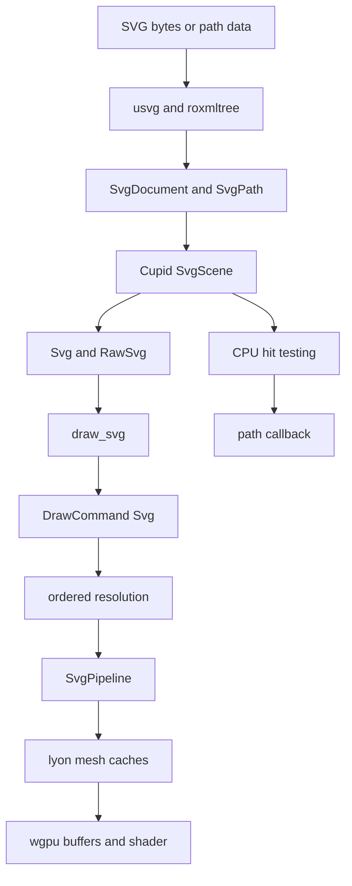

# Native SVG Renderer

This document is the implementation specification and current status for Aimer's native retained-mode SVG renderer.

## Status

### Interactive core

- [x] Parse SVG with `usvg` into Aimer-owned retained scene data.
- [x] Preserve source IDs, classes, element names, source groups, parent links, and paint order.
- [x] Normalize paths, basic shapes, viewport dimensions, `viewBox`, transforms, opacity, solid fills, and solid strokes.
- [x] Select nodes with `#id`, `.class`, and element-name selectors.
- [x] Construct standalone paths from SVG path data or a selected SVG node.
- [x] Tessellate non-zero/even-odd fills and cap/join/miter-aware strokes with `lyon`.
- [x] Cache geometry independently from transform, opacity, and color values.
- [x] Render SVG through a first-class Cupid command and GPU pipeline.
- [x] Anti-alias tessellated fill and stroke edges with 4x multisampling.
- [x] Preserve SVG/rectangle/text/image paint order and current canvas transform, clip, bounds, and alpha.
- [x] Apply runtime fill, stroke, opacity, and transform overrides without retessellation.
- [x] Hit-test fills and solid strokes under normalized nested transforms in reverse paint order.
- [x] Support selector-targeted hover, pressed, and press callback behavior.
- [x] Load memory, file, and network sources through explicit loading states.
- [x] Compile on native and `wasm32-unknown-unknown`.
- [x] Report SVG CPU geometry, GPU geometry, and instance-buffer usage in `RendererMemoryStats`.

## Architecture



`aimer_svg` owns parsing, public selectors and styles, source loading, widgets, and interaction. `aimer_cupid::svg` owns parser-independent scene and geometry types. This keeps Cupid independent from `usvg` and prevents a dependency cycle through the canvas/widget layers.

## Public API

```rust
use aimer::{Svg, SvgColor, SvgDocument, SvgStyle};

let document = SvgDocument::from_svg(include_bytes!("logo.svg"))?;
let widget = Svg::new(document)
    .width(240.0)
    .style(".accent", SvgStyle::new().fill(SvgColor::rgba8(30, 120, 255, 255)))
    .hover_style("#button", SvgStyle::new().opacity(0.8))
    .on_path_press("#button", |hit| {
        println!("pressed {:?}", hit.metadata.svg_id);
    });
```

Selectors are intentionally limited to one `#id`, `.class`, or element name. Invalid convenience-builder selectors are ignored without panicking; `try_style`, `try_hover_style`, `try_pressed_style`, and `try_on_path_press` return the structured selector error.

Standalone geometry requires an explicit selection when sourced from a document:

```rust
use aimer::SvgPath;

let path = SvgPath::from_path_data("M0 0 L10 0 L10 10 Z")?;
let selected = SvgPath::from_svg(include_bytes!("icons.svg"), "#download")?;
```

### Source loading

```rust
use std::sync::Arc;
use aimer::{SvgLoadState, SvgLoader, SvgSource};

let loader = SvgLoader::new(SvgSource::Memory(Arc::from(svg_bytes)));
match loader.load().await {
    SvgLoadState::Ready(document) => { /* build Svg::new(document) */ }
    SvgLoadState::Error(error) => eprintln!("{error}"),
    SvgLoadState::Loading => {}
}
```

Native file/network loading uses the platform filesystem and `reqwest`. Browser file/network sources use `fetch`. Parsing never follows external references embedded in the loaded SVG.

## Scene and rendering behavior

- Paths retain normalized absolute move, line, quadratic, cubic, and close commands.
- Basic SVG shapes are normalized to paths by `usvg`.
- Source groups remain selectable even when `usvg` flattens a visually redundant group.
- Renderable paths carry the normalized absolute transform, cumulative group opacity, solid fill/stroke, fill rule, and paint order.
- Widget destination bounds map the normalized viewport to the allocated widget size.
- Canvas transform and rectangular/rounded widget clip are captured at command resolution.
- Empty, non-positive-size, fully transparent, and offscreen geometry does not produce prepared GPU draws.
- Fill/stroke paint order is retained per path. SVG commands are not moved across other primitive types.
- Cupid renders all built-in pipelines into one reusable 4x multisample color target and resolves it into the presentation surface. Custom pipelines must use the `RenderContext::sample_count` value.

## Geometry and memory policy

Geometry cache keys contain:

- normalized path command bits;
- fill rule, or stroke width/cap/join/miter limit;
- one of eight bounded physical-scale tolerance buckets.

Keys deliberately exclude color, opacity, destination bounds, canvas transforms, and selector metadata. Updating those values only changes per-frame SVG instance data.

The CPU tessellation cache is bounded to `32 MiB` and `4096` meshes. The GPU mesh cache is bounded to `64 MiB` and `4096` meshes. Least-recently-used meshes not referenced by the current frame are evicted under pressure. The instance buffer follows Cupid's delayed-shrink policy after `120` underused frames.

`Renderer::clear_svg_resources()` immediately clears CPU and GPU SVG geometry caches. `RendererMemoryStats` exposes:

- `svg_geometry_cpu_bytes`;
- `svg_geometry_gpu_bytes`;
- `svg_instance_buffer_bytes`;
- `multisample_target_bytes`.

`instance_buffer_bytes` also includes the SVG instance buffer.

## Security and limits

Default `SvgLimits`:

| Resource | Limit |
|---|---:|
| Source bytes | `4 MiB` |
| Retained source nodes | `16,384` |
| Normalized path commands | `1,000,000` |
| Viewport width or height | `1,000,000` |

Inputs are rejected before normalization when empty, malformed UTF-8/XML, over a configured source/node limit, or containing explicit `NaN`/infinite numeric literals. Normalized transforms and viewport dimensions are checked again for finite values. Path-command and viewport limits are checked before retained/GPU use.

External `href` values are rejected unless they are document-local fragment references. No SVG input path uses `unwrap()`. Unsupported visual features produce diagnostics or predictable omissions rather than panics.

## Interaction and animation

Hit testing maps pointer coordinates from widget bounds into scene coordinates, applies the inverse normalized node transform, and visits visible path nodes from front to back.

- Fills use non-zero or even-odd containment.
- Strokes use distance to flattened line, quadratic, and cubic segments.
- A press is emitted only when pointer down and pointer up resolve to the same path.
- Selector callbacks run only for the winning path and matching rules.
- Pointer exit and cancellation clear hover/pressed state.

`SvgStyle` is the animation-facing property container. Existing Aimer controllers/builders remain responsible for ticking and requesting frames. Passing new transform, opacity, fill, or stroke values rebuilds instance data while preserving cached geometry. Stroke width and path changes are geometry-affecting and require a different tessellation key.

## Known restrictions

- Only solid fills and solid strokes render. Parsed dash arrays are retained, but dashed strokes are not submitted yet.
- Source groups are retained for selectors and hierarchy. Visual style overrides currently target renderable path nodes; inherited group override propagation is deferred.
- The widget maps the viewport directly to destination bounds. Additional `preserveAspectRatio`/fit policies beyond intrinsic aspect-ratio sizing are deferred.
- CPU curve hit testing uses bounded subdivision and can differ slightly from GPU tessellation at extreme zoom.
- Tessellation errors skip the affected draw rather than failing the complete frame.
- The loader exposes state but does not automatically construct loading/error fallback widgets.

## Deferred roadmap

### Phase 2: paint and clipping

- [ ] Linear/radial gradients and spread modes.
- [ ] Patterns.
- [ ] SVG-authored clip paths and masks.
- [ ] Group isolation and blend modes.

### Phase 3: additional content

- [ ] SVG text and cross-platform font resolution.
- [ ] Embedded/raster images.
- [ ] Controlled external resource resolvers.
- [ ] Full `preserveAspectRatio` and fit/alignment controls.

### Phase 4: effects and declarative behavior

- [ ] Filters.
- [ ] Broader CSS cascade and selector support.
- [ ] SMIL/CSS animation parsing.
- [ ] Links and accessibility semantics.
- [ ] Compatible-topology path morphing.

Scripts, uncontrolled external resources, and animated image formats remain outside the native interactive-core contract.

## Validation

The implementation has focused tests for parser errors and limits, selectors and source-group retention, normalized transforms/styles, path construction, fill/stroke tessellation, fill rules, cache reuse and eviction, scale buckets, mixed command order, renderer state capture, WGSL validation, intrinsic sizing, style isolation, transformed reverse-order hit testing, stroke hits, pointer lifecycle, and loading-state transitions.

Required release checks are native and `wasm32-unknown-unknown` compilation, focused/downstream tests, `cargo fmt --all`, strict Clippy for affected crates, and `git diff --check`.