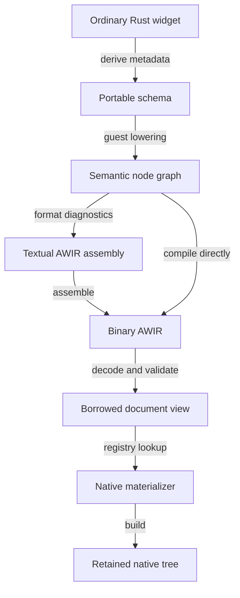

# New Generation Hot-Reload Implementations Board

> An unchecked phase has not been implemented yet. Mark it complete with `[x]` only after its exit criteria pass.

### Widget IR lifecycle

Widget IR is produced and consumed in ordered phases. The readable forms below are diagnostics and assembly; only the
final bounded binary AWIR document crosses the guest/host boundary.



The host-facing half of this lifecycle is implemented: binary AWIR decoding, schema validation, registry lookup, and
derived native materialization are connected to Quiver. `PortableWidget::to_portable_node` now uses generated lowering
for `Text`, `Container`, `Row`, `Column`, and `SizedBox`; callback-bearing built-ins still have explicit lowerings.
`PortableProperty` describes values and has a checked `PortableEncodeProperty` counterpart, while
`PortableBuildContext` owns and validates bounded `BLOBREF` payloads. The remaining phases close callback, diagnostic,
and compatibility gaps without replacing the working AWIR transport or host materializer.

The same `Container` and `Text` example is used in every phase so each transformation is visible.

#### - [x] Phase 1: AWIR 2.0 schema identity foundation

Establish the permanent wire-identity contract before implementing schema derives or registries:

1. Specify a deterministic `const hash64` algorithm with fixed test vectors and domain-separated inputs.
2. Introduce `u64` newtypes for widget, property, event, and portable value-type IDs.
3. Migrate AWIR encoding and decoding to those identity types and advance the format to `2.0`.
4. Retain canonical names in schema metadata and reject hash collisions, duplicate identities, and overlapping versions.
5. Prove the contract end to end with one `Text` schema before generalizing it through `PortableWidget`.

The first TDD acceptance test is:

> A `Text` schema receives deterministic `u64` widget and property IDs, encodes as AWIR 2.0, decodes successfully,
> and rejects a duplicate canonical identity.

This phase must complete first because derives, reflection metadata, registries, validation, and materializers all
depend on the same stable identity and binary contracts. Building those layers against AWIR 1.0 would require rewriting
them after the wire-format migration.

#### - [x] Phase 2: ordinary widget source

Application code continues to use normal Aimer builders:

```rust-ignore
Container::new()
    .width(320.0)
    .height(180.0)
    .color(Color::HexA(0x112233FF))
    .child(Text::new("Hello"))
```

No wire IDs, tables, or host construction logic appear in application code.

#### - [x] Phase 3: portable schema metadata

The primitive's handwritten schema or `PortableWidget` derive maps Rust fields to stable wire semantics:

```text
Container 1.0
  widget ID: hash64("aimer.widget:aimer_container::single_child::Container")
  property hash64("aimer.property:aimer_container::single_child::Container:width")  = F64
  property hash64("aimer.property:aimer_container::single_child::Container:height") = F64
  property hash64("aimer.property:aimer_container::single_child::Container:color")  = RGBA
  children: exactly one

Text 1.0
  widget ID: hash64("aimer.widget:aimer_text::Text")
  property hash64("aimer.property:aimer_text::Text:text") = STRREF
  children: none
```

This metadata is now the shared contract that later phases consume for guest lowering, host validation, registry
entries, and—when the normal builder convention is sufficient—the host materializer. Schema and property IDs are
versioned contracts, not Rust field positions.

#### - [x] Phase 4: automatic 64-bit schema identities

AWIR 2.0 uses `u64` for widget, property, event, and portable value-type IDs. Document-local node, string, and table
references remain `u32`, because they are bounded indices rather than permanent identities. `PortableWidget` and the
canonical metadata constructors generate typed IDs from domain-separated canonical names using Aimer's specified stable
`hash64` algorithm; they never use Rust's `DefaultHasher`, source lines, declaration order, compiler type names, or
memory layout.

Conceptually, the generated constants for the example above are:

```rust
const WIDGET_CONTAINER: u64 =
    hash64("aimer.widget:aimer_container::single_child::Container");
const PROPERTY_CONTAINER_WIDTH: u64 =
    hash64("aimer.property:aimer_container::single_child::Container:width");
const PROPERTY_CONTAINER_HEIGHT: u64 =
    hash64("aimer.property:aimer_container::single_child::Container:height");
const PROPERTY_CONTAINER_COLOR: u64 =
    hash64("aimer.property:aimer_container::single_child::Container:color");
```

The registry retains both each generated number and its canonical name. Two declarations with the same `u64` ID and
overlapping schema versions are rejected at compile time when visible together, or at host startup when linked from
separate crates. A true hash collision is also rejected by comparing canonical names; registration order never decides
the winner. Distinct versions of the same canonical widget are allowed only as explicit schema evolution.

The same construction path covers widgets, properties, callback events, and custom value types. Handwritten metadata
uses `from_canonical_name(...)`, so normal schema declarations cannot accidentally pair a canonical name with a stale or
copied numeric ID. Low-level numeric constructors remain available for binary decoding and negative validation tests.

Automatic identity is the default, so an ordinary primitive needs no widget-ID annotation:

```rust
#[derive(PortableWidget)]
pub struct Container<W> {
    width: Option<Dimension>,
    height: Option<Dimension>,
    color: Option<Color>,

    #[portable_child]
    child: W,
}
```

Moving or renaming this type changes its generated schema ID. A compatibility-sensitive widget can pin its old canonical
identity with `#[portable_widget(id = "aimer.container", version = "1.0")]`; this is an escape hatch, not a normal
requirement. Widget schema identity remains separate from widget-instance identity, which still comes from a
`Key` or deterministic source fingerprint.

#### - [x] Phase 5: Rust type to AWIR reflection table

The schema derive uses the compile-time `PortableProperty::REFLECTION` contract to select the AWIR representation for
each ordinary Rust field. Each immutable descriptor carries the wire value kind, requiredness, bounded custom-value
schema, and checked conversion policy. This is generated metadata, not Rust runtime reflection and not a table
transferred with every document. Guest lowering and host validation in later phases consume the same mapping:

| Rust field or role                                           | AWIR representation                                                         | Reflection behavior                                                                                                                   |
|--------------------------------------------------------------|-----------------------------------------------------------------------------|---------------------------------------------------------------------------------------------------------------------------------------|
| `bool`                                                       | `BOOL` property value                                                       | Stored inline.                                                                                                                        |
| `i8`, `i16`, `i32`, `i64`                                    | `I64` property value                                                        | Publishes the exact signed destination range; decoding rejects values outside it.                                                     |
| `u8`, `u16`, `u32`                                           | `I64` property value                                                        | Publishes the exact non-negative range and never wraps through a signed conversion. Wider integers require a bounded versioned codec. |
| `f32`, `f64`                                                 | `F64` property value                                                        | `f32` is widened; schema validation applies any finite/range requirements.                                                            |
| `Color`                                                      | `RGBA` property value                                                       | Encoded as the stable packed RGBA contract rather than the Rust enum layout.                                                          |
| `String`, `&str`, text content                               | `STRREF` property value                                                     | Interned in the bounded string table; the property stores only its index.                                                             |
| Portable framework value such as `Dimension` or `EdgeInsets` | Stable typed value record or bounded `BLOBREF` codec                        | Uses an explicit type ID, schema version, size limit, validator, and decoder.                                                         |
| `Option<T>` property                                         | Property omitted for `None`; the reflected representation of `T` for `Some` | Omission preserves the versioned `new()` default.                                                                                     |
| Child widget                                                 | `CHILD` node reference                                                      | Lowered recursively and applied after properties during materialization.                                                              |
| Child collection                                             | Range in the child table                                                    | Element count and child cardinality are bounded by the widget schema.                                                                 |
| `Key`                                                        | Stable node key                                                             | Used for reconciliation and callback/state identity; it is not a visual property.                                                     |
| Synchronous callback                                         | Event kind plus stable callback ID                                          | Closure code remains in the active WASM guest and is never serialized into AWIR.                                                      |
| Native handle, pointer, GPU resource, thread, or FFI object  | Not representable                                                           | Requires a host-owned capability or a native rebuild and relaunch.                                                                    |

`bool`, the checked integer widths above, `f32`, `f64`, `String`, `&str`, `Color`, `Dimension`, and `Option<T>` now
provide built-in reflection. `Option<T>` preserves the inner conversion and value schema while changing requiredness to
omission-based optional. A custom type uses `PortablePropertyReflection::custom(...)`; this requires a stable value ID,
schema version, and maximum encoded size. Types such as `u64` are deliberately not mapped to `I64`, because values above
`i64::MAX` must never truncate or wrap.

For example, reflection for the `Container` and `Text` fields used here is conceptually:

```text
RUST TYPE Container  -> WIDGET hash64("aimer.widget:aimer_container::single_child::Container") 1.0
  FIELD width         Dimension     -> PROP hash64("aimer.property:...:width") F64
  FIELD height        Dimension     -> PROP hash64("aimer.property:...:height") F64
  FIELD color         Option<Color> -> PROP hash64("aimer.property:...:color") RGBA, OMIT_IF_NONE
  FIELD child         W             -> CHILD exactly_one

RUST TYPE Text       -> WIDGET hash64("aimer.widget:aimer_text::Text") 1.0
  FIELD text          String        -> PROP hash64("aimer.property:aimer_text::Text:text") STRREF
```

The reflected contract uses stable widget, property, event, and value-type IDs. It must not use `TypeId`, field memory
offsets, enum discriminants, generic monomorphization names, or other compiler-layout details because those can change
between guest generations. A custom Rust type is portable only when its schema declares a bounded, versioned codec and
the permanent host already knows how to validate and materialize that semantic value. Otherwise the candidate is
rejected while the active generation remains running, with a rebuild or hot-restart diagnostic as appropriate.

#### - [x] Phase 6: semantic node graph

Guest lowering evaluates the widget builders and produces a human-facing description of the resulting graph:

```text
AWIR format: 2.0
root: node0

node0: Container 1.0 [widget_id = hash64("aimer.widget:aimer_container::single_child::Container")]
  width:  F64(320.0)
  height: F64(180.0)
  color:  RGBA(0x112233FF)
  children: [node1]

node1: Text 1.0 [widget_id = hash64("aimer.widget:aimer_text::Text")]
  text: StringRef(hello)
  children: []

hello: String("Hello")
```

This form is useful in documentation and diagnostics. Symbolic names make relationships clear but are not transferred as
part of production AWIR.

The guest runtime now completes each build as a bounded `PortableSemanticGraph` before encoding. Its immutable borrowed
node views expose typed `WidgetSchemaId`, schema version, stable instance key, `WidgetProperty` values,
`CallbackBinding` entries, ordered child IDs, and resolved interned strings. Builder insertion rejects malformed
references, duplicate slots, and resource-limit overflow before growth. `finish_graph` then validates the root and
requires every constructed node to belong to it. `finish_document` remains a compatibility shorthand for
`finish_graph(...).compile()`, while `encode` performs the existing AWIR model validation. Existing widget lowering and
native standalone construction are unchanged.

The owned graph preserves deterministic insertion order and compiles into the existing bounded AWIR 2.0 document.
Symbolic labels such as `node0` and `hello` remain a presentation concern for the textual assembly phase; the semantic
runtime uses typed document-local node IDs and checked string-table references.

#### - [x] Phase 7: textual AWIR assembly

A deterministic assembly form keeps stable numeric schema IDs while allowing labels for references:

```text
AWIR 2 0

GENERATION 0
REVISION 0

SECTION TEXT
ROOT node0

node0:
  NODE hash64("aimer.widget:aimer_container::single_child::Container") 1 0
  PROP hash64("aimer.property:aimer_container::single_child::Container:width") F64 320.0
  PROP hash64("aimer.property:aimer_container::single_child::Container:height") F64 180.0
  PROP hash64("aimer.property:aimer_container::single_child::Container:color") RGBA 0x112233FF
  CHILD node1
  END

node1:
  NODE hash64("aimer.widget:aimer_text::Text") 1 0
  PROP hash64("aimer.property:aimer_text::Text:text") STRREF hello
  END

SECTION DATA
hello:
  STRING "Hello"
```

An assembler resolves `node0`, `node1`, and `hello` into table indices. Keywords such as `NODE`, `PROP`, and `END`
describe the text format; they do not each become an opcode in the production document.

`WidgetAssemblyDocument::parse` now accepts this bounded grammar. `encode` delegates to the canonical `WidgetDocument`
encoder and then decodes the image under the same limits, so assembled input passes the complete binary and graph
topology validation path before it is returned. Stable widget, property, and event identities accept either fixed
hexadecimal `u64` values or `hash64("canonical name")` expressions. `GENERATION` and `REVISION` are optional when
handwritten and default to zero; deterministic disassembly emits both explicitly so a disassemble/assemble round trip
preserves every header field and produces byte-identical AWIR.

The complete grammar also represents optional properties, `BOOL`, `I64`, `F64`, `RGBA`, `STRREF`, and `BLOBREF`
values, stable widget keys, callback event/schema/identity triples, ordered children, escaped UTF-8 strings, and bounded
hexadecimal blobs. Handwritten finite `F64` values may use decimal notation; disassembly emits their exact compact
`0x` bit pattern so extreme values and negative zero round trip without decimal expansion. Node, string, and blob labels
share one namespace. Parsing rejects duplicate labels, unresolved references, missing roots or node terminators,
malformed values and escapes, non-finite floats, unsupported versions, invalid stable identities, malformed topology,
and configured resource-limit overflow with source-line context where a single directive caused the failure. Text input
has its own finite derived budget rather than reusing the smaller binary document ceiling, allowing deterministic
assembly to round trip under the same `ModelLimits` that accepted its binary image.

`disassemble_widget_document` assigns deterministic table-order labels (`nodeN`, `stringN`, and `blobN`) to a validated
borrowed document. `PortableSemanticGraph::to_assembly` exposes the same format for explicit diagnostics, while the
normal guest path still compiles the graph directly to binary AWIR and does not pay textual formatting or parsing cost.

#### - [x] Phase 8: binary AWIR document and optimization

The machine format is a bounded set of fixed-width tables and payload sections. Conceptually, assembling the previous
text produces records like these:

```text
Header
  magic = "AWIR"
  format = 2.0
  root_node = 0
  node_count = 2

Node table
  [0] type=<Container u64 ID> schema=1.0 properties=0..3 children=0..1
  [1] type=<Text u64 ID>      schema=1.0 properties=3..4 children=1..1

Property table
  [0] id=<Container.width u64 ID>  kind=F64    value=320.0
  [1] id=<Container.height u64 ID> kind=F64    value=180.0
  [2] id=<Container.color u64 ID>  kind=RGBA   value=0x112233FF
  [3] id=<Text.text u64 ID>        kind=STRREF value=0

Child table
  [0] node=1

String table
  [0] offset=0 length=5

String bytes
  "Hello"
```

The actual encoding stores widget, property, event, and value-type identities as fixed-width little-endian `u64`
values. One-byte tags remain appropriate for small closed categories such as property kinds and flags. Checked `u32`
ranges address document-local tables. Counts and ranges replace textual delimiters, which permits fast indexed access
and allocation-free borrowed decoding.

`WidgetDocument::encode_compact` preserves this AWIR 2.0 layout while deterministically interning equal string and blob
payloads. The first occurrence supplies the compact table index, every `StringRef` and `BlobRef` is checked against the
original table and remapped, and all model limits are applied to the resulting image. Documents without repeated
payloads remain byte-identical to `WidgetDocument::encode`; the original encoder remains available as the exact-table
compatibility path.

The production portable builder interns repeated widget strings and blobs before they enter the semantic graph, avoiding
duplicate storage and byte-budget charges during construction. Blob payloads are checked against the per-blob and
complete-document ceilings before insertion, and the resulting ordered table is passed through compact encoding. This
optimization changes neither schema identities nor fixed record widths, and the host continues to decode the result
through the same allocation-free `WidgetDocumentView`.

#### - [x] Phase 9: host decode and validation

The permanent host first creates a borrowed document view, then validates generic AWIR invariants and widget-specific
schema rules before constructing anything:

```text
decode: AWIR 2.0, 2 nodes, root 0
validate node 0: Container 1.0, properties [width, height, color], one child
validate node 1: Text 1.0, property [text], no children
result: accepted
```

Invalid offsets, excessive counts, unknown required properties, unsupported versions, duplicate callbacks, or wrong
child cardinality reject the candidate while the active generation remains running.

`WidgetDocumentView::decode` owns binary and graph safety: it validates fixed-width section ranges, canonical offsets,
UTF-8 and blob references, finite values, unique keys, single-parent acyclic topology, reachability, depth, and all
model limits before exposing borrowed node views. It does not allocate copies of strings, blobs, properties, callbacks,
or children.

`PortableWidgetSchemaValidator` then applies the host's validated schema metadata without running native factories. It
checks each widget version, required and optional properties, reflected AWIR value kinds, duplicate property IDs,
bounded custom blobs, callback event versions and multiplicity, duplicate callback IDs, and child cardinality. Unknown
optional properties remain forward-compatible; unknown required properties fail closed. Quiver layers native value
domains such as nonnegative dimensions after metadata validation and before `materialize_widget_tree` builds the first
element, so a schema failure cannot partially construct or publish a candidate tree.

#### - [x] Phase 10: native materialization

After validation, Quiver's host-owned registry selects the `Container 1.0` and `Text 1.0` materializers. The registry
rejects overlapping registrations and resolves inclusive version ranges without relying on linker order. A Container
materializer performs the equivalent of:

```rust
let text = Text::new("Hello");

let container = Container::new()
.width(320.0)
.height(180.0)
.color(Color::HexA(0x112233FF))
.child(text);
```

Children are materialized before their parent and applied last, preserving Aimer's generic child-builder convention. The
result is a normal retained native element tree handled by the existing layout and rendering pipeline; AWIR is not
interpreted on every frame.

Missing native registrations return a structured materialization error with a rebuild-and-relaunch recommendation rather
than reaching an `unreachable!` branch. The six current primitive materializers are registered explicitly; schema-driven
derive generation described below remains the extension path for reducing primitive-author boilerplate.

For callbacks, the node graph carries a stable event kind and callback ID rather than a Rust closure. A native event
sends that ID to the active guest, which runs the current callback, updates portable state, and starts the same lowering
flow again to return a new binary AWIR document.

Pass `--verbose-widget-ir` with the unstable hot-reload command to print every representation after a candidate has
successfully reached native materialization:

```bash
aimer +nightly run -Z hot-reload --verbose-widget-ir
```

The report contains the semantic node graph, deterministic textual assembly, complete compact binary AWIR hex image,
decoded node records and data-table counts, schema-validation result, and native-materialization result. The switch is
carried in the private, versioned host policy so desktop, iOS, and Android use the same behavior. It defaults to off;
ordinary reloads do not format, allocate, or print this report and continue transferring the same binary bytes.

#### - [x] Phase 11: derive-generated materializers

For ordinary primitive widgets, the schema-driven `PortableWidget` derive also generates a checked
`PortableNativeWidget` host-construction implementation. Aimer's widget convention gives the derive a predictable
sequence: validate and decode inputs, start with `Type::new()`, apply decoded properties through their builder methods,
and apply the child builder last. Omitted optional properties keep the defaults supplied by `new()`.

For example, a `Container` declaration can describe its portable contract next to its fields:

```rust
#[derive(PortableWidget)]
pub struct Container<W> {
    #[portable_optional]
    width: Dimension,
    #[portable_optional]
    height: Dimension,
    #[portable_optional]
    padding: LayoutSpacing,
    #[portable_optional]
    margin: LayoutSpacing,
    #[portable_optional]
    box_decoration: BoxDecoration,
    color: Option<Color>,

    #[portable_child]
    child: W,
}
```

Unannotated fields are portable properties by default. The derive resolves their AWIR value kind and codec through the
Rust-type reflection table, derives each property ID from the stable widget ID plus the field name, and uses the field
name as the builder setter. `Option<T>` omits the property for `None`; `#[portable_optional]` applies the same omission
contract to a non-optional field when it still has a meaningful `Default` value. Both preserve the versioned `new()`
default. Property IDs must not depend on declaration order, so reordering fields does not change the wire contract. The
derive emits canonical names beside every generated ID, and assembled registries reject identity reuse or hash
collisions. Future schema-evolution work may add a canonical property-identity override; arbitrary numeric IDs are not
accepted.

The widget schema ID is generated from the crate, module, and type path by default. Moving or renaming the type
therefore creates a new schema identity and may select the interpreted fallback or require rebuilding and relaunching
the native host. An explicit canonical ID remains available when a widget must preserve compatibility across such a
refactor.

An unannotated field whose type has no reflected AWIR representation fails the generated `PortableProperty` trait bound
rather than being silently omitted:

```text
error[E0277]: the trait bound `NativeDecoration: PortableProperty` is not satisfied
```

Provide a portable codec, mark the field `#[portable_skip]`, or require a native restart. A manual materializer replaces
native decoding/construction but still requires every unskipped schema property to have portable reflection.

Attributes are therefore reserved for semantic exceptions rather than ordinary properties:

```rust
#[portable_child(optional)]
child: OptionalChild<W>,
#[portable_callback]
on_press: Option<Callback>,
#[portable_skip]
native_cache: NativeCache,
```

The derive generates checked property decoding followed by host construction equivalent to:

```rust
let child = required_child(children) ?;
let width = decode_property(node, PROPERTY_CONTAINER_WIDTH) ?;
let height = decode_property(node, PROPERTY_CONTAINER_HEIGHT) ?;
let padding = decode_property(node, PROPERTY_CONTAINER_PADDING) ?;
let margin = decode_property(node, PROPERTY_CONTAINER_MARGIN) ?;
let box_decoration = decode_property(node, PROPERTY_CONTAINER_BOX_DECORATION) ?;
let color = decode_property(node, PROPERTY_CONTAINER_COLOR) ?;

let mut widget = Container::new();

if let Some(width) = width {
widget = widget.width(width);
}
if let Some(height) = height {
widget = widget.height(height);
}
if let Some(padding) = padding {
widget = widget.padding(padding);
}
if let Some(margin) = margin {
widget = widget.margin(margin);
}
if let Some(box_decoration) = box_decoration {
widget = widget.box_decoration(box_decoration);
}
if let Some(color) = color {
widget = widget.color(color);
}

let widget = widget.child(child);
```

All values and the required child count are decoded before `Container::new()` runs. A malformed type, invalid reference,
or Rust numeric-range mismatch therefore returns `PortableMaterializeError` without partially constructing a widget;
generic AWIR and portable schema validation still run before the host calls the materializer. The complete lifecycle
above shows how the same generated logic becomes a semantic graph, textual AWIR assembly, fixed-width binary tables, a
validated host view, and finally a native `Container` and `Text` tree.

The child is deliberately applied last because it changes the widget's generic type. A missing optional property does
not call its builder, so the running host uses the default from `Container::new()`. The host-side materializer and the
Phase 16 schema-derived guest lowering remain separate contracts, so a widget may retain a handwritten materializer when
its constructor is nonstandard while still using generated guest lowering.

Field annotations describe exceptions that Rust cannot infer: an optional child, a synchronous callback slot, or a field
deliberately excluded from the portable schema. Custom property types implement `PortableProperty` with a single
`PortablePropertyReflection::custom(...)` descriptor containing their bounded, versioned value schema. A custom blob
codec, callback binding, optional or collection child, platform resource, or nonstandard constructor uses an explicit
handwritten override while retaining the generated schema:

```rust
#[derive(PortableWidget)]
#[portable_widget(materializer = materialize_special_widget)]
pub struct SpecialWidget {
    value: u32,
}
```

The function receives the validated document/node plus already materialized children and returns `AnyWidget`. On
linker-supported desktop hosts, the derive contributes its schema and constructor to host-owned `linkme` slices. Quiver
validates the built-in and linked schemas as one registry, rejects overlapping identities or versions before
construction, adapts retained child elements back into `AnyWidget`, invokes the generated or manual implementation, and
converts the result into an `AnyElement`. Linker order is never used to resolve a conflict.

The six current built-ins keep their handwritten registrations because callbacks and existing custom construction make
them explicit exceptions. Ordinary derived primitives need no Quiver registration entry. The linker registry is
currently enabled only on the platforms documented by `linkme`: Linux, macOS, Windows, FreeBSD, OpenBSD, and illumos.
WASM guests never compile or transfer native registrations, while iOS and Android continue using Quiver's explicit
built-in registry until their linker behavior is proven. Metadata-only declarations can use
`#[portable_widget(schema_only)]`; combining it with a manual materializer is rejected.

For example, a button callback needs explicit event metadata even though its ordinary properties can still be derived:

```rust
#[portable_callback]
on_press: Option<Callback>,
```

The callback annotation generates a stable event identity from the widget identity and field name. Later lowering and
materialization phases use that metadata to bind the guest callback and corresponding host builder operation.

Constructor defaults are part of the versioned schema contract. If a visible
`new()` default changes, the schema must either encode that property explicitly or advance its version so an older
permanent host cannot silently materialize a different UI.

#### - [x] Phase 12: blob-aware portable build context

Connect the semantic guest builder to AWIR's existing blob table before asking property codecs or derives to emit
`BLOBREF` values.

1. Add owned blob storage to `PortableBuildContext` and `PortableSemanticGraph`.
2. Extend `PortableWidgetLimits` with an explicit per-blob byte ceiling and carry it into the equivalent `ModelLimits`;
   the current builder-derived model limits reserve zero blob bytes.
3. Add a checked `push_blob` operation that returns `PropertyValue::BlobRef`.
4. Charge the blob range record and payload against both the per-blob and complete-document byte limits before
   allocating or mutating the graph.
5. Intern equal blobs deterministically, preserving the first document-local index.
6. Make `push_node` accept only blob references already owned by the current context; missing and forged references
   remain errors.
7. Preserve blob ordering through `finish_graph`, `compile`, compact encoding, diagnostics, and disassembly.
8. Clear per-document blob storage after finishing a generation while retaining state and callback machinery.

This phase adds no type-specific collection limits. Blob payloads are bounded by the existing complete-document ceiling
and the new per-blob ceiling, which is propagated to `ModelLimits::max_blob_bytes`; a codec may apply a smaller schema
limit when its wire contract requires one.

The first acceptance test is:

> A guest build pushes two equal blobs, receives the same `BlobRef`, emits a node containing that reference, finishes
> the document, and the borrowed host view resolves the original bytes. A forged reference and a blob exceeding either
> byte budget are rejected before the node is committed.

#### - [x] Phase 13: guest property encoding contract

Add the missing value-side counterpart to `PortableMaterializeProperty`. The contract must encode semantic Rust values,
not their compiler memory representation:

```rust
pub trait PortableEncodeProperty {
    fn encode_property(
        self,
        context: &mut PortableBuildContext,
    ) -> Result<PropertyValue, PortableBuildError>;
}
```

Primitive implementations perform the same checked conversions declared by `PortableProperty::REFLECTION`:

- Boolean and supported integers become canonical inline AWIR values.
- Floats reject non-finite input and preserve the reflected widening policy.
- `Color` uses the stable packed RGBA order.
- Owned strings move into the string table; borrowed strings are copied through the same interning path.
- `Dimension` follows its declared semantic wire conversion.
- Custom values produce versioned bytes and insert them through Phase 12's checked blob operation.

Optional properties need omission semantics rather than a synthetic `None` value. Generated lowering should branch on
`Option<T>` and invoke `T::encode_property` only for `Some`; the encoding trait itself therefore remains focused on one
present value. Errors identify the stable property and source fingerprint so they survive the guest ABI boundary.

Rust enums are not serialized by discriminant or memory layout. A framework enum uses explicit stable tags inside a
primitive value or custom codec. Adding, removing, or reassigning a tag is value-schema evolution and requires the
appropriate version change.

Exit criteria:

- Every built-in reflected property has a matching encoder and decoder test.
- Known literal inputs produce independently specified AWIR values.
- Invalid numeric inputs fail without inserting a partial property or payload.
- Reflection kind, encoding output kind, and materialization input kind cannot disagree silently.

#### - [x] Phase 14: versioned codecs for `LayoutSpacing` and `BoxDecoration`

Complete the two custom style-value codecs already reflected and materialized by adding guest encoding for their
version-one blob formats.

`LayoutSpacing` encodes the version byte followed by top, bottom, left, and right values. `Spacing::{None, Px,
Percent}` uses explicit stable tags and little-endian payloads. Its version-one encoding is exactly 21 bytes.

`BoxDecoration` encodes border and outline slices, dimensions, corner radii, shadows, and optional background color.
`BorderStyle`, `Dimension`, and `ShadowSide` use explicit stable tags; colors use the stable packed color contract; all
floating-point values must be finite. The shadow count is derived from the actual vector length and checked for wire
conversion overflow.

There is deliberately no independent maximum number of box shadows. Before allocating, the decoder proves that the
declared count can fit in the already validated remaining blob bytes. On the guest, the document/blob byte ceilings and
checked `u32` wire count provide the resource boundary.

Exit criteria:

- Independently specified literal blobs decode to the expected Rust values.
- Encode-then-materialize round trips cover every enum tag and optional field.
- Empty and multiple-shadow decorations pass.
- Truncation, trailing bytes, unknown tags, noncanonical Boolean/option tags, non-finite floats, and an impossible
  shadow count fail closed.
- The codec never serializes Rust enum discriminants, padding, addresses, or `Cell` memory representation.

#### - [x] Phase 15: move guest lowering into `PortableWidget`

Make `PortableWidget` own `to_portable_node` while preserving the existing `-> impl Widget` builder API. The
transitional relationship is intentionally:

```rust
pub trait PortableWidget {
    #[cfg(feature = "portable-guest")]
    fn to_portable_node(
        self,
        context: &mut PortableBuildContext,
        source: SourceFingerprint,
    ) -> Result<PortableNodeId, PortableBuildError>
    where
        Self: Sized;
}

pub trait Widget: PortableWidget {
    // Native element construction and widget metadata remain here.
}
```

Remove the blanket `impl<T> PortableWidget` marker implementation. Every concrete `Widget` gets an explicit
`PortableWidget` implementation; portable widgets provide `to_portable_node`, while widgets without guest support
implement it by returning the unsupported-widget diagnostic. Keeping `Widget: PortableWidget` in this phase is
deliberate: the existing `StatelessWidget::build` and state `build` contracts return `impl Widget`, and generated guest
lowering can continue to lower those values without changing every builder signature.

This phase moves method ownership but does not yet make portability an optional refinement of `Widget`. A future API
revision may invert the relationship to `PortableWidget: Widget`, but that requires a separate portable builder contract
because `impl Widget` does not expose the `PortableWidget` capability.

Migration requirements:

1. Move the default and handwritten `to_portable_node` implementations from `impl Widget` into `impl PortableWidget`.
2. Update `DynWidget`, `AnyWidget`, and their forwarding adapters to dispatch through `PortableWidget` while retaining
   the consuming type-erasure seam.
3. Update the stateless and stateful widget macros and their generated-code tests.
4. Keep `PortableWidgetSchema` as the reflection contract; it must remain distinct from the lowering capability.

Exit criteria:

- `Widget` no longer declares `to_portable_node`.
- The blanket `PortableWidget` implementation is gone.
- Existing `-> impl Widget` builder APIs compile unchanged.
- Native-only widgets retain the existing unsupported-widget diagnostic.
- Built-in portable widgets, `AnyWidget`, and generated widgets pass their focused guest-lowering tests.

#### - [x] Phase 16: derive-generated guest lowering through `PortableWidget`

Teach the `PortableWidget` derive to generate the guest half of its schema. The derive must emit a distinct
`impl PortableWidget` rather than attempting to add a method to an existing handwritten `impl Widget` or generating a
second `Widget` implementation.

```rust
impl PortableWidget for MyWidget {
    #[cfg(feature = "portable-guest")]
    fn to_portable_node(
        self,
        context: &mut PortableBuildContext,
        source: SourceFingerprint,
    ) -> Result<PortableNodeId, PortableBuildError> {
        todo!("generated lowering")
    }
}
```

The generated implementation must:

1. Capture the widget key before consuming fields.
2. Encode each required property through `PortableEncodeProperty`.
3. Omit `None` optional properties.
4. Bind callbacks through their reflected event metadata.
5. Lower children before their parent using deterministic child source fingerprints.
6. Push the parent with the exact `PortableWidgetSchema::SCHEMA` widget ID, version, property IDs, and cardinality.
7. Preserve field ownership and avoid clones on the guest build path.

Ordinary handwritten widgets implement the same capability explicitly:

```rust
impl PortableWidget for MyWidget {
    #[cfg(feature = "portable-guest")]
    fn to_portable_node(
        self,
        context: &mut PortableBuildContext,
        source: SourceFingerprint,
    ) -> Result<PortableNodeId, PortableBuildError> {
        // Handwritten lowering or delegation to a generated helper.
        build_portable_node(self, context, source)
    }
}
```

The stateful and stateless widget macros already own their generated `Widget` implementations and can emit the separate
`PortableWidget` implementation automatically. The existing schema derive currently produces
`PortableWidgetSchema`; its schema output and guest lowering must remain separate contracts. This phase must not depend
on specialization or generate a conflicting second `Widget` implementation.

Exit criteria:

- A compile fixture proves the derive generates schema, guest lowering, and native materialization for the same widget.
- Reordering source fields does not change property identities or output semantics.
- A missing `PortableEncodeProperty` implementation produces a useful compile-time error naming the field type.
- Optional, required-child, and child-collection cases have public-seam tests.

The derive now emits a feature-gated `PortableWidget` implementation that uses schema property IDs and versions, checked
property codecs, omission-based optional properties, reflected callback metadata, and stable field-name source
discriminators for child lowering. `#[portable_widget(manual_lowering)]` remains available for widgets that still need a
handwritten lowering while retaining generated schema/materializer contracts. `Text` and `Container` now use the
generated guest path; `Text` supplies a custom validator/materializer for its nonstandard constructor and native-only
style fields, while `Container` uses generated codecs for spacing and decoration blobs.

#### - [x] Phase 17: migrate built-in widget lowering to reflected schemas

Adopt the derived guest path vertically before removing all handwritten implementations.

1. [x] Migrate `Text` as the primitive/string control case.
2. [x] Migrate `Container` with width, height, padding, margin, decoration, color, and one child.
3. [x] Migrate `Row`, `Column`, and `SizedBox` through reflected schemas while preserving their current cardinality and
   dimension behavior.
4. [x] Migrate callback-bearing widgets only after generated callback lowering has parity with their handwritten paths.
5. [x] Delete old hardcoded IDs and handwritten lowering only when byte-level and behavioral equivalence tests pass.

`Text`, `Container`, `Row`, `Column`, and `SizedBox` now have reflected-schema and focused lowering coverage. The flex
and sizing collection/skip-field constructors remain host-owned, while the guest property/cardinality contract is
generated. `Button` now uses reflected callback metadata and the generated guest lowerer; its non-optional callback
slots, async-callback rejection, retained child slot, and native-only decoration validation match the previous
handwritten behavior. The stable Anteros schema constants remain the public wire contract, and Quiver retains the
explicit host callback materializer. Byte-level and dispatch tests cover the migration. A Quiver integration test now
lowers and materializes a `Container` carrying all six portable fields—width, height, padding, margin, decoration, and
color—with its `Text` child.

For `Container`, the acceptance example is:

```rust
Container::new()
.box_decoration(BoxDecoration::new().border_radius(12))
.width(1300)
.padding(LayoutSpacing::all(20))
.height(300)
.color(Color::GREEN)
.child(Text::new("Hello World"))
```

The WASM guest must encode this tree without `UnsupportedWidget`, Quiver must validate it against the same derived
schema, and the derived native materializer must reconstruct all values without a handwritten Container property list.
Defaults must remain visually equivalent when optional properties are omitted.

#### - [x] Phase 18: structured guest build diagnostics

Do not collapse actionable lowering failures into `ApplicationError` with an empty payload. Extend the guest/host error
contract so a rejected candidate reports at least:

- The failing operation (`aimer_build`, callback rebuild, import, or migration).
- The `PortableBuildError` category.
- Widget/property canonical name when known.
- Stable source fingerprint.
- Configured limit and actual usage for resource errors.

The ABI remains bounded: diagnostics use a negotiated finite output buffer and a fixed maximum encoded length. Invalid
or oversized diagnostic payloads degrade to a status-only error rather than compromising the active generation.

The motivating acceptance test is:

> A widget without guest lowering reports `unsupported widget Container at source …`; an invalid custom property reports
> its property name and codec error. Neither appears as `aimer_build probe returned ApplicationError with length 0`.

Phase 20 is implemented with the versioned, bounded `AGDI` diagnostic payload. Generated portable lowering preserves the
operation, `PortableBuildError` category, canonical widget/property names, source fingerprint, and resource limit values
through the optional `aimer_diagnostic` export. The host negotiates the diagnostic output size, enforces the 4 KiB
maximum, and falls back to the stable status-only result for old guests or malformed/oversized payloads. Shared codec
tests, generated guest export tests, portable property-error tests, and isolated runtime tests cover valid, malformed,
and oversized diagnostics.

#### - [x] Phase 19: source-mapped guest panic diagnostics

Make guest panics from hot-reloaded widgets point back to the original application source rather than the generated
shadow or target directory.

1. Capture guest panic payloads at the ABI boundary without allowing a panic to unwind across the export.
2. Preserve the guest operation, widget name, build phase, panic payload, file, line, and column in a bounded, versioned
   diagnostic envelope.
3. Preserve application source bytes while appending reflection implementations inside their original modules, which
   makes line and column translation identity for reflection-rewritten files; pass the resulting shadow-to-original
   path map to rustc with `--remap-path-prefix`.
4. Remap guest locations on the host and render the existing source snippet and caret format when the original source is
   available; fall back to the raw guest location when the map is missing or stale.
5. Keep candidate failure isolated: a panic diagnostic must reject only the candidate and preserve the last active
   native generation.

The acceptance example is a panic in `HttpRequestButtonState::build`: hot reload must report the original application
path and source coordinates, such as `jaime/src/http_request_button.rs:117:67`, rather than a path under the shadow or
`target` directory. Tests cover transformed and untransformed files, bounded panic payloads, host source rendering,
and the abort-only guest fallback. On the stable `wasm32-unknown-unknown` target, the prebuilt standard library uses
an abort panic strategy and cannot recover a panic; the ABI capture path is enabled automatically for unwind-capable
guest toolchains and otherwise the host retains the raw execution/trap diagnostic.

#### - [x] Phase 20: host-visible guest panic overlay

- Dependency: Phase 19

Make a failed guest build visible in the running application without installing a partial or invalid guest tree. The
diagnostic surface is host-owned; the guest must not serialize `ErrorWidget` as part of AWIR.

1. Retain the structured guest panic diagnostic, including widget name, build phase, payload, and source location when
   Phase 19 can recover it.
2. Add host-side diagnostic state to the live reload host and display an `ErrorElement`/`ErrorWidget` overlay when a
   candidate build is rejected.
3. Keep the last committed generation, its state, keys, and callback registry active underneath the overlay; do not
   mutate the active snapshot or publish a partial candidate.
4. Clear the overlay only after a corrected candidate commits successfully, or after an explicit retry/dismissal policy
   is applied. A first-generation failure must still produce a visible host error surface.
5. Fall back to a bounded generic reload error when the guest cannot supply a structured panic location, while logging
   the raw runtime detail for diagnostics.

The acceptance sequence is: Gen3 is active, Gen4 panics during `HttpRequestButtonState::build`, and the application
continues rendering Gen3 with a visible diagnostic naming `HttpRequestButton` and its build failure. After the source is
fixed, the next valid candidate commits, renders, and removes the overlay. Tests must prove rollback, active-state
preservation, first-generation failure, successful recovery, and diagnostic-message bounds.

Phase 20 is implemented. `LiveReloadHost` retains the bounded candidate or callback diagnostic and owns an
`ErrorWidget` overlay that the shared frame path paints above the active generation, without putting diagnostic nodes in
guest AWIR. Rejected candidates leave the previous generation, state, keys, and callback registry active; a first
generation rejection leaves the native fallback underneath the overlay. A successful candidate commit clears the
diagnostic and overlay. Headless Quiver tests cover rollback/state preservation, first-generation fallback, recovery,
and UTF-8-safe diagnostic bounds.

#### - [x] Phase 21: parallel native and guest startup pipeline

Reduce initial hot-reload launch latency by running the independent native and guest build branches concurrently:

```text
resolve/session
    ├─ native compile → native assemble/package → launch/authenticate ─┐
    └─ guest codegen → WASM compile ---------------------------------┘
                                                        push initial guest
```

1. Start guest code generation and its WASM compiler without modifying the application source or the native build
   inputs.
2. Compile and assemble/package the native host while guest code generation and WASM compilation are in progress.
3. Permit the host to launch and authenticate as soon as the native branch is ready, but keep the initial guest push as
   a barrier until the guest module has completed validation.
4. Retain a cancellable guest-build handle and ensure native or guest failure terminates the other branch without
   leaving an orphaned Cargo/compiler process or partial active generation.
5. Keep host and guest compiler outputs in separate target namespaces; concurrent Cargo invocations must not share the
   same guest target directory or generated source tree.
6. Preserve the existing sequential watch behavior after the initial commit and report the failing branch with its
   structured build diagnostic.

The acceptance test uses instrumented native and guest commands to prove that both branches overlap, that launch waits
only for the native branch, that the initial module is not pushed before the guest branch joins, and that every success
or failure path performs bounded cancellation and cleanup. A real fixture run must show the reduced critical path while
retaining the existing first-generation rollback and host-visible error behavior.

Phase 21 is implemented. `SystemPipelineOperations` starts the initial guest code-generation/WASM build on a named
background task before native compilation; native assembly, route preparation, launch, and authentication continue
while that task runs. `PushInitialModule` joins the task before publishing the first generation, while runtime-owned
native and guest compiler children are tracked in separate slots and cancelled together on either branch failure or
startup cleanup. The existing sequential watch path is unchanged. Instrumented overlap, initial-push barrier, and
cross-branch cancellation tests cover the startup contract, and the automatic generated-guest fixture exercises the
real build path.

#### - [x] Phase 22: minimal generated guest regeneration and build

Avoid rewriting the generated guest project when a source change does not alter its generated bytes. The optimization
must reduce filesystem churn and preserve Cargo/rustc incremental reuse without weakening candidate isolation.

1. Render generated wrapper files such as `Cargo.toml`, `src/lib.rs`, and `Cargo.lock` in memory, compare them with the
   existing files, and write only files whose bytes changed.
2. Generate the automatic shadow project into an ephemeral staging location, validate the complete result, then compare
   its path-relative files with the active generated project and apply only changed files.
3. Delete stale files that were previously generated but are absent from the new result, using an owned-output manifest or
   an equivalently bounded comparison so unrelated files under `target` cannot be removed.
4. Preserve unchanged files and their modification times so Cargo fingerprints and the retained guest target directory
   can reuse incremental work. Per-file updates must use temporary files and rename, rather than exposing partial writes.
5. Keep the active generated project untouched when generation, validation, or staging fails. The WASM build and reload
   push begin only after the changed-file synchronization succeeds.
6. Treat this as a generation/build optimization only: the existing protocol still sends a complete validated WASM
   module. Runtime property patching remains the optional source-aware optimization described later in this document.

The acceptance tests are: identical generation preserves file modification times; a one-file source change updates only
the corresponding generated file; removed input deletes only its stale generated output; failed generation leaves the live
generated project unchanged; and the subsequent Cargo build reuses its existing incremental target where possible. A
fixture run must demonstrate that the optimized path still produces byte-identical AWIR and the same host-visible
candidate behavior as full regeneration.

Phase 22 is implemented. Automatic guest generation still uses an ephemeral validated shadow, but synchronizes it into
the persistent application output one changed file at a time instead of replacing the whole directory. The generated
wrapper renders its manifest, source, and optional lockfile in memory, preserves byte-identical files and timestamps,
and removes stale generated entries. Changed files are written through temporary siblings and renamed; invalid staging
is rejected before the live generated tree is touched. The automatic fixture covers repeated source variants and a real
WASM build, while focused generation tests cover unchanged bytes, stale-file removal, lockfile removal, and failure
isolation. This phase reduces generation/build churn but does not change the complete-WASM reload protocol.

#### - [x] Phase 23: Quiver end-to-end candidate verification

Prove the complete reflected round trip through the real boundary rather than only unit-testing codecs and derives:

1. Compile the fixture application to the supported WASM guest target.
2. Probe and retry `aimer_build` through the production ABI.
3. Decode binary AWIR with the permanent host limits.
4. Validate the candidate using linked derived schemas.
5. Materialize it through derived native registrations.
6. Commit the candidate generation and verify a callback-driven rebuild retains state.
7. Reject an incompatible codec version, unknown required property, oversized blob, and missing native materializer
   while keeping the previous generation active.

Run the same fixture with `--verbose-widget-ir` and verify its semantic graph, assembly, compact binary, decoded view,
schema result, and materialization result agree. Completion of this phase marks the reflection-driven AWIR pipeline as
wired into hot reload; passing only host materializer or standalone builder tests is insufficient.

Phase 23 is implemented. The `aimer_quiver` candidate-preparation fixture now compiles the stateful guest for the
WASM32 target, sends it through the authenticated production reload socket, and exercises the runtime's build probe and
retry path. The host decodes the bounded AWIR image, validates the linked schemas, materializes the derived `Container`
fields, commits generation 1, and verifies that a callback-driven rebuild preserves the counter state. The same test
enables verbose Widget IR diagnostics and checks candidate rollback for an incompatible codec version, an unknown
required property, an oversized blob, and a schema-linked widget with no native materializer; every rejection retains
generation 1 and its state. `schema_only` derives now publish schema metadata without publishing a native constructor,
so missing-materializer diagnostics are distinguishable from unsupported-schema diagnostics.

#### - [x] Phase 24: compatibility cleanup and documentation

The permanent host contract is now deliberately smaller and has one source of truth:

- `aimer_anteros::BUILTIN_PORTABLE_WIDGET_SCHEMAS` is the canonical built-in table. The obsolete
  `BUILTIN_WIDGET_SCHEMAS` duplicate table and its coupling/index assumptions were removed. Consumers that used the
  old table must use the portable table instead.
- `Column`, `Row`, `Container`, `SizedBox`, `Text`, and `Button` derive metadata is parity-tested against that table.
  The test uses a valid concrete child witness for generic widgets, so it checks metadata rather than a particular
  constructor instantiation.
- The derive defaults to `BUILTIN_WIDGET_SCHEMA_VERSION` and only emits an explicit version when a widget declares one.
  Built-in callback metadata follows the same shared version constant.
- Manual native hooks remain only where they carry behavior that a schema derive cannot reproduce: collection-child
  layout (`Column` and `Row`), native-only sizing behavior (`SizedBox`), and callback/native behavior (`Button`).
  These hooks are not duplicate schema declarations.

The value-codec contract is:

- `LayoutSpacing` is `aimer.value:aimer_style::LayoutSpacing`, version `1.0`, with wire version byte `1` and a
  maximum encoded size of 21 bytes. Its four records are emitted in top, bottom, left, right order; `None`, `Px`, and
  `Percent` retain tags `0`, `1`, and `2`.
- `BoxDecoration` is `aimer.value:aimer_style::BoxDecoration`, version `1.0`, with wire version byte `1`. Its
  schema-level maximum is `u32::MAX`; the document's normal blob limit still bounds an actual AWIR payload. Border
  styles `None`, `Solid`, `Dashed`, and `Dotted` retain tags `0..3`; dimensions `Auto`, `Px`, and `Percent` retain
  tags `0..2`.
- `ShadowSide` retains `All`, `Top`, `Right`, `Bottom`, `Left`, `Vertical`, `Horizontal`, `Range`, `TopLeft`,
  `TopRight`, `BottomRight`, and `BottomLeft` as tags `0..11`. Optional values and booleans use `None`/`Some` and
  `false`/`true` tags `0`/`1`.
- Existing canonical identities and tags are never renumbered. An incompatible meaning requires a codec or schema
  version bump plus an explicit migration; a new enum value is appended rather than inserted.

Omitted optional properties materialize through the widget's default constructor value. A newer guest may add an
unknown optional property and still target the oldest permanent host schema version, while required properties,
required callbacks, child cardinality, malformed values, and over-limit blobs remain strict. The compatibility test
`newer_guest_can_target_the_oldest_permanent_host_schema_version` covers this rule.

The host must reject the candidate and retain the active generation when a new schema identity or required shape is
not linked, a required callback or native materializer is missing, a value codec is incompatible, or the change needs
new platform/native behavior. Those cases remain restart-required; a failed candidate never partially replaces the
running generation.

Validation evidence:

```text
CARGO_NET_OFFLINE=true cargo test -p aimer_anteros --test portable_schema_metadata
cargo test -p aimer_style --all-features
cargo test -p aimer_macro --all-features --tests
cargo test -p aimer_quiver --all-features --test widget_materialization built_in_derived_schemas_match_the_permanent_host_contract
CARGO_NET_OFFLINE=true AIMER_WASM_GUEST_FIXTURE=/Users/cottons/Documents/aimer/target/candidate-preparation-fixture/wasm32-unknown-unknown/debug/aimer_stateful_wasm_guest.wasm cargo test --workspace --all-features
```

No cleanup phase may change an established canonical identity or wire tag merely to make the implementation prettier.
Such a change is schema evolution and requires an explicit compatibility decision.

#### - [x] Phase 25: portable Provider and Theme context

Make ambient provider values available to guest-built widgets without serializing native runtime handles or closures.
Provider and Theme are host-native today: `ProviderHandle`, subscriptions, animation controllers, `Rc`/`RefCell`
storage, and `BuildContext` inherited state cannot cross the guest ABI as raw Rust values.

1. Add a bounded portable ambient-context stack to the guest build context. Nested scopes must shadow and restore
   provider values deterministically while preserving the existing `ProviderContext::read`, `watch`, `select`, and
   missing-provider diagnostics.
2. Give `Provider<T>` a reflected AWIR node with a stable provider type identity, a child edge, and a bounded,
   versioned snapshot codec for `T`. `ProviderHandle`, `Rc`, `RefCell`, initializer closures, reducer closures, and
   native handles remain host-owned and are never serialized.
3. Materialize provider nodes on the host by rebuilding the native provider store and its subscriptions around the
   decoded child. A provider value is portable only when `T` declares a stable schema, validator, and codec; arbitrary
   Rust provider values remain restart-required with an actionable diagnostic.
4. Add the Theme contract on top of the same ambient mechanism. `ThemeData` is the first supported value; custom
   `Theme` implementations require an explicit derived or handwritten portable codec. `AnimatedTheme` must lower its
   resolved value, mode, duration, curve, and child while keeping platform brightness as an explicit host capability.
5. Preserve provider and theme values, subscription identity, and animation progress across generations when the
   provider key and schema version remain compatible. Version migrations may reset individual entries; malformed,
   incompatible, or over-limit values must reject only the candidate and keep the previous generation active.
6. Define the write path separately: `ProviderContext::update` and `dispatch` may use guest state and reflected
   callback/capability routes, but arbitrary native closures must never be invoked across the ABI.

The acceptance example is an `AnimatedTheme` or typed `Provider<T>` surrounding a generated stateless/stateful guest
widget. The guest build reads and watches the ambient value, a callback updates it, and the host materializes the same
scope. A subsequent generation preserves compatible provider/theme state and animation progress. Tests must cover
nested provider shadowing, missing-provider diagnostics, ThemeData light/dark values, custom codec rejection, callback
updates, schema migration, and candidate rollback without installing a partial context.

Phase 25 implementation status:

- The portable build context now shares a bounded, scoped ambient state map with every generated child build. Nested
  `Provider` and `AnimatedTheme` scopes restore the previous value even when a child lowering fails. `read`, `watch`,
  and `select` keep their native missing-provider diagnostics; portable builds read without registering a native
  subscription because the guest document owns the rebuild boundary.
- `Provider<T>` emits `aimer.widget:aimer_provider::Provider` with a stable value-type ID, version, bounded blob
  snapshot, and one child edge. `PortableProviderCodec<T>` uses function pointers and versioned `ValueSchemaMetadata`;
  handles, reference-counted storage, reducers, and closures remain process-local.
- The permanent host materializes the built-in `ThemeData` provider codec and the reflected `AnimatedTheme` schema.
  `AnimatedTheme` carries the resolved value, `ThemeMode`, duration, curve tag, optional cubic-bezier controls, and
  child. Its native keyed state preserves provider handles, subscriptions, and in-flight animation state when the
  schema remains compatible.
- Custom `Theme` values must return an explicit codec from `Theme::portable_codec`. Guest encoding succeeds only with
  that contract; the current permanent host accepts `ThemeData` version `1.0`, so an unregistered custom codec is
  rejected as restart-required with a property-scoped diagnostic. `StoreProvider` and arbitrary native reducer
  closures remain outside the guest ABI.
- Host validation rejects unknown value identities, unsupported versions, malformed or missing blobs, invalid modes,
  unsupported curves, incomplete cubic controls, negative durations, and over-limit payloads before materialization.
  Rejections occur before candidate publication, so the active generation remains installed.

Validation evidence:

```text
CARGO_NET_OFFLINE=true cargo test -p aimer_provider --features portable-guest
CARGO_NET_OFFLINE=true cargo test -p aimer_style --features portable-guest
CARGO_NET_OFFLINE=true cargo test -p aimer_quiver --lib provider_validation --features wasm-hot-reload
CARGO_NET_OFFLINE=true cargo test -p aimer_quiver --lib animated_theme_validation --features wasm-hot-reload
CARGO_NET_OFFLINE=true cargo test -p aimer_quiver --lib animated_theme_materializer --features wasm-hot-reload
```

#### - [x] Phase 26: derived PortableValue codecs

Add a derive-generated value contract for ordinary deterministic Rust structs and enums used as reflected AWIR
properties or portable provider/theme values. The derive must make custom values ergonomic without weakening AWIR's
stable, bounded, versioned BLOBREF contract. Serde may be offered as an optional adapter, but it must not become the
canonical wire format: the AWIR codec remains responsible for deterministic bytes, schema identity, limits, and
compatibility diagnostics.

1. Add `#[derive(PortableValue)]` in `aimer_macro` with explicit attributes for the canonical value identity, schema
   version, maximum encoded size, field names/order, and enum discriminant tags. Generated identities must not depend
   on incidental Rust layout, hash-map iteration, compiler ordering, or memory representation.
2. Generate the complete custom-property contract: `PortableProperty` reflection with `CustomValue`, bounded guest
   `PortableEncodeProperty` lowering through `push_owned_blob`, and host `PortableMaterializeProperty` decoding with
   version and schema validation. The derive must reject unsupported fields, ambiguous enum variants, missing bounds,
   and non-canonical collection representations at compile time or with a property-scoped diagnostic.
3. Implement `PortableValue` support for the common standard-library value and collection families: `Option<T>`,
   `Box<T>`, arrays, `Vec<T>`, `VecDeque<T>`, `LinkedList<T>`, `BTreeMap<K, V>`, `BTreeSet<T>`, and `BinaryHeap<T>`
   when their element bounds and reconstruction rules are explicit. Sequences preserve element order; ordered maps and
   sets use their canonical key order; heaps use a documented canonical sequence and rebuild through bounded insertion.
   Every collection must enforce maximum elements, encoded bytes, nesting depth, and aggregate document limits.
4. Support `HashMap<K, V>` and `HashSet<T>` only through an explicit canonical-order adapter. Raw hash-table iteration is
   never portable. The adapter must define key/element ordering, duplicate handling, collision behavior, and the
   compatibility rule when a key's encoded representation changes; otherwise the type remains non-portable.

The acceptance example is a custom `BorderRadius`-like value used as a `Container` property and as a portable
`Provider<T>` value. The same derived schema must encode identically in native and WASM guest builds, materialize from
one bounded BLOBREF, deduplicate equal payloads within a document, and reject an older or newer incompatible version
without replacing the active generation. Tests must cover structs, enums, options, nested values, every supported
collection family, empty/single/maximal collections, deterministic bytes, canonical unordered collections,
Serde-feature parity, invalid input, size/depth limits, schema migration, and macro diagnostics.

Phase 26 implementation status:

- `#[derive(PortableValue)]` now emits explicit canonical field order, enum tags, schema identity/version metadata,
  bounded AWIR bytes, deterministic encode/decode implementations, and compile-time diagnostics for missing bounds,
  ambiguous tags, unsupported fields, and raw hash collections.
- The generated value implements the complete custom-property contract. Guest lowering moves one versioned payload
  through `push_owned_blob`, while native materialization validates the BLOBREF, schema version, wire header, limits,
  and complete payload before constructing a value. Equal payloads continue to use the document's existing blob
  interning path; `PortableProviderCodec::from_portable_value` reuses the same schema and bytes.
- The bounded structural codec covers options, boxes, arrays, ordered sequences, ordered maps/sets, and binary heaps.
  Binary heaps use ascending sorted sequences and bounded insertion on decode. Hash maps/sets remain non-portable
  unless wrapped in the explicit encoded-key/element-order adapters, which reject duplicate encodings and collisions.
- Serde remains an optional consumer-side derive/parity check only; it is not used as the AWIR wire format. The
  byte-level contract stays in the `PortableEncode`/`PortableDecode` implementation on every target.

Validation evidence:

```text
cargo test -p aimer_macro --test portable_value -- --nocapture
cargo test -p aimer_macro --all-features --tests
cargo test -p aimer_widget --features portable-guest portable::codec::tests -- --nocapture
cargo test -p aimer_widget --all-features -- --test-threads=1
CARGO_NET_OFFLINE=true cargo test -p aimer_provider --features portable-guest
CARGO_NET_OFFLINE=true cargo test -p aimer_style --features portable-guest
```

#### - [x] Phase 27: guest async callback protocol

Extend callback-bearing portable widgets so an async callback can survive the guest/host hot-reload boundary without
serializing a Rust `Future`, executor handle, `Rc`, or native closure into AWIR. Native Aimer already schedules
`VoidCallback::from_async` through Venus; the portable encoder currently rejects `RawInnerCallback::Async` because the
callback event seam is synchronous.

1. Add a versioned reflected async-callback contract beside the existing synchronous callback metadata. A callback
   invocation must return a bounded start result or task identity; arbitrary future state must remain owned by either
   the guest runtime or a host capability and never cross the ABI as a Rust object.
2. Integrate the chosen scheduler path with the application wake/safe-point loop. Guest-owned callbacks must be able to
   poll and wake the guest runtime; host-owned I/O must use a typed capability request and completion event rather than
   capturing a native executor or handle in the guest callback.
3. Make every async task generation-owned and bounded. Retiring or superseding a generation must cancel its tasks,
   release their resources, and reject late completion, cancellation, or callback events from that generation.
4. Route completion, failure, cancellation, and panic diagnostics through stable callback/task identities. State
   mutations become visible only through the existing serialized guest build and host safe-point pipeline.
5. Preserve synchronous callback behavior and callback identity compatibility. Async callback support must be an
   explicit schema capability so an older host rejects an unsupported candidate cleanly and keeps the active generation.
6. Add limits for in-flight tasks, completion payloads, callback duration/fuel, and retained async resources. Malformed,
   stale, duplicated, over-limit, or out-of-order events must fail closed without installing a partial candidate.
7. Migrate callback-bearing built-ins only after generated async lowering has parity with their native and synchronous
   portable paths, including `Button` press variants and text-field callbacks where applicable.

The acceptance example is a hot-reloaded `Button::on_press_async` callback that awaits a deterministic guest-owned task,
updates reflected guest state, wakes the application, and renders the updated state in a later build. A second example
must start a host-owned asynchronous capability request and apply its bounded completion to the active generation. Tests
must prove that compatible callback identities remain stable, an old generation's in-flight task is cancelled on reload,
late completions are rejected, async failures produce structured diagnostics, and malformed or over-limit async events
leave the previous generation and its native tree unchanged.

Phase 27 is complete for the supported async contract: the guest callback encoder no longer returns
`UnsupportedCallback`, and the generation, cancellation, wakeup, rollback, stale-event, host-capability, and bounded
guest-state tests pass.

Phase 27 implementation status:

- Added the reflected `AsyncCallbackSchemaMetadata` contract and explicit async callback lowering. AWIR retains the
  stable callback identity plus a versioned async capability; futures, executor state, `Rc`, and native closures stay
  inside the guest Venus scope.
- Added bounded `AASY` completion, failure, and cancellation documents with generation/task identity, replay ordering,
  payload limits, fail-closed decoding, and structured guest diagnostics. Host generations now own task identities,
  cancellation, resource ceilings, and late-event rejection.
- Added optional guest poll, wake-hint, and host-completion ABI exports. The live host polls async work only at its
  serialized safe point and keeps the active native tree when a completion or diagnostic is rejected.
- Migrated all four Button press callback routes to the explicit async contract while preserving their existing callback
  IDs and synchronous behavior.

Validation evidence:

```text
CARGO_NET_OFFLINE=true cargo test -p aimer_anteros --features wasm-hot-reload --lib
CARGO_NET_OFFLINE=true cargo test -p aimer_wasm_guest
CARGO_NET_OFFLINE=true cargo test -p aimer_widget --features portable-guest
CARGO_NET_OFFLINE=true cargo test -p aimer_input --features portable-guest portable -- --nocapture
CARGO_NET_OFFLINE=true cargo test -p aimer_macro --all-features --tests
CARGO_NET_OFFLINE=true cargo test -p aimer_cli --lib shadow::
CARGO_NET_OFFLINE=true cargo test -p aimer_quiver --features wasm-hot-reload
CARGO_NET_OFFLINE=true cargo test -p aimer_quiver --all-features --lib \
  host_owned_typed_capability_completion_uses_generation_identity_and_rejects_stale_delivery -- \
  --test-threads=1
```

The live-host capability proof now passes generation-bound typed completion through the generated guest request path,
mutates bounded guest state, renders the returned document, and rejects duplicate and post-reload delivery. Together
with the generated `Button::on_press_async` state/render proof, this closes the Phase 27 acceptance examples.

#### - [x] Phase 28: complete portable built-in widgets and standard collections

Close the remaining portability gap across the built-in widget catalog and the standard-library value and collection
families used by those widgets. Phases 17, 25, and 26 establish the schema, ambient context, and derived value
foundations; Phase 28 turns those foundations into an exhaustive coverage contract rather than a maintained allowlist
of a few proven examples.

1. Build a generated inventory of every public built-in widget and portable helper in the workspace. The inventory must
   identify its schema identity and version, every property and value codec, child cardinality or child collection,
   callback/event contract, state contract, guest lowering, host materializer, and native-only dependencies. A widget is
   not complete merely because it compiles with `portable-guest`; it must produce a bounded guest representation and a
   permanent host can validate and materialize it.
2. Migrate every built-in widget to that contract. This includes ordinary layout and styling widgets, flex and grid
   families, input and text widgets, scrolling and positioning widgets, modal and focus widgets, provider and theme
   widgets, animation wrappers, asset and SVG widgets, and every public built-in used by `jaime` or `website`. A
   platform-backed widget must carry a portable descriptor or capability request instead of a raw native handle; if no
   safe descriptor exists, the phase remains incomplete rather than silently treating the widget as portable.
3. Remove accidental gaps between handwritten and derived lowering. Every manual materializer must have the same stable
   schema metadata, property validation, optional-field behavior, callback identity, child rules, source diagnostics,
   state migration, and rejection behavior as a derive-generated widget. Manual code remains allowed for nonstandard
   constructors, but it must satisfy the same public portable interface.
4. Complete the standard-library value and collection matrix used by built-ins and application-facing portable APIs:
   `Option<T>`, `Result<T, E>` where explicitly enabled, `Box<T>`, arrays, tuples, `Vec<T>`, `VecDeque<T>`,
   `LinkedList<T>`, `BTreeMap<K, V>`, `BTreeSet<T>`, `BinaryHeap<T>`, `HashMap<K, V>`, and `HashSet<T>` through
   canonical encoded-key or encoded-element adapters. Raw hash iteration, pointer identity, `Rc`/`Arc` ownership,
   native handles, and executor state are never wire semantics.
5. Define one deterministic representation for every supported collection. Sequence order, ordered-map order, set
   order, heap reconstruction, duplicate encodings, hash collisions, empty values, nested values, and schema-version
   changes must be documented and tested. A collection becomes portable only when the same value produces identical
   bytes in native and `wasm32-unknown-unknown` builds.
6. Apply independent limits to element count, nesting depth, encoded bytes, key/value bytes, aggregate document bytes,
   and reconstruction work. Decoders must reject malformed, duplicate, non-canonical, over-limit, and trailing bytes
   before a candidate can reach materialization. Collection limits must compose with the existing AWIR, provider, theme,
   state, and guest ABI limits rather than creating an unbounded side channel.
7. Cover collection-backed child APIs and widget builders, not only property codecs. `children(Vec<_>)`, boxed child
   collections, provider values, theme values, text/style values, state snapshots, and application structs must all use
   an explicit portable contract. A collection that is portable as a value but cannot be lowered into its widget role is
   not Phase 28-complete.
8. Add a workspace coverage test that fails when a public built-in registry entry has no guest lowering, host
   materializer, schema validator, or focused round-trip test. The test must report the widget identity and missing
   contract instead of requiring a maintainer to discover the gap through an end-to-end failure.

The acceptance example is a portable showcase document containing one instance of every built-in widget family and a
matrix of nested standard collections: empty, singleton, nested, maximal-within-limits, canonical unordered, and
invalid values. The same document must build in native and WASM guest configurations, decode through the permanent
host registry, materialize into a retained native tree, preserve compatible state and callback identities, and reject
one malformed or over-limit variant without replacing the active generation.

Phase 28 is complete now that the generated coverage inventory has no unclassified public built-in widget, every
supported standard collection has deterministic native/WASM parity and bounded rejection tests, every built-in has a
portable guest lowering and permanent host materializer, and the complete workspace portability matrix passes.

Validation evidence:

```text
cargo test --workspace --all-features
cargo test -p aimer_macro --all-features --tests
cargo test -p aimer_widget --all-features -- --test-threads=1
CARGO_NET_OFFLINE=true cargo test -p aimer_anteros --test portable_schema_metadata
CARGO_NET_OFFLINE=true cargo test -p aimer_provider --features portable-guest
CARGO_NET_OFFLINE=true cargo test -p aimer_style --features portable-guest
```

Phase 28 implementation status (2026-08-24):

- The linked-schema audit now excludes test fixtures, validates the union of handwritten and linker-collected schemas,
  and has focused generated-lowering/materialization coverage for `SelectionArea`, `AspectRatio`, `ZeroSizedBox`,
  `Opacity`, and `FocusScope`.
- The derived `PortableValue` collection matrix and independent limits cover `Option`, enabled `Result`, `Box`, arrays,
  tuples, `Vec`, `VecDeque`, `LinkedList`, ordered maps/sets, `BinaryHeap`, and canonical hash adapters, including
  deterministic ordering, duplicate/collision rejection, trailing bytes, and reconstruction-work limits.
- The exhaustive coverage inventory now contains 25 built-in contracts and passes schema validation, generated guest
  lowering classification, permanent host materializer lookup, and focused round-trip-test coverage. The linked
  registry includes the formerly missing `TextField`, `TextArea`, `Resizable`, `Scalable`, `RichText`,
  `ContextMenuRows`, `ContextMenu`, `AnimatedBuilder`, `NamedWidget`, and `ChildBuilder` contracts.
- `Button::decoration` now uses the bounded version-one `BoxDecoration` BLOBREF codec and is decoded by the permanent
  Quiver materializer. Native-only hover/press/disabled decorations and platform-backed controller fields remain
  explicitly rejected with source diagnostics rather than being serialized as native state.
- `StatefulWidget` and `StatelessWidget` derive output now participates in the same portable child-lowering path. The
  external `CounterWidget` stateful sample compiled as a guest, built the native macOS host, started the reload listener
  and Metal renderer, and committed generation 1 through the host safe point.
- The complete Quiver suite passes 204 tests with native listener permissions; the unprivileged sandbox run passes 185
  tests and reports only socket `Operation not permitted` failures.

#### - [x] Phase 29: final application-wide hot-reload proof and cleanup

Make the completed portable contract usable as one end-to-end development workflow. This phase is the final proof that
the CLI can launch and reload the real application surfaces in both `jaime` and `website`, not only isolated fixtures or
individual schema tests. It adds no new portability escape hatch: every failure must identify a missing Phase 28
contract, a native-only dependency, a guest ABI issue, or a CLI/runtime defect.

1. Generate an application inventory for the `jaime` and `website` packages. Include every application root, route or
   screen, public and private widget builder, stateful widget, callback-bearing widget, provider/theme scope, collection
   child source, asset/SVG/Markdown surface, and supported target-specific entry. The inventory must map each item to
   the built-in schemas, custom portable values, capabilities, and state schemas it exercises.
2. Launch each application through the actual CLI hot-reload command from its package root:

   ```text
   aimer +nightly run -Z hot-reload
   ```

   Run the maintained native target matrix required by the project, including desktop and mobile targets that support
   the interpreted guest runtime. The web target remains rejected by the policy because it already runs WebAssembly;
   this rejection must remain explicit and documented.
3. Exercise every inventory item while the process remains running. For each screen and route, apply a deterministic
   source change to a guest-owned property, text/style value, collection element, callback body, provider/theme value,
   and state schema where supported. Observe a new generation commit, the expected visible change, preserved compatible
   state, preserved callback routing, and no native-host restart for guest-only changes.
4. Exercise the failure and recovery paths in the real applications: guest compile failure, guest build panic,
   incompatible state, malformed or over-limit portable value, callback failure, stale event, reconnect, native-source
   change, and target transport interruption. Every failed candidate must leave the last committed UI and state active;
   every later valid change must recover without restarting the process unless the change is explicitly native-only.
5. Verify that all application-specific types participating in a portable build have an explicit schema, value codec,
   state migration policy, and source-mapped diagnostic. No application type may pass only because it happened to be
   erased into `AnyWidget`, a native closure, a platform handle, or an unbounded collection.
6. Verify the complete generated-output lifecycle. Automatic hot reload may use its ephemeral validated shadow, but the
   original application must remain unchanged; only changed generated files may replace the persistent application
   shadow; stale staging directories, temporary files, routes, listeners, processes, and session credentials must be
   cleaned on normal exit, startup failure, cancellation, and panic.
7. Remove obsolete compatibility scaffolding only after the real-application matrix is green. Consolidate duplicate
   schema tables, dead native-only lowerings, stale fixture workarounds, provisional diagnostics, and unused feature
   gates without changing established schema identities, wire tags, state IDs, callback IDs, or source-remapping rules.
8. Publish a final reproducible proof record containing the commit/toolchain, target and device, exact commands,
   inventory revision, generation sequence, changed source item, observed commit/rejection result, payload/build
   timings, and cleanup result. A passing unit-test suite without a real `jaime` and `website` reload run is not enough.

The acceptance run must cover, at minimum, the stateful input/list and file-drop surfaces, scrolling/row and modal
surfaces, routing pages, buttons, text and style variations in `jaime`, and the home, learn, blog, blog-detail,
Markdown, themed, navigation, and interactive button surfaces in `website`. The inventory—not this minimum list—owns the
complete set, so newly added application items fail the coverage check until they are exercised.

Phase 29 remains pending until both applications launch through `aimer +nightly run -Z hot-reload`, every inventory item
has at least one successful guest reload and one required rejection/recovery observation, all supported target proofs
pass, no unexplained native restart occurs for a guest-only change, and cleanup leaves no run-owned process, route,
listener, credential, temporary staging directory, or generated-file corruption.

Validation evidence:

```text
cargo test --workspace --all-features
cargo test -p aimer_cli --all-features --tests
AIMER_REQUIRE_ALL_TARGETS=1 scripts/hot_reload_target_checks.sh

# Run from each application package root with the selected maintained target.
aimer +nightly run -Z hot-reload
```

Phase 29 proof record (2026-08-24, `nightly-aarch64-apple-darwin`, macOS target):

- The generated two-generation Jaime proof passes with callback identity/routing, guest async polling, retained state,
  malformed-state rejection/recovery, stale callback rejection, WASM artifact validation, and staging cleanup:
  `CARGO_NET_OFFLINE=true cargo test -p jaime --test phase29_hot_reload -- --test-threads=1`.
- The corresponding website proof passes the same two-generation checks and generated WASM artifact/load validation:
  `CARGO_NET_OFFLINE=true cargo test -p website --test phase29_hot_reload -- --test-threads=1`.
- Portable website guest builds now use `default-features = false` and an explicit `portable-guest` feature, keeping
  native Markdown/Arborium application modules out of the generated guest crate. Native website builds retain the
  default full feature set.
- `MY_PROJECT_DIR` is read at CLI runtime, so the reproducible workspace-root invocation is
  `MY_PROJECT_DIR=jaime cargo +nightly run -p aimer_cli -- +nightly run -Z hot-reload --target macos --no-tui`.
  The focused runtime override test passes.
- The socket-sensitive CLI client/system checks pass with local listener permissions, and the full `aimer_quiver`
  suite passes 204 tests, including the complete built-in portability audit.
- The website host-materializer proof passes with `portable_proof`, and the generated two-generation proof remains
  green after the portable guest feature isolation cleanup.
- The real Jaime and website CLI launches reached guest build/session startup but were cancelled by the headless
  environment before a native window/listener became ready. Both runs cleaned `target/aimer-hot-reload`; no real
  screen-by-screen application inventory or desktop reload commit can be claimed from this environment.

The checkbox remains pending until the real native application launches complete on a window-capable device and the
full application inventory, target matrix, and interactive failure/recovery observations are recorded.


### Interpreted widget fallback

A future fallback may allow a newly compiled simple widget to hot reload before its native materializer is linked. The
guest would emit a bounded, versioned layout/drawing program through one pre-linked interpreted schema. The host would
validate instruction count, nesting, memory, properties, children, callbacks, and opcodes, then cache a retained result
by program hash rather than interpreting the program on every frame.

This fallback would report that hot reload succeeded in interpreted mode and recommend rebuilding and relaunching the
app for native performance. Widgets that require new GPU pipelines, platform views, FFI, or other unsupported native
behavior remain restart-required; arbitrary guest Rust is never interpreted by the host.

For example, a newly compiled `Sparkline` could lower to bounded drawing operations such as `move_to`, `line_to`, and
`stroke`. The current host could validate and cache that program immediately, while reporting:

```text
Sparkline is running through the portable interpreted fallback.
Hot reload succeeded; rebuild and relaunch for native performance.
```

By contrast, a widget that introduces a new `wgpu` pipeline or platform view cannot be represented by those operations
and remains restart-required.

### Later option: source-aware literal and property patching

After the reflected full-recompile path and interpreted fallback are stable, hot reload may add a narrower fast path for
source edits whose semantic effect is only a bounded property-value change. For example:

```rust
Text::new("Hello")
```

could become:

```rust
Text::new("Hello World")
```

without compiling a new Rust/WASM module. The compiler or derive-generated guest metadata would identify the stable node
instance, the reflected `Text::text` property, the source span, and a fingerprint of the previous literal. The CLI would
then send a bounded, versioned property patch:

```text
base generation: 3
node instance: <stable instance identity>
property:      Text::text
value:         "Hello World"
```

The host must validate the base generation, node identity, property schema, value limits, and previous-value fingerprint
before applying the patch at the normal safe point. A successful patch becomes the next generation and preserves the
existing retained state, keys, and callback registry. This is a patch payload, not a replacement for the compiled guest
module.

Schema and property IDs alone are insufficient: they identify the widget type and field, not which runtime instance is
being edited. Stable instance identities, explicit keys where needed, source-span mapping, and compiler-produced
patchability metadata are required. The CLI should use that metadata rather than attempting to interpret arbitrary Rust
or infer the result of macros, loops, conditionals, helper functions, or context-dependent expressions.

The fast path must be limited to proven literal/property edits. Dynamic expressions, ambiguous source matches, changed
children or callbacks, provider-dependent values, stale base generations, and unsupported value codecs must fall back to
the normal guest code-generation and WASM-compilation path. Tests must cover exact literal replacement, duplicate and
ambiguous call sites, shifted source locations, stale patches, bounded UTF-8 values, rollback, and fallback selection.

The portable schema metadata, derived host materialization, blob-aware guest construction, reflected primitive property
encoding, the Phase 15 `PortableWidget` boundary, Phase 16 schema-derived guest lowering, Phase 17 built-in migration,
Phase 18 structured guest diagnostics, and Phase 19 source-mapped guest panic diagnostics are implemented. `Text`,
`Container`, `Button`, flex, and sizing use the derived guest path; explicit host hooks remain where callbacks or
native-only behavior require them. The host-visible panic overlay is implemented in Phase 20, the parallel startup
pipeline is implemented in Phase 21, minimal generated regeneration is implemented in Phase 22, Quiver end-to-end
candidate verification is implemented in Phase 23, compatibility cleanup/documentation is implemented in Phase 24,
portable Provider/Theme ambient context is implemented in Phase 25, and derived bounded `PortableValue` codecs are
implemented in Phase 26. The guest async callback protocol in Phase 27 is implemented for the supported bounded
contract; exhaustive built-in/standard-collection coverage in Phase 28 is complete, and final `jaime`/`website`
proof and cleanup in Phase 29 remain pending. The interpreted fallback remains separate and is not
required to complete the reflection-driven AWIR pipeline. Source-aware literal/property patching is an optional later
optimization and is not required for the compiled or interpreted hot-reload paths.


#[cfg(aimer::hot_reload)]
