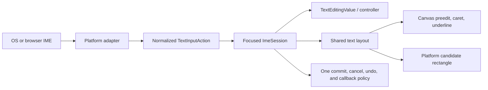

# IME composition plan

This plan makes Aimer's text-input path explicit and reliable across desktop,
web, iOS, and Android. Aimer should own the composition state, text editing
transactions, rendering, selection, undo behavior, and caret geometry. The
operating system or browser must still own the actual IME engine: candidate
lookup, dictionaries, language conversion, keyboard layouts, and candidate UI
are not practical to replace inside the framework.

The goal is therefore a deep framework module behind a small text-input
interface, with thin platform adapters at a clear seam. A platform adapter
translates native composition events; it must not decide how a widget stores,
renders, or commits text.

## Current state

The repository already has most of the necessary vocabulary, but the paths are
not yet one coherent protocol:

| Platform | Current ingress | What works | Remaining concern |
| --- | --- | --- | --- |
| Desktop | `winit::event::Ime::{Preedit, Commit}` in [`event_handler.rs`](../aimer_quiver/src/handler/event_handler.rs) | Preedit text is routed to the focused field, raw key strokes are suppressed during composition, and committed phrases can be inserted as one edit. | Preedit rendering/caret geometry is calculated separately from the normal text layout. Real macOS event ordering and candidate navigation are not covered by an integration test. |
| Web | Hidden browser input in [`platform.rs`](../crates/aimer_input/src/input_field/raw_fields/platform.rs) | Plain input and final `compositionend` text can reach the canvas. | `compositionstart`/`compositionupdate` are not forwarded, so live CJK preedit is not rendered. Committed text is synthesized as key events, which creates an avoidable second event protocol. |
| iOS | Mirrored `UITextView` in [`main.swift`](../jaime/builds/ios/Jaime/main.swift) | Revisioned text, selection, marked ranges, UTF-16 offsets, and native deltas are represented. | Device behavior, candidate anchoring, and startup/focus races need real-device coverage. |
| Android | Mirrored `EditText` / `InputConnection` in [`AimerActivity.kt`](../jaime/builds/android/app/src/main/kotlin/com/aimer/AimerActivity.kt) | Revisioned deltas, UTF-16 selection, composing spans, and editor synchronization are represented. | Device behavior, candidate anchoring, and template/runtime parity need verification. |

The framework event model already contains [`ImePreedit` and
`TextEditingDelta`](../crates/aimer_events/src/element.rs), and native ranges
are explicitly documented as UTF-16 ranges in
[`text_editing.rs`](../crates/aimer_events/src/text_editing.rs). The field
currently combines those paths in [`event.rs`](../crates/aimer_input/src/input_field/raw_fields/event.rs)
and stores a separate preedit presentation in
[`composition.rs`](../crates/aimer_input/src/input_field/raw_fields/composition.rs).

### Observed desktop symptoms

The supplied screenshots show the native IME is active: `こんにちは` and
`ni hao` are marked preedit text, and the second image shows the native pinyin
candidate strip. They do not by themselves prove that the final commit failed,
but they expose the fragile presentation boundary:

- the canvas-drawn preedit caret can appear visually separated from the glyphs;
- the candidate UI is positioned by the window server from a separately
  reported caret rectangle and can appear poorly aligned with the field;
- the field, the native IME, and the renderer do not currently share one
  explicit layout/transaction model.

The immediate code smell is that [`draw_preedit`](../crates/aimer_input/src/input_field/raw_fields/composition.rs)
uses the generic `measure_text` path for underline and caret advances while
the preedit glyphs are painted through a styled `RawTextWidget`. The normal
field caret and the IME caret rectangle use yet another geometry path in
[`layout.rs`](../crates/aimer_input/src/input_field/raw_fields/layout.rs). These
paths can disagree for font fallback, style, language, scaling, spacing, or
grapheme boundaries.

## Goals

- Show live preedit text for Chinese, Japanese, Korean, and dead-key/marked
  text composition on every supported platform.
- Keep the committed value, composing value, selection, undo stack, and change
  callbacks consistent regardless of the platform adapter.
- Use one canonical text layout for normal text, preedit text, the caret,
  selection geometry, and the platform candidate rectangle.
- Treat composition updates as provisional and commits as atomic edits.
- Handle candidate browsing, cursor movement inside preedit, cancellation,
  focus changes, scrolling, resizing, and composition in the middle of text.
- Make all event ordering and offset-unit conversions explicit and testable.
- Keep the public `TextField` API source-compatible unless a separate API
  change is intentionally approved.

## Non-goals

- Implementing a pinyin, Japanese, Korean, or other language-conversion engine
  inside Aimer.
- Replacing the OS/browser candidate window with a framework candidate UI.
- Treating raw key events as a complete substitute for IME events.
- Adding a large third-party text-input dependency before the platform seams
  and failure modes are understood.

## Design contract

### One composition lifecycle

The framework should model one lifecycle independently of the platform event
names:

```text
Focus gained
    -> activate text-input session with a snapshot
    -> zero or more preedit updates
    -> commit OR cancel
    -> focus lost / session invalidated
```

An empty preedit is not automatically a user cancellation. In particular,
`winit` documents an empty preedit immediately before a commit. The desktop
adapter must preserve the composition transaction until the following commit
is handled, or normalize that pair into one atomic commit action. A genuine
cancel comes from an explicit platform cancellation, IME disable, or focus
loss.

### Explicit units

Every interface must state its offset unit:

| Value | Unit | Conversion rule |
| --- | --- | --- |
| `winit` preedit cursor | UTF-8 byte offset | Validate the boundary before using it for slicing or geometry. |
| iOS / Android native ranges | UTF-16 code units | Convert through the existing checked UTF-16 adapter; reject offsets inside a surrogate pair. |
| Controller selection | Aimer grapheme offset / `TextEditingValue` range | Use Unicode grapheme boundaries for editing and cursor movement. |
| Canvas geometry | Logical pixels | Derive from the same shaped layout used to paint the glyphs. |

No adapter may silently reinterpret one unit as another. Debug assertions and
negative tests should make invalid conversions visible.

### Proposed deep module and seam

Introduce an internal composition module—tentatively `ImeSession`—behind a
small interface. The exact name can change during implementation, but the
responsibilities should remain centralized:

```rust
struct TextInputSnapshot {
    session_id: u64,
    revision: u64,
    value: TextEditingValue,
}

enum TextInputAction {
    Preedit {
        text: String,
        cursor: Option<(usize, usize)>, // UTF-8 byte range
    },
    Commit(String),
    NativeDelta(TextEditingDelta),
    Cancel,
}

trait TextInputBackend {
    fn activate(&mut self, snapshot: &TextInputSnapshot);
    fn update(&mut self, snapshot: &TextInputSnapshot);
    fn set_caret_area(&mut self, area: ImeCaretArea);
    fn deactivate(&mut self);
}
```

This is a design sketch, not a request to expose a new public trait. The
`TextInputBackend` seam is platform-facing; the `ImeSession` implementation
owns validation, lifecycle, composition origin, transaction grouping, and
rendering state. `RawTextField` should consume normalized actions rather than
branching on platform-specific behavior. Existing `ElementEvent` variants can
remain the event-tree transport while the normalization seam is introduced.

The interface must stay small. Callers should not need to know whether an
adapter uses `winit`, a hidden browser textarea, `UITextView`, or Android's
`InputConnection`. That gives the module depth and gives fixes locality: a
change to commit/cancel behavior should be made once and exercised through
all adapters.

### Canonical state ownership

`TextEditingValue` should be the source of truth for committed text,
selection, and the composing range. The separate `preedit_text` cell may be
retained temporarily as a presentation cache, but it must not become a second
editable value. Prefer deriving the visible preedit and its position from the
canonical composing range, with only platform-specific clause/cursor metadata
stored separately when required.

The session must retain the original value at composition start so that:

- each preedit update replaces the prior composing range without adding undo
  history;
- a commit replaces the original selection with one committed phrase and one
  undo entry;
- a cancellation restores the original selection and text;
- `on_changed` fires once for the committed edit, not once per preedit update;
- stale native deltas cannot mutate a field after focus or revision changes.

The application-level `ime_composing` flag should become a derived routing
state, not an independent source of truth. Raw key suppression must follow the
session phase and platform contract, not only whether the latest preedit string
is empty.

## Architecture



The platform adapter is allowed to deal with native lifecycle and FFI. It is
not allowed to implement its own text semantics. The field/session is allowed
to implement text semantics. It is not allowed to assume native offsets or
native event ordering without the adapter documenting the conversion.

## Implementation phases

### Phase 1 — Freeze the protocol and add safe diagnostics

- [ ] Write the lifecycle, offset-unit, revision, and callback rules as
      internal documentation next to the composition module.
- [ ] Record the actual desktop event sequence in a debug-only structured
      recorder. Do not log text content by default because IME input can be
      sensitive; log event kinds, lengths, cursor ranges, session IDs, and
      revisions.
- [ ] Capture representative macOS sequences for:
      - pinyin `ni hao` with candidate browsing and final selection;
      - Japanese hiragana conversion for `こんにちは`;
      - cursor movement within preedit;
      - escape/cancel and focus loss;
      - composition after selecting existing text;
      - composition in the middle of a string;
      - pointer movement outside the field while the field remains focused.
- [ ] Document the `winit` empty-preedit-before-commit ordering and decide where
      the pair is normalized into an atomic commit.
- [ ] Keep the current event path available while the new normalized path is
      introduced so each phase can be verified independently.

### Phase 2 — Build the platform-neutral `ImeSession`

- [ ] Add a focused internal module under `crates/aimer_input/src/input_field`
      for composition lifecycle and action normalization. Split it from
      layout and platform FFI responsibilities before any source file exceeds
      the repository's file-size limit.
- [ ] Define the smallest internal action/snapshot interface that can represent
      desktop preedit/commit and native revisioned deltas without exposing
      platform types to the field implementation.
- [ ] Centralize session creation, invalidation, revision checks, and focus
      ownership.
- [ ] Make commit/cancel behavior atomic and selection-aware, including an
      existing selection and a caret in the middle of text.
- [ ] Make composition updates history-free and ensure a final commit creates
      exactly one undo entry and one change notification.
- [ ] Reject stale session IDs, stale revisions, unmappable UTF-16 ranges,
      invalid UTF-8 boundaries, and events delivered after focus loss.
- [ ] Ensure a read-only or disabled field never adopts a composition.
- [ ] Keep the current focus-directed event routing: composition must reach the
      focused field even when the pointer is elsewhere.
- [ ] Add deterministic unit tests before changing each behavior:
      - preedit replacement;
      - cursor/active-clause updates with unchanged text;
      - commit after an empty preedit marker;
      - cancellation restoring selection;
      - focus loss invalidating in-flight input;
      - one callback and one undo entry;
      - stale and invalid native deltas.

### Phase 3 — Unify text layout and caret geometry

- [ ] Extract a shared interaction layout result for a text run. It should
      provide grapheme/byte mapping, shaped advances, line position, caret
      rectangle, and selection/underline spans.
- [ ] Make normal text, preedit text, selection, the drawn caret, and the
      platform candidate rectangle consume that same result.
- [ ] Measure and paint preedit with the exact `TextStyle` used by the field:
      font family, style, weight, size, language, transform, spacing, and
      fallback behavior must agree.
- [ ] Replace the generic measurement calls in `draw_preedit` with the shared
      styled layout or the styled measurement equivalent. Do not repair the
      screenshot by adding a fixed pixel offset.
- [ ] Map native byte ranges to safe grapheme boundaries for visual caret and
      clause drawing without changing the native range sent back to the IME.
- [ ] Derive `ImeCaretArea` from the same logical caret rectangle after scroll,
      padding, alignment, scale, and transforms are applied.
- [ ] Add pure geometry tests for Latin preedit, CJK ideographs, Japanese
      kana, combining marks, emoji clusters, font fallback, centered/right
      alignment, and a scrolled multiline field.
- [ ] Add a regression test that the preedit caret equals the final shaped
      advance used to paint the same preedit, within a documented floating-
      point tolerance.

### Phase 4 — Repair the desktop adapter

- [ ] Translate `winit::Ime` into normalized actions in one desktop adapter.
- [ ] Treat `Enabled` as session activation and stale-preedit cleanup, not as a
      second text model.
- [ ] Treat `Preedit` as an update of the canonical composition, including
      cursor/active-clause movement when the text itself is unchanged.
- [ ] Pair the documented empty-preedit marker with the following `Commit`, or
      otherwise preserve the composition origin until commit handling finishes.
- [ ] Treat `Disabled`, explicit cancellation, and focus loss as cancellation
      paths that restore the correct selection and clear the presentation.
- [ ] Suppress raw key events according to the session phase. Candidate
      navigation keys must not leak into the field as ordinary text or editing
      commands while the IME owns them.
- [ ] Keep multi-character commits as one framework action, one edit, one undo
      entry, and one callback.
- [ ] Update `set_ime_cursor_area` after every caret movement and relevant
      scroll/resize. Verify logical versus physical coordinates and DPI scaling
      against the rectangle actually painted by Aimer.
- [ ] Add deterministic desktop event-sequence tests for pinyin, Japanese
      conversion, candidate navigation, cancel, commit, selection replacement,
      and pointer movement away from the field.
- [ ] Add a manual macOS checklist because synthetic `winit` events cannot
      prove candidate-window behavior or native event ordering.

### Phase 5 — Make the web adapter an explicit composition adapter

- [ ] Keep a hidden editable element because browsers expose IME composition
      through an editable target; do not rely on raw canvas key events.
- [ ] Listen explicitly for `compositionstart`, `compositionupdate`, and
      `compositionend`.
- [ ] Forward live composition updates as normalized preedit actions so the
      canvas paints the provisional string and active clause.
- [ ] Forward the final commit once through the text-input protocol. Choose one
      authoritative event ordering and suppress duplicate `input` delivery
      rather than synthesizing keydown/keyup pairs for committed characters.
- [ ] Handle canceled compositions, empty `compositionend`, browser focus
      changes, and the hidden element's stale value.
- [ ] Synchronize the hidden element's value and selection from the canonical
      snapshot without resetting an active composition on every frame.
- [ ] Continue moving the hidden element to the shared caret rectangle, using
      viewport coordinates after page scroll and canvas transforms.
- [ ] Add browser-level tests for live pinyin preedit, candidate commit,
      Japanese composition, cancellation, duplicate-input suppression, and
      focus switching. If the repository has no browser harness, document the
      manual test page and add a small adapter-level event test first.

### Phase 6 — Normalize iOS and Android adapters

- [ ] Keep the native mirrored editor as an adapter, but make its only semantic
      output the normalized revisioned text-input action.
- [ ] Share the same session/revision rules as desktop and web; do not let the
      Swift or Kotlin editor become an independent source of truth.
- [ ] Verify marked/composing ranges across insertion, replacement, deletion,
      candidate selection, and `finishComposingText`.
- [ ] Verify UTF-16 conversion for CJK, surrogate pairs, combining marks, and
      emoji sequences.
- [ ] Apply the Aimer caret area to native input positioning where the platform
      allows it, or document the platform limitation when the candidate UI is
      owned by the OS.
- [ ] Resolve startup/focus races so the first focus request reliably installs
      and activates the native editor.
- [ ] Keep [`jaime/builds`](../jaime/builds) and the CLI templates behaviorally
      identical; add a parity check if the build system permits one.
- [ ] Add device tests for iOS and Android rather than treating cross-target
      compilation as proof of IME correctness.

### Phase 7 — Harden widget integration

- [ ] Ensure programmatic controller changes during composition either cancel
      and rebase the session or are explicitly adopted by it; stale preedit
      must never remain painted after the controller changes.
- [ ] Require focus for every composition action, including native deltas whose
      session ID happens to be zero or default-valued.
- [ ] Keep focus-directed routing independent of pointer hit testing.
- [ ] Ensure blur, disable, modal cancellation, and widget rebuild invalidate
      the native session and clear preedit presentation exactly once.
- [ ] Verify max-length, single-line newline handling, read-only fields, and
      selection replacement with both desktop and native action paths.
- [ ] Preserve input-language capture and ensure any language-specific font
      choice affects measurement and painting through the shared layout.

### Phase 8 — Verification and rollout

- [ ] Run focused unit tests for the session, text editing conversions, layout
      geometry, and each adapter.
- [ ] Run the `aimer_input` and `aimer_quiver` crate tests serially while
      investigating any parallel test-runner instability.
- [ ] Run wasm, iOS, and Android cross-target checks for the Rust crates.
- [ ] Run the desktop manual matrix on macOS with at least one Chinese pinyin
      input source and one Japanese input source.
- [ ] Run browser tests on at least one Chromium-based browser and one WebKit
      browser if the web target is supported.
- [ ] Run iOS and Android device tests with hardware keyboards disabled and
      software IMEs active.
- [ ] Capture before/after screenshots for:
      - Japanese marked text with an active clause;
      - pinyin before candidate selection;
      - a committed phrase;
      - composition in the middle of existing text;
      - a scrolled field with the candidate window visible.
- [ ] Confirm no duplicate text, no lost text, no ghost preedit, no cursor jump,
      no stale-field mutation, and no callback/undo duplication.

## Acceptance matrix

| Scenario | Expected committed value | Expected composition state | Expected side effects |
| --- | --- | --- | --- |
| Empty field, pinyin `ni hao` before selection | Empty | Preedit visible, underlined, caret aligned to its shaped end | No change callback and no undo entry |
| Select `你好` candidate | `你好` | Composition cleared atomically | One change callback and one undo entry |
| Japanese `こんにちは` while converting | Prior committed value | Marked kana visible with active clause/cursor | No committed-value callback yet |
| Cancel with escape or IME disable | Original value | Composition cleared; original selection restored | No committed edit callback |
| Composition over selected text | Original value until commit | Preedit replaces the selection visually | Commit replaces selection once |
| Composition in the middle of text | Original prefix/suffix retained | Preedit appears at the correct caret position | Commit preserves both sides |
| Pointer leaves focused field | Unchanged | Composition continues in focused field | No event loss or retargeting |
| Stale native delta after blur/rebuild | Unchanged | No composition | Delta rejected and cannot mutate the field |
| CJK plus emoji/combining marks | Exact Unicode text | Caret and clauses stay on valid grapheme boundaries | No surrogate or cluster corruption |

## Risks and decisions to preserve

- The OS/browser remains authoritative for candidate conversion. Aimer can
  provide a reliable rendering and editing surface, but it cannot guarantee
  identical candidate UI or event ordering on every IME.
- Candidate-window placement is controlled by the platform. The framework can
  provide an accurate caret rectangle and test it, but should not draw a second
  candidate bar as a workaround.
- Text-input traces must avoid logging user-entered strings by default.
- The implementation must preserve unrelated work in this dirty repository;
  changes should be limited to the IME modules, their platform templates, tests,
  and this plan.
- Do not solve a geometry mismatch with a constant pixel adjustment. If the
  glyphs, caret, underline, and candidate rectangle disagree, repair the
  shared layout or the coordinate conversion at the seam.
- Do not claim device/browser support from Rust compilation alone. Cross-target
  checks prove that the adapter builds; only platform integration tests prove
  that the IME lifecycle works.

## Definition of done

The work is complete when the same normalized composition contract drives all
four platform adapters, the field has one canonical composing value, the
preedit/caret/candidate geometry comes from one text layout, and the acceptance
matrix passes on real desktop, browser, iOS, and Android environments. The
Japanese and pinyin screenshots should then show a preedit that is visually
anchored to Aimer's caret, and committing or canceling it should leave exactly
the expected text, selection, callback count, and undo history.
