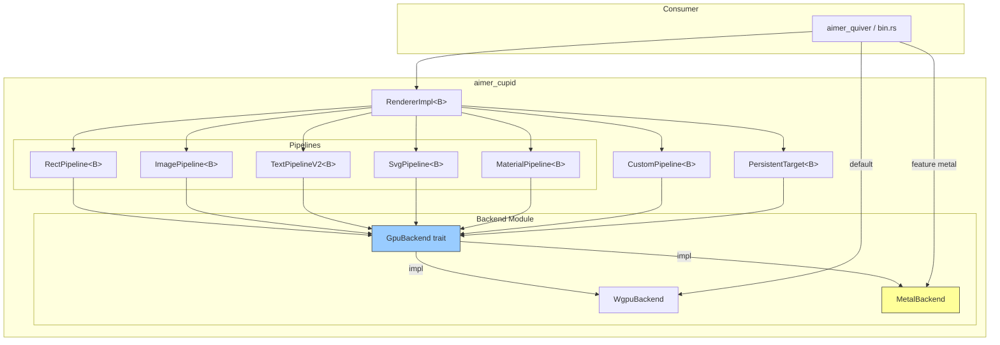

# Requirements

### Overview & Goals

Make `aimer_cupid`'s GPU backend **pluggable** behind an experimental feature flag, with wgpu as the default backend and a native Metal backend as the first alternative.

**Goals:**
- Define a `GpuBackend` trait that abstracts all GPU operations (device, queue, resources, render pass encoding, submission)
- Provide a `WgpuBackend` adapter that delegates to wgpu — the default, zero-cost when selected
- Provide a `MetalBackend` adapter using `objc2-metal` with pre-compiled MSL shaders
- Keep the existing wgpu direct path unchanged when neither flag is enabled
- Maintain backward compatibility via type aliases

### Scope

**In Scope:**
- `backend/` module with `GpuBackend` trait and associated type hierarchy (behind `pluggable-backend-exp`)
- `WgpuBackend` adapter implementing the trait for all wgpu operations (behind `pluggable-backend-exp`)
- `MetalBackend` adapter implementing the trait via `objc2-metal` (behind `metal` feature)
- Generic `RendererImpl<B: GpuBackend>` with `Renderer` type alias for backward compat
- All 6 pipelines generic over `B`: `RectPipeline`, `ImagePipeline`, `TextPipelineV2`, `SvgPipeline`, `FrameCompositePipeline`, `MaterialPipeline`
- `CustomPipeline` trait generic over `B`
- `PersistentTarget`, `FrameUpload` generic over `B`
- `RenderContext` generic over `B`
- MSL shaders for rect pipeline as Metal proof-of-concept
- `GpuContext` split: wgpu-specific version (default) vs backend-agnostic surface management

**Out of Scope:**
- Removing wgpu as a dependency (wgpu remains the default, always available)
- WASM/WebGPU Metal backend
- Vulkan, DirectX, or OpenGL backends
- Runtime backend switching (compile-time selection only)
- Full MSL port of all shaders (only rect pipeline as POC; remaining WGSL shaders ported later)
- Performance optimization of the Metal path

### Non-Functional Requirements

- The non-flag path must produce identical code (zero overhead when `pluggable-backend-exp` is off)
- The generic path must not regress wgpu renderer performance when the default `WgpuBackend` is used
- The `metal` feature must only compile on `target_os = "macos"` or `target_os = "ios"`

# Technical Design

### Current Implementation

The entire rendering pipeline is hard-wired to wgpu types (`wgpu::Device`, `wgpu::Queue`, `wgpu::RenderPass`, etc.) across **15+ source files** (~12,330 lines). There is no abstraction layer between the pipelines and the GPU API:

- `gpu_context.rs` (384 lines) — wraps `wgpu::Device`, `wgpu::Queue`, `wgpu::Surface`
- `renderer.rs` (2,828 lines) — orchestration, takes `&wgpu::Device`, `&wgpu::Queue`, `&wgpu::TextureView`
- `custom_pipeline.rs` (174 lines) — `trait CustomPipeline { fn render(&self, pass: &mut wgpu::RenderPass); }`
- 6 pipeline files (~4,200 lines) — each owns wgpu resources and calls wgpu directly
- `persistent_target.rs` (323 lines) — `wgpu::Texture`, `wgpu::TextureView`
- `frame_upload.rs` — `wgpu::Buffer` upload dedup
- 10 WGSL shader files consumed by wgpu pipeline creation

Consumers (`aimer_quiver/src/render_ctx/wgpu_ctx.rs`, `bin.rs`, tests in `lib.rs`) pass wgpu types directly.

### Key Decisions

**Decision 1: Full device abstraction (user-approved)**
The `GpuBackend` trait abstracts **every GPU operation** — resource creation, data upload, command encoding, render pass ops, and submission. This gives the cleanest seam and maximum leverage for future backends.

**Decision 2: All-at-once migration behind feature flag (user-approved)**
The entire `Renderer` + all pipelines become generic in one change, gated by `pluggable-backend-exp`. Backward-compatible type aliases prevent consumer breakage.

**Decision 3: Generic (compile-time) dispatch via type parameter**
`RendererImpl<B: GpuBackend = WgpuBackend>` with a default type parameter. No `Box<dyn>` overhead — the concrete backend is known at compile time.

**Decision 4: Parallel wgpu-only path when flag is off**
When `pluggable-backend-exp` is disabled, the code compiles to the current wgpu-only path (unchanged). This avoids regressions and keeps the experimental feature clearly scoped.

**Decision 5: Separate surface/context creation per backend**
`GpuContext` is split: a wgpu-specific path (current code, used when flag is off) and a backend-generic path (when flag is on) that works with `WgpuBackend` or `MetalBackend`.

### Proposed Changes

#### Module Structure

```
aimer_cupid/src/
├── backend/
│   ├── mod.rs              # GpuBackend trait + associated type traits
│   ├── wgpu.rs             # WgpuBackend impl (behind pluggable-backend-exp)
│   └── metal.rs            # MetalBackend impl (behind cfg(feature = "metal"))
├── renderer.rs              # RendererImpl<B: GpuBackend = WgpuBackend>
├── pipeline/
│   ├── rect_pipeline.rs     # RectPipeline<B: GpuBackend>
│   ├── image_pipeline.rs    # ImagePipeline<B: GpuBackend>
│   ├── svg_pipeline.rs      # SvgPipeline<B: GpuBackend>
│   ├── text_pipeline.rs     # TextPipelineV2<B: GpuBackend>
│   ├── frame_composite.rs   # FrameCompositePipeline<B: GpuBackend>
│   ├── material/
│   │   └── render.rs        # MaterialPipeline<B: GpuBackend>
│   ├── frame_upload.rs      # FrameUpload (already mostly backend-agnostic data)
│   └── ...
├── custom_pipeline.rs       # CustomPipeline<B: GpuBackend>
├── persistent_target.rs     # PersistentTarget<B: GpuBackend>
├── gpu_context.rs           # Current wgpu-specific (unchanged when flag off)
└── lib.rs
```

#### Trait Architecture

```
GpuBackend (main entry point — device + queue)
  │
  ├── associated types: Buffer, Texture, TextureView, BindGroup,
  │                     BindGroupLayout, PipelineLayout, RenderPipeline,
  │                     Sampler, ShaderModule, CommandEncoder, RenderPass,
  │                     TextureFormat, SurfaceStatus
  │
  ├── resource creation: create_buffer, create_texture, create_sampler,
  │                       create_shader_module, create_bind_group_layout,
  │                       create_pipeline_layout, create_render_pipeline,
  │                       create_bind_group
  │
  ├── data upload: write_buffer, write_texture
  │
  ├── command encoding: create_command_encoder
  │
  ├── render pass: begin_render_pass (returns RenderPass)
  │
  └── submission: submit, (surface management in separate trait)

GpuRenderPass<B: GpuBackend>
  ├── set_pipeline(&mut self, &B::RenderPipeline)
  ├── set_bind_group(&mut self, u32, &B::BindGroup, &[u32])
  ├── set_vertex_buffer(&mut self, u32, &B::Buffer, u64)
  ├── set_index_buffer(&mut self, &B::Buffer, ...)
  ├── set_scissor_rect(&mut self, u32, u32, u32, u32)
  └── draw(&mut self, Range<u32>, Range<u32>)
```

#### Core Trait Signatures

```rust
// backend/mod.rs
pub trait GpuBackend: Sized + 'static {
    type Buffer: GpuBufferOps;
    type Texture: GpuTextureOps;
    type TextureView: GpuTextureViewOps;
    type BindGroupLayout;
    type BindGroup;
    type PipelineLayout;
    type RenderPipeline;
    type Sampler;
    type ShaderModule;
    type TextureFormat: Copy + Eq + Send + Sync;

    fn create_shader_module(&self, source: &[u8], label: &str) -> Self::ShaderModule;
    fn create_buffer(&self, size: u64, usage: u32, label: &str) -> Self::Buffer;
    fn write_buffer(&self, buffer: &Self::Buffer, offset: u64, data: &[u8]);
    fn create_bind_group_layout(&self, entries: &[BindGroupLayoutEntry]) -> Self::BindGroupLayout;
    fn create_pipeline_layout(&self, layouts: &[&Self::BindGroupLayout]) -> Self::PipelineLayout;
    fn create_render_pipeline(&self, desc: &RenderPipelineDescriptor<Self>) -> Self::RenderPipeline;
    fn create_bind_group(&self, layout: &Self::BindGroupLayout, entries: &[BindGroupEntry<Self>]) -> Self::BindGroup;
    fn create_command_encoder(&self, label: &str) -> Self::CommandEncoder;
    fn begin_render_pass(&self, encoder: &mut Self::CommandEncoder, desc: &RenderPassDescriptor<Self>) -> Self::RenderPass<'_>;
    fn submit(&self, encoder: Self::CommandEncoder);
    fn limits(&self) -> GpuLimits;
}
```

#### Renderer Type Aliases

```rust
// When feature is OFF — exact current code, no change
#[cfg(not(feature = "pluggable-backend-exp"))]
pub type Renderer = RendererImpl<backend::wgpu::WgpuBackend>;

// When feature is ON — generic with default
#[cfg(feature = "pluggable-backend-exp")]
pub type Renderer<B = backend::wgpu::WgpuBackend> = RendererImpl<B>;
```

#### Feature Flag Wiring

```toml

# aimer_cupid/Cargo.toml

[features]
default = ["apple-core-text"]
pluggable-backend-exp = ["dep:wgpu"]  # Requires wgpu for WgpuBackend adapter
metal = ["pluggable-backend-exp", "dep:objc2-metal"]

[dependencies]
wgpu = { workspace = true, optional = true }   # ← becomes optional

[target.'cfg(any(target_os = "macos", target_os = "ios"))'.dependencies]
objc2-metal = { ... optional = true }  # Added dep
```

#### WgpuBackend Adapter Pattern

```rust
// backend/wgpu.rs
pub struct WgpuBackend {
    pub device: wgpu::Device,
    pub queue: wgpu::Queue,
}

impl GpuBackend for WgpuBackend {
    type Buffer = wgpu::Buffer;
    type Texture = wgpu::Texture;
    // ... all types map directly to wgpu types

    fn create_buffer(&self, size: u64, usage: u32, label: &str) -> wgpu::Buffer {
        // Map our flags to wgpu::BufferUsages
        self.device.create_buffer(&wgpu::BufferDescriptor {
            size,
            usage: wgpu::BufferUsages::from_bits_truncate(usage),
            label: Some(label),
            mapped_at_creation: false,
        })
    }
    // ...
}
```

#### MetalBackend (initial scope: rect pipeline only)

```rust
// backend/metal.rs — behind #[cfg(feature = "metal")]
pub struct MetalBackend {
    device: metal::Device,
    queue: metal::CommandQueue,
    format: MTLPixelFormat,
}

impl GpuBackend for MetalBackend {
    type Buffer = metal::Buffer;
    type Texture = metal::Texture;
    // ...
    
    fn create_shader_module(&self, source: &[u8], label: &str) -> metal::Library {
        // Compile MSL source at runtime via Metal's runtime compilation
        self.device.new_library_with_source(
            std::str::from_utf8(source).unwrap(),
            &metal::CompileOptions::new(),
        ).unwrap()
    }
    // ...
}
```

### Data Models / Contracts

**Shader source abstraction:**
- For `WgpuBackend`: WGSL source bytes → `wgpu::ShaderModule` via naga
- For `MetalBackend`: MSL source bytes → `metal::Library` via Metal runtime compilation
- Each pipeline embeds its shader source with `include_str!` as before; the backend interprets the bytes

**Bind group model:**
`BindGroupEntry` and `BindGroupLayoutEntry` are defined as simple enums/structs in `backend/mod.rs` that each backend converts to its native representation:

```rust
pub enum BindingResource<'a, B: GpuBackend> {
    Buffer(&'a B::Buffer, u64, u64),     // buffer, offset, size
    TextureView(&'a B::TextureView),
    Sampler(&'a B::Sampler),
}
```

### Components

| Component | Before | After | Lines Affected |
|-----------|--------|-------|----------------|
| **backend/mod.rs** | (new) | `GpuBackend` trait + associated types | +~200 |
| **backend/wgpu.rs** | (new) | `WgpuBackend` adapter | +~300 |
| **backend/metal.rs** | (new) | `MetalBackend` adapter | +~500 (POC) |
| **renderer.rs** | wgpu types directly | `RendererImpl<B: GpuBackend>` | ~2,828 |
| **rect_pipeline.rs** | wgpu types directly | `RectPipeline<B: GpuBackend>` | ~383 |
| **image_pipeline.rs** | wgpu types directly | `ImagePipeline<B: GpuBackend>` | ~1,091 |
| **text_pipeline.rs** | wgpu types directly | `TextPipelineV2<B: GpuBackend>` | ~3,122 |
| **svg_pipeline.rs** | wgpu types directly | `SvgPipeline<B: GpuBackend>` | ~643 |
| **frame_composite.rs** | wgpu types directly | `FrameCompositePipeline<B: GpuBackend>` | ~111 |
| **material/render.rs** | wgpu types directly | `MaterialPipeline<B: GpuBackend>` | ~682 |
| **custom_pipeline.rs** | `&mut wgpu::RenderPass` | `&mut B::RenderPass<'_>` | ~174 |
| **persistent_target.rs** | `wgpu::Texture` | `B::Texture` + `B::TextureView` | ~323 |
| **frame_upload.rs** | `wgpu::Buffer` | `B::Buffer` | ~254 |
| **gpu_context.rs** | wgpu-specific | Split: wgpu-path + generic surface | ~385 |
| **pipeline.rs** | `wgpu::MultisampleState` | Backend-agnostic | ~70 |
| **lib.rs** | wgpu re-exports | Conditional re-exports | ~1,148 |
| **Cargo.toml** | wgpu required | wgpu optional | ~104 |

### Architecture Diagram



### Risks

| Risk | Impact | Mitigation |
|------|--------|------------|
| Lifetime complexity of `RenderPass` borrowing | Trait design may require GATs | Use lifetime on `GpuBackend::RenderPass<'a>`; wgpu already uses this pattern |
| Dual path maintenance (flag on/off) | Two code paths to maintain | Keep non-flag path minimal — only used until `pluggable-backend-exp` stabilizes |
| Metal backend completeness | Only rect pipeline initially | Clearly document as experimental POC; remaining pipelines ported incrementally |
| Pipeline cache trait abstraction | Backend-specific | Only expose cache operations that exist in both backends; fallback for Metal |
| `CustomPipeline` downstream breakage | API signature changes | Provide `CustomPipeline<WgpuBackend>` type alias for existing users |

# Testing

### Validation Approach

All validation is behind feature flags. The existing test suite runs unchanged when no flag is enabled.

### Key Scenarios

1. **Default path (no flags)** — all existing tests pass identically to current code
2. **`pluggable-backend-exp` enabled, default WgpuBackend** — all existing tests pass through the generic path (pixel-level regression tests in `deferred_frame_uploads`, `resized_text_preparation`, `scrolled_text_culling`)
3. **`metal` enabled on macOS** — Metal backend initializes and renders a rect correctly

### Test Changes

- Existing tests in `lib.rs` remain unchanged for the non-flag path
- When `pluggable-backend-exp` is on, test `gpu()` helpers must use `WgpuBackend`-based initialization
- Metal backend needs platform-gated integration tests: `#[cfg(all(feature = "metal", target_os = "macos"))]`

### Edge Cases

- `pluggable-backend-exp` without wgpu as a dependency (wgpu feature must be required)
- Metal backend on non-macOS platforms (compile error, as intended)
- Pipeline cache — `WgpuBackend` preserves it, `MetalBackend` returns `None`

# Delivery Steps

### ✓ Step 1: Backend trait layer + WgpuBackend adapter
The `backend/` module is created with the `GpuBackend` trait and all associated type traits, plus the `WgpuBackend` adapter implementation that wraps `wgpu::Device` and `wgpu::Queue`.

- Create `aimer_cupid/src/backend/mod.rs`:
  - Define `GpuBackend` trait with associated types: `Buffer`, `Texture`, `TextureView`, `BindGroupLayout`, `BindGroup`, `PipelineLayout`, `RenderPipeline`, `Sampler`, `ShaderModule`, `TextureFormat`
  - Define `GpuRenderPass<B: GpuBackend>` trait with `set_pipeline`, `set_bind_group`, `set_vertex_buffer`, `set_scissor_rect`, `draw`
  - Define helper types: `BindGroupLayoutEntry`, `BindGroupEntry`, `BindingResource`, `RenderPipelineDescriptor`, `RenderPassDescriptor`, `BufferDescriptor`, `GpuLimits` — as simple enums/structs that each backend maps to native types
  - The module is gated by `#[cfg(feature = "pluggable-backend-exp")]`

- Create `aimer_cupid/src/backend/wgpu.rs`:
  - `WgpuBackend` struct holding `wgpu::Device` + `wgpu::Queue`
  - `impl GpuBackend for WgpuBackend` — map each trait method to the corresponding wgpu call
  - Conversions from our simple descriptors to wgpu descriptor types

- Update `aimer_cupid/Cargo.toml`:
  - Make `wgpu` optional: `wgpu = { workspace = true, optional = true }`
  - Add `pluggable-backend-exp = ["dep:wgpu"]` feature
  - Add `metal` feature (wires to nothing yet, just declared)

- Update `aimer_cupid/src/lib.rs`:
  - Export `pub mod backend;` behind `#[cfg(feature = "pluggable-backend-exp")]`

This stage has no functional changes — the existing wgpu-only path is completely unchanged.

### * Step 2: Port Renderer and all pipelines to generic backend
The `Renderer` struct and all 6 pipelines become generic over `B: GpuBackend`, gated behind `pluggable-backend-exp`. Backward-compatible type aliases keep consumers working.

- Modify `RectPipeline<B: GpuBackend>` in `rect_pipeline.rs`:
  - Replace all `wgpu::*` types with `B::*` associated types
  - `new()` takes `&B` instead of `&wgpu::Device`, and backend-agnostic descriptor structs
  - `begin_frame()` takes `&B` instead of device+queue
  - `flush()` takes `&mut B::RenderPass<'_>` instead of `&mut wgpu::RenderPass`
  - `flush_clear()` same pattern

- Modify `ImagePipeline<B: GpuBackend>` in `image_pipeline.rs`:
  - Same pattern: wgpu types → `B::*`
  - `upload_image()` uses `B::write_texture()` instead of `queue.write_texture()`

- Modify `TextPipelineV2<B: GpuBackend>` in `text_pipeline.rs`:
  - Same wgpu→B::* replacement
  - `GlyphAtlas` becomes generic over B internally

- Modify `SvgPipeline<B: GpuBackend>` in `svg_pipeline.rs` — same pattern

- Modify `FrameCompositePipeline<B: GpuBackend>` in `frame_composite.rs` — same pattern

- Modify `MaterialPipeline<B: GpuBackend>` in `material/render.rs` — same pattern

- Modify `RendererImpl<B: GpuBackend>` in `renderer.rs`:
  - All wgpu types → `B::*`
  - `new()` takes `&B` and `B::TextureFormat`
  - `render()`, `render_impl()` use backend-agnostic descriptors
  - Provide `pub type Renderer = RendererImpl<WgpuBackend>` for backward compat
  - The non-flag path (`#[cfg(not(feature = "pluggable-backend-exp"))]`) keeps the current concrete type alias

- Modify `CustomPipeline<B>` trait in `custom_pipeline.rs`:
  - `render()` takes `&mut B::RenderPass<'_>`
  - `capture_backdrop()` takes `&mut B::CommandEncoder`
  - `RenderContext<B>` uses `B::*` types
  - Provide backward-compat `type alias` for existing consumers

- Modify `PersistentTarget<B>` in `persistent_target.rs` — `B::Texture`, `B::TextureView`

- Modify `frame_upload.rs` — `FrameUpload<B>` or use backend-agnostic upload tracking

- Modify `gpu_context.rs`:
  - When `pluggable-backend-exp` is on, provide `WgpuBackend`-based context as a new path
  - Keep the existing wgpu-specific path when flag is off

- Update `aimer_cupid/src/lib.rs` — conditional re-exports for `Renderer`, `CustomPipeline`, `GpuBackend`, etc.

- Existing tests in `lib.rs` gain a second variant behind `#[cfg(feature = "pluggable-backend-exp")]` that exercises the generic `Renderer` path through `WgpuBackend`

- The non-flag path (default) remains identical and compiles unchanged.

###   Step 3: Metal backend implementation
Implement `MetalBackend` behind the `metal` feature flag, with rect pipeline rendering as proof of concept.

- Create `aimer_cupid/src/backend/metal.rs`:
  - `MetalBackend` struct holding `metal::Device`, `metal::CommandQueue`, format info
  - `impl GpuBackend for MetalBackend`:
    - `create_shader_module()` — compile MSL via `device.new_library_with_source()`
    - `create_buffer()` — `device.new_buffer()`
    - `create_bind_group_layout()` — map to Metal argument buffer or manual binding
    - `create_render_pipeline()` — `device.new_render_pipeline_state()` with `MTLRenderPipelineDescriptor`
    - `create_command_encoder()` — `queue.new_command_buffer()`
    - `begin_render_pass()` — `cmd_buffer.new_render_command_encoder()`
    - `submit()` — `cmd_buffer.commit()` + `waitUntilCompleted`
  - Surface management: `CAMetalLayer` integration for getting drawables

- Add MSL shader for rect pipeline:
  - Create `pipeline/shaders/rect.metal` — MSL equivalent of `rect.wgsl`
  - Both shaders coexist; `RectPipeline` selects the right one based on backend type
  - The shader covers: vertex transform, SDF rounded-rect, shadows, borders, clipping

- Update `Cargo.toml`:
  - `metal = ["pluggable-backend-exp", "dep:objc2-metal"]` or `metal-rs`
  - Add `objc2-metal` dependency behind the feature flag
  - The `metal` feature implies `pluggable-backend-exp`

- Add integration test: `#[cfg(all(feature = "metal", target_os = "macos"))]` that creates a `MetalBackend`, initializes a `RendererImpl<MetalBackend>`, renders a single rect, and validates pixels via CPU readback

- The Metal backends `create_render_pipeline` for the rect pipeline creates the PSO with the MSL shader, vertex descriptor matching `RectInstance::ATTRIBS`, and appropriate blend state