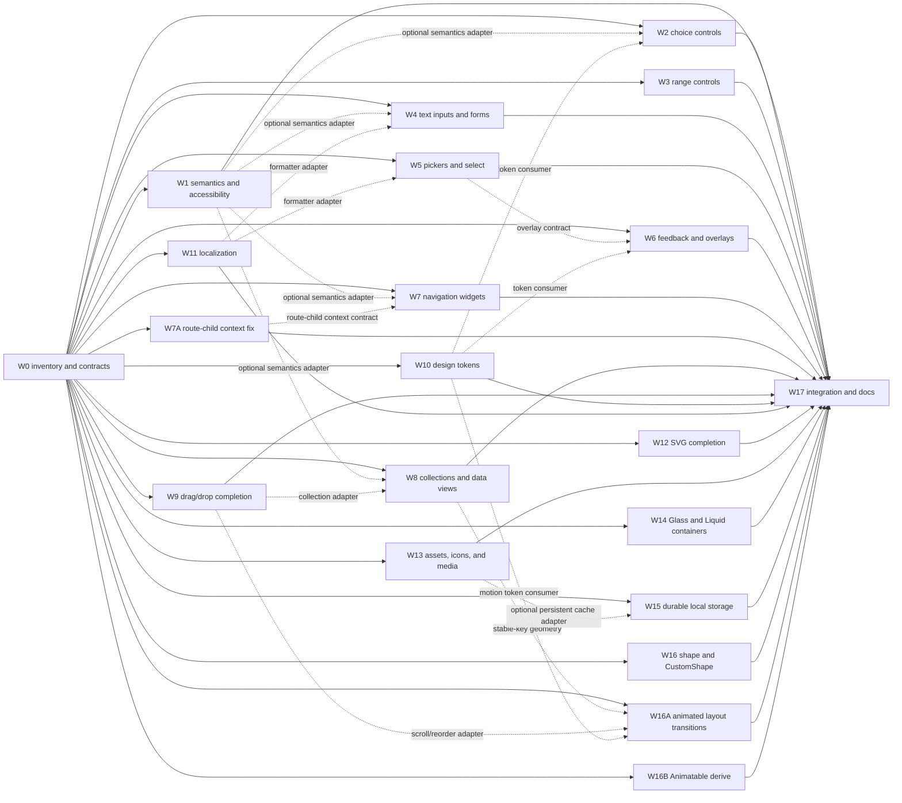

# Widget and feature delivery plan

> This is the implementation backlog for missing or incomplete public widgets
> and framework features. It is organized as independent work packages so
> several agents can implement packages in parallel and integrate them without
> sharing mutable design decisions.

The status in this document is an implementation plan, not a promise that a
type exists merely because a similarly named item appears in an older README.
The first work package reconciles the public exports, source, tests, and docs.

## Scope

This plan covers:

- first-class controls and input types;
- forms, validation, feedback, overlays, and navigation widgets;
- collection and data-display widgets;
- drag-and-drop completion;
- accessibility semantics and platform adapters;
- localization, design tokens, asset lifecycle, media adapters, durable
  storage, derived animation values, custom vector shapes, responsive layout
  transitions, and SVG completion;
- route-child context ownership and `Shell`/`Outlet` composition correctness;
- public API documentation, examples, tests, and integration.

The following are explicitly excluded from this plan:

- Inspector, inspector servers, visual tree inspection, and related devtools;
- hot-reload implementation, optimization, transport, or reload-specific
  protocol work.

Those areas must not be added as dependencies, acceptance criteria, or hidden
follow-up work for any package below.

## Status vocabulary

- **Implemented** — a public API and production path are present and covered
  well enough to be used as a dependency.
- **Partial** — a primitive exists, but an important user-facing capability or
  platform behavior is missing.
- **Missing** — no public, supported implementation was found.
- **Audit** — repository documents and source disagree; resolve the status
  before implementing a replacement.

## Current baseline

The framework already has a useful core. New work should deepen these seams
instead of introducing parallel versions of existing primitives.

| Area | Current baseline | Missing or incomplete surface |
| --- | --- | --- |
| Layout | Containers, flex, grid, stack, alignment, scrolling, and `FlexList` | Grouped/sticky collections, table/tree views, and reorderable collections |
| Layout animation | `AnimatedBuilder`, animated themes, and paint/transition helpers | Layout-aware transitions for Flex, `Expanded`, wrapping, responsive shells, and keyed `FlexList` changes |
| Animation values | `Animatable` primitives, `Tween`, and keyframe interpolation | Derived field-wise interpolation for user-defined structs and explicit enum policies |
| Text | `Text`, `RichText`, selection, text styling, shaping, and bidi layout | Public localization/formatting APIs, text-scaling policy, and richer text input types |
| Input | `Button`, `TextButton`, `GestureDetector`, `MouseRegion`, `TextField`, and `TextArea` | Checkbox, switch, radio, slider, select, pickers, forms, validation, and the remaining input types |
| Overlays | Modal, floating/anchored content, context menu, and focus trapping | Tooltip, snackbar/toast, progress/spinner, and reusable presentation policy |
| Drag and drop | Draggable, drag targets, drop zones, and drag overlay | Auto-scroll, reorderable lists, browser file drops, and a documented multi-pointer policy |
| Routing | Navigator, named/query routes, redirects/guards, `Shell`, `Outlet`, and stateful shells | Tab/navigation widgets, route-aware navigation chrome, and direct route-child context composition |
| Route composition | `Shell` injects an `OutletSlot`; route transitions can build an `AnyWidget` child | Direct route children must retain app-wide providers; `Outlet` scope must remain explicit and diagnostic |
| Focus | Focus nodes, focus manager, `Focusable`, and `FocusScope` | Semantic roles, platform accessibility tree, announcements, preference handling, and accessibility validation |
| Assets | Raster images, network images, fonts, SVG, and Markdown behind features | Asset registry/lifecycle, bounded cache policy, icon system, media/platform adapters, and the deferred SVG feature set |
| Vector drawing | SVG path commands and Cupid tessellation exist behind SVG | Public `aimer_shape` geometry, `CustomShape`, fill/stroke, clipping, and shape hit testing |
| Surface materials | Solid colors, borders, shadows, clipping, and opacity | GPU-native `Glass`, `Liquid`, and bounded backdrop-effect containers with backdrop sampling, blur, distortion, inversion, and material highlights |
| Storage | No public durable application storage; only process-local resource caches and internal runtime storage | Async durable key/value storage, migrations, quotas, and native/web adapters |
| Styling | `ThemeData`, animated themes, and six core color roles | Component tokens for typography, spacing, shape, elevation, density, states, and contrast |
| Localization | Unicode bidi support in text layout | Locale, plural, number/date/time formatting, translation lookup, and RTL policy |

### Baseline facts to preserve

- `FlexList` already provides lazy/windowed materialization. A new
  `ListView` must either be a deliberate façade over it or explain why a new
  layout primitive is necessary.
- Focus plumbing already exists. Accessibility work must add semantics and
  platform integration rather than replace `FocusNode`, `FocusManager`, or
  `FocusScope`.
- Swipe events are present in the gesture implementation even though an older
  README checklist calls them missing. Do not implement a second swipe path.
- The README describes Dropdown/Select as complete, while the public source
  inventory still needs to prove that a supported public type and tests exist.
  Treat this as **Audit**, not as permission to duplicate an unknown widget.
- `InputType` currently covers only the existing text/number/obscure behavior;
  number selection alone is not validation.
- The SVG renderer intentionally supports a smaller feature set than the SVG
  format. Deferred gradients, masks, fit policies, filters, text, and related
  behavior belong to the SVG package below.

## W0 audit record

**Audit date:** 2026-08-27<br>
**Audit branch:** `zodiac-widget-and-features` at `9cf2d707`<br>
**Audit rule:** a README or older guide entry is not evidence of a supported
public type; source exports, tests, and the current crate boundary are the
source of truth.

The clean worktree intentionally starts at the branch commit. Uncommitted
changes in the original `main` worktree remain there and are not part of this
inventory.

### Status and ownership findings

| Area/package | Status | Evidence and W0 decision |
| --- | --- | --- |
| Core widgets, containers, layout, scrolling, text, and selection | Implemented | `aimer_widget`, `aimer_container`, `aimer_flex`, `aimer_scroll`, and `aimer_text` expose the existing retained widget seams. `FlexList` remains the collection baseline. |
| Basic input and gestures | Partial | `aimer_input` provides `Button`, `GestureDetector`, `MouseRegion`, `TextField`, `TextArea`, IME/selection, and swipe recognition. `InputType` currently has only `Text`, `Number`, and `Obscure`; `Number` remains an input hint, not validation. |
| Swipe | Implemented | `SwipeDirection`, `on_swipe`, and deterministic recognizer/handler tests already exist under `aimer_input`. The older README checkbox is stale; no second swipe path is planned. |
| Choice controls (except the unresolved README claim) | Missing | No public `Checkbox`, `Switch`, `Radio`, `RadioGroup`, or autocomplete control was found. W2 owns a new `aimer_selection` module/crate. |
| `DropdownMenu` / `Select` | Audit | README marks this complete, but the public source inventory has no supported type or tests. W0 freezes `Select` as the canonical single-choice widget; `Dropdown`/`DropdownMenu` describe presentation and do not create a duplicate control. |
| Range controls | Missing | No public `Slider` or `RangeSlider` was found. W3 owns `aimer_range`; `RangeSlider` remains optional until its distinct value model is tested. |
| Forms, pickers, feedback, navigation UI, collections, and accessibility | Missing | No supported public family was found for these areas. W4–W8 own the proposed modules; existing modal/focus/router primitives are consumed rather than replaced. |
| Overlay primitives | Implemented | `aimer_modal` exposes `Modal`, `Floating`, `Anchor`, placement, focus-trap, and host/layer primitives. W6 extends this host for feedback; no global popup singleton is allowed. |
| Drag and drop | Partial | `aimer_dnd` exposes typed draggable/target/drop-zone/file-drop primitives and Jaime examples. Auto-scroll, reorderable collections, browser file drops, and the alternate-input policy remain W9 work. |
| Routing and route composition | Partial | Named/query routes, redirects, `Shell`, `Outlet`, and stateful branch stacks exist and pass the current router tests. Direct route-child provider ownership remains unresolved and is exclusively W7A work. |
| Styling and animation values | Partial | `ThemeData`, `AnimatedTheme`, controllers, curves, `Tween`, and `Animatable` exist. Component tokens, layout transitions, and derived `Animatable` values are not present; W10, W16A, and W16B own those extensions. |
| Assets and SVG | Partial | Raster/network images, fonts, and an SVG model/renderer exist behind the current asset/SVG seams. Asset lifecycle/cache/icon/media adapters and deferred SVG features remain W12/W13 work. |
| Glass/Liquid materials, durable storage, and shape geometry | Missing | No public `Glass`, `Liquid`, durable application storage, `aimer_shape`, or `CustomShape` implementation was found. W14–W16 own these seams. |
| Jaime showcase/integration | Partial | The clean branch has feature-local example modules and a commented launcher in `jaime/src/main.rs`, but no central showcase/index. W17 owns shared registration and manifest/export edits. |

### Frozen W0 contracts

- Choice-control names are `Checkbox`, `Switch`, `Radio`, `RadioGroup`,
  `Select`, and `Autocomplete`. `Switch`, `Select`, and `Autocomplete` are
  the canonical names; `Toggle`, `Dropdown`, `DropdownMenu`, and `Combobox`
  are not separate implementations or parallel state models.
- Controls use controlled values plus `on_changed`-style callbacks. Retained
  focus, pressed/hovered/disabled/loading state, and rebuild identity belong to
  the widget/state mechanism or an explicit controller; no process-global
  control state is introduced. Validation is owned by W4, not by an input hint.
- `FlexList` is the only lazy/windowed list baseline. W8 may add `ListView`
  only as a façade with a demonstrably deeper stable-key/empty/loading/error
  contract. No public `ScrollTarget` exists yet; W8/W9 must freeze that
  adapter before implementing collection auto-scroll or reorder behavior.
- W1 owns the platform-neutral semantic tree and bounded announcement port;
  platform adapters consume it. Focus plumbing remains in `aimer_focus`.
  W6 consumes the existing `aimer_modal` host for anchored and queued
  presentation.
- W7A freezes provider ownership at the application/router composition seam:
  app-wide providers must be ancestors of `Navigator` and therefore available
  to both direct route children and shell frames. `Shell` owns only its local
  `OutletSlot`; an unscoped `Outlet` keeps its source-located diagnostic. No
  route child or stateless shell frame gains a `StatefulWidget` requirement.
  The application-owned host must also wrap `ModalHost` when overlay content
  reads an app-wide provider; feedback and picker packages must not introduce a
  second global provider or overlay host.
- W11 owns `aimer_i18n` with pure locale/translation/formatting interfaces;
  existing bidi shaping is reused. W15 owns byte-oriented `aimer_storage`
  without UI or asset dependencies. W16 owns pure finite shape geometry, and
  `CustomShape<T>` remains a retained visual child container.
- W16B uses `#[derive(Animatable)]`; enum policy is explicit with
  `#[animatable(discrete)]` or `#[animatable(fieldwise)]`. The derive shares
  field-generation logic with `Theme` and does not change the existing
  `Animatable::lerp` endpoint/non-finite policy.

### Feature and platform decisions

- New pure model crates default to no native dependency. Native, web, media,
  and durable-storage adapters are opt-in and expose typed unsupported/error
  results. `portable-guest` follows the existing propagation pattern only
  where a package can provide a bounded portable representation.
- The existing root `svg` feature remains the opt-in SVG export boundary.
  W14's GPU-native materials use an opt-in `liquid-glass` feature while the
  fallback is Cupid-owned tint/border/shadow rendering; no native visual-effect
  API or browser `backdrop-filter` is introduced.
- Shared manifests, umbrella exports, the central Jaime showcase, README/book
  edits, and this plan's release checkboxes belong to W17. Feature agents may
  request exact mechanical edits but do not modify those shared seams.

**W0 result:** the package names, ownership paths, test/example targets, and
platform boundaries below are frozen. W1–W16B may now proceed in disjoint
worktrees; W17 remains serialized integration work.

## Proposed crate taxonomy

The following are proposed crate names for missing widget families. They are
ownership targets for the work packages, not a requirement to create one crate
per widget. W0 must confirm that each proposed crate has a deep interface and
enough implementation to justify a new crate; otherwise, keep the module in
the closest existing crate.

### New crate candidates

| Proposed crate | Grouped widgets/features | Primary seam and dependencies |
| --- | --- | --- |
| `aimer_accessibility` | Semantic tree, roles, labels, states, actions, announcements, platform adapters | Platform-neutral semantics; must not depend on a platform renderer |
| `aimer_form` | `Form`, `FormField`, validation, submit/reset, dirty/touched state, error presentation contracts | Composes `aimer_input`, focus, accessibility, and localization adapters |
| `aimer_selection` | `Checkbox`, `Switch`/`Toggle`, `Radio`/`RadioGroup`, `Select`, `Dropdown`, `Autocomplete`/`Combobox` | Choice/value model; consumes input, overlay, style, and semantics seams |
| `aimer_range` | `Slider` and `RangeSlider` | Finite numeric value model; consumes input, style, and semantics seams |
| `aimer_picker` | `Calendar`, `DatePicker`, `DateTimePicker`, `TimePicker`, and `ColorPicker` | Date/time/color model and picker state; consumes overlay and locale adapters |
| `aimer_feedback` | `Tooltip`, `Snackbar`, `Toast`, `ProgressIndicator`, `Spinner`, and status banners | Feedback lifecycle and presentation requests; consumes `aimer_modal` rather than replacing it |
| `aimer_navigation` | `TabBar`, `TabView`, navigation drawer/rail/bottom navigation, breadcrumbs, and stepper | Navigation UI over `aimer_router`; route state remains owned by the router |
| `aimer_data_view` | Grouped/sticky lists, `DataTable`, `TreeView`, and collection state adapters | Conditional: justified for tables/trees/grouping, but must build on `FlexList` and a separately frozen `ScrollTarget` adapter |
| `aimer_i18n` | Locale identity, translation lookup, plural rules, number/date/time formatting, and direction policy | Pure formatting/localization seam; existing bidi shaping remains the text baseline |
| `aimer_media` | Optional `Audio`, `Video`, `WebView`, camera capture, and native file/media picker adapters | Conditional capability/adapters only; unrelated platform APIs must not become one mandatory broad crate or a default/root dependency |
| `aimer_storage` | Durable application key/value data, preferences, migrations, and optional cache backends | Async platform-neutral storage interface with native, web, and memory adapters; must not depend on widgets |
| `aimer_shape` | `ShapePath`, path builder, finite geometric primitives, fill/stroke values, and geometry validation | Pure geometry module; no platform, GPU, or widget dependencies; consumed by shape/container/rendering adapters |

### Existing crates to extend instead of duplicating

| Existing crate | Owns the extension | Do not create a parallel crate for |
| --- | --- | --- |
| `aimer_input` | Text editing, IME/selection, pointer/keyboard input, and input hints | A second gesture or text-field foundation |
| `aimer_modal` | Modal, floating, anchor, placement, and focus-trap primitives | A second overlay host or global popup singleton |
| `aimer_dnd` | Drag state, targets, drop zones, auto-scroll, and reordering adapters | A separate drag implementation inside collection widgets |
| `aimer_scroll` | Scroll physics, viewport state, and the `ScrollTarget` adapter | DnD-specific scroll physics |
| `aimer_style` | Theme tokens, state layers, density, contrast helpers, and animated themes | `aimer_theme` or per-widget palettes |
| `aimer_animation` | Controllers, curves, `AnimatedBuilder`, existing transition helpers, and `Animatable` values | Layout snapshots, geometry interpolation, retargeting, reduced-motion layout policy, and derived composite `Animatable` implementations |
| `aimer_flex` | `Row`, `Column`, `Expanded`, `FlexList`, and flex geometry resolution | Layout-animation adapter hooks; do not create parallel `AnimatedRow`/`AnimatedColumn` widgets |
| `aimer_macro` | Existing derive macros and shared code generation | `Animatable` derive and its struct/enum interpolation diagnostics; do not embed macro expansion in widget crates |
| `aimer_assets` | Asset identity/resolution, images, fonts, SVG loading, icons, and cache lifecycle | `aimer_icon` until icon behavior has an independently deep interface |
| `aimer_container` | `CustomShape<T>` child retention, layout, clipping, and hit-test integration over `aimer_shape` | A separate custom-paint container or shape-specific layout engine |
| `aimer_canvas` | Typed shape draw-command bridge without exposing renderer internals | Public `wgpu`, `lyon`, or arbitrary-pipeline types in widget interfaces |
| `aimer_container` + `aimer_canvas` + `aimer_cupid` | `Glass`, `Liquid`, and `BackdropFilter` container interfaces, draw-command bridge, and GPU material implementation | A separate `aimer_glass` crate or native/system visual-effect API |
| `aimer_svg` / `aimer_cupid` | SVG parsing, diagnostics, tessellation, and rendering | Another SVG widget or renderer |
| `aimer_router` | Route matching, navigation state, shells, outlets, history, and route-child context ownership | A second routing core inside `aimer_navigation` |

### Proposed dependency direction

The dependency direction keeps the new modules deep and prevents cycles:

```text
aimer_input ───────────────> aimer_form
aimer_accessibility ───────> aimer_form
aimer_i18n ────────────────> aimer_form

aimer_input ───────────────> aimer_selection
aimer_modal ───────────────> aimer_selection
aimer_style ───────────────> aimer_selection
aimer_accessibility ───────> aimer_selection

aimer_modal ───────────────> aimer_picker
aimer_i18n ────────────────> aimer_picker
aimer_accessibility ───────> aimer_picker
aimer_style ───────────────> aimer_picker

aimer_modal ───────────────> aimer_feedback
aimer_accessibility ───────> aimer_feedback
aimer_i18n ────────────────> aimer_feedback
aimer_style ───────────────> aimer_feedback

aimer_router ──────────────> aimer_navigation
aimer_flex/grid/scroll ────> aimer_data_view
aimer_style -. motion tokens .-> aimer_animation
aimer_animation -. compile-time derive adapter .-> aimer_macro
aimer_animation ──layout transition contract──> aimer_flex
aimer_dnd ────────────────> collection and scroll adapters
aimer_assets ─────────────> aimer_media (optional platform adapters)
aimer_container ──material request via aimer_canvas──> aimer_cupid
aimer_assets -. optional persistent cache adapter .-> aimer_storage
aimer_container ───────────> aimer_shape
aimer_canvas ──shape bridge─> aimer_shape
aimer_cupid ──tessellation──> aimer_shape
```

Arrows describe allowed consumption of an interface, not a mandatory build
dependency for every package. In particular, `aimer_accessibility` and
`aimer_i18n` should remain usable by test adapters without native platform
dependencies. `aimer_storage` must not depend on `aimer_assets`; an asset cache
may consume the storage interface only through an optional adapter.

Route-child context ownership is an integration contract, not a dependency
from `aimer_router` to `aimer_style`: app-wide providers must be composed above
both direct route children and persistent shells, while the `OutletSlot`
provided by a `Shell` remains local to that shell.

## Jaime example contract

`jaime` is the canonical, runnable showcase for the public framework. A
feature is not complete when its crate tests pass but its public behavior is
not demonstrated there.

### Required example behavior

- Every implemented public widget and user-facing feature has at least one
  visible example in the `jaime` crate. A grouped example is acceptable only
  when every public type in the group has its own exercised state or control in
  that example.
- Examples use only the public crate interface. They must not reach into
  private test helpers or require an agent's unfinished implementation.
- Each example demonstrates the meaningful states for its feature: normal,
  focused, disabled, invalid, loading, empty, error, or platform-unsupported
  states as applicable.
- Interactive examples demonstrate the real pointer, keyboard, focus,
  semantics, or alternative-input path that the feature claims to support.
- Accessibility examples include labels, roles, states, focus behavior, and
  at least one dynamic update or announcement where applicable.
- Optional or platform-specific features show a safe fallback in `jaime` and
  do not become mandatory dependencies of the default demo.
- Examples are registered in one discoverable Jaime showcase/index. Do not
  leave a feature reachable only through a commented-out call in
  `jaime/src/main.rs`.
- W0 freezes the current Jaime example shape described below: a module-local
  public builder or widget constructor, a themed standalone launcher, and a
  central showcase registration. Do not put the central `ExampleId` dispatch
  inside a feature module.

### Target Jaime example format

The clean W0 branch still declares feature modules directly from
`jaime/src/main.rs`, manually selects one `start_*` launcher, and keeps the
other examples behind commented calls. It does not yet have the showcase or
theme modules described below. W17 will migrate that launcher-per-module
baseline to one shared two-pane showcase: each feature module owns the example
implementation, while the showcase owns the left-side list, selection state,
metadata, and right-side dispatch. New work should follow this target shape
without pretending that an unregistered module is runnable.

#### 1. Feature-owned example module

Each feature adds a public builder function when the example is a composed
page, or a public zero-argument widget constructor when the example's root
widget already expresses the feature. The builder is the entry used by the
showcase and must use only the public Aimer API.

```rust
// jaime/src/feature_example.rs
use aimer::style::*;
use aimer::*;

use crate::theme;

/// Builds the feature page without starting an application.
pub fn feature_example() -> impl Widget {
    let app_theme = theme::app_theme();

    Container::new()
        .color(app_theme.background_color)
        .child(Text::new("Feature example"))
}

/// Runs this example by itself with Jaime's application theme.
pub fn start_feature_example() {
    AimerApp::start(theme::provide(feature_example()));
}
```

For a stateful example, expose a public root constructor and read the active
theme from the build context so the example follows the app-wide provider:

```rust
#[widget(Stateful)]
pub struct FeatureExample {}

impl FeatureExample {
    pub fn new() -> Self {
        Self {}
    }
}

impl State<FeatureExample> for FeatureExampleState {
    fn build(&self, ctx: &BuildContext) -> impl Widget {
        let app_theme = ThemeData::copied(ctx);
        // Build the feature using app_theme's semantic roles.
        Container::new().color(app_theme.background_color)
    }
}
```

Use `crate::theme::app_theme()` for builder-only values that are created
outside a build context. Inside `build`, use `ThemeData::copied(ctx)`. A
standalone launcher wraps the same page with `crate::theme::provide(...)` so
it behaves like the page mounted by the showcase.

#### 2. Central showcase registration

The Integration Agent adds the feature to `jaime/src/showcase.rs`. The
feature agent returns the module path and entry point but does not edit this
shared file. Registration has four matching pieces: an `ExampleId` variant,
the variant in `EXAMPLES`, metadata (`label`, `icon`, `key`, and
`description`), and one `build_example(...)` match arm.

```rust
use crate::feature_example::feature_example;

enum ExampleId {
    Feature,
}

const EXAMPLES: &[ExampleId] = &[ExampleId::Feature];

fn build_example(example: ExampleId, app_theme: ThemeData) -> AnyWidget {
    match example {
        ExampleId::Feature => feature_example().boxed(),
    }
}
```

`ExampleShowcaseState` keeps the selected `ExampleId`; the sidebar buttons
update that state and the keyed right viewport rebuilds the selected example.
The dispatch argument may be unused by examples that read `ThemeData` from
their build context, but builder-only examples use it for themed surfaces and
text. Every registered variant must have non-empty metadata and a
constructible page test.

#### 3. App-wide theme entry

The root application installs Jaime's theme once in `jaime/src/main.rs`:

```rust
AimerApp::new()
    .child(
        AnimatedTheme::new()
            .data(theme::app_theme())
            .child(showcase::ExampleShowcase::new()),
    )
    .run();
```

The palette and standalone provider live in `jaime/src/theme.rs`. New
examples must consume semantic theme roles instead of defining an unrelated
page palette. Examples whose purpose is to demonstrate system, animated, or
custom theme overrides may intentionally install their own inner provider and
must state that exception in their description.

### Example ownership seam

Each feature agent owns a unique example module under `jaime/src/` and its
example-specific tests. W17 owns only the shared registration seam:

- `jaime/src/main.rs`;
- the central example index or navigation screen;
- `jaime/Cargo.toml` feature wiring; and
- the final cross-package example build/run checks.

Feature agents must not edit `jaime/src/main.rs` or the central index. They
return the example module path, public builder or constructor, standalone
launcher, required feature flags, theme requirements, and platform limitations
in their handoff. W17 then applies the `ExampleId`, `EXAMPLES`, metadata, and
`build_example(...)` registration mechanically. This lets agents implement
and review examples independently while keeping one conflict-free integration
point.

### Jaime example matrix

The default paths below are unique ownership paths. W0 may rename a path, but
it must preserve one owner and one example entry for each package.

| Package | Jaime example module | Required coverage |
| --- | --- | --- |
| W1 / `aimer_accessibility` | `jaime/src/accessibility_example.rs` | Semantic tree, labels/roles/states, keyboard focus, announcements, and an unsupported/fallback adapter |
| W2 / `aimer_selection` | `jaime/src/selection_controls_example.rs` | Checkbox, switch/toggle, radio group, select/dropdown, and autocomplete interactions |
| W3 / `aimer_range` | `jaime/src/range_controls_example.rs` | Slider boundaries, keyboard increments, invalid values, and disabled state |
| W4 / `aimer_form` plus `aimer_input` | `jaime/src/form_example.rs` | Text input types, validation, submit/reset, dirty/touched state, and focus-on-error |
| W5 / `aimer_picker` | `jaime/src/picker_example.rs` | Calendar/date/time boundaries, color selection, keyboard navigation, and cancellation |
| W6 / `aimer_feedback` | `jaime/src/feedback_example.rs` | Tooltip, snackbar/toast queueing, progress, spinner, timeout, and reduced motion |
| W7 / `aimer_navigation` | `jaime/src/navigation_example.rs` | Tabs, drawer/rail/bottom navigation, route synchronization, and state retention |
| W7A / `aimer_router` | `jaime/src/routing_context_example.rs` | Shell-wrapped and direct route children, app-wide provider scope, animated route replacement, stateless shell frames, and explicit missing-scope diagnostics |
| W8 / `aimer_data_view` | `jaime/src/data_view_example.rs` | Grouped list, table, tree, empty/loading/error states, and stable item identity |
| W9 / `aimer_dnd` | `jaime/src/dnd_completion_example.rs` | Auto-scroll, reorder, cancellation, keyboard alternative, and file-drop fallback |
| W10 / `aimer_style` | `jaime/src/style_tokens_example.rs` | Theme variants, component states, density, contrast, and animated token changes |
| W11 / `aimer_i18n` | `jaime/src/i18n_example.rs` | Translation fallback, plural/number/date formatting, and RTL direction |
| W12 / `aimer_svg` | `jaime/src/svg_example.rs` | Supported/deferred SVG features, fit policy, diagnostics, and fallback rendering |
| W13 / `aimer_assets` plus `aimer_media` | `jaime/src/assets_media_example.rs` | Manifest resolution, preload/cache states, loading/progress/error/retry, icons, fonts/SVG, and optional media/platform unsupported states |
| W14 / `Glass`, `Liquid`, and `BackdropFilter` containers | `jaime/src/glass_liquid_example.rs` | Glass, Liquid, and backdrop-inversion surfaces over varied content, material controls, normal child text rendering, accessibility fallback, and GPU fallback |
| W15 / `aimer_storage` | `jaime/src/storage_example.rs` | Preferences, namespaced bytes, migration, quota/error fallback, and an in-memory test adapter |
| W16 / `aimer_shape` plus `CustomShape` | `jaime/src/custom_shape_example.rs` | Finite paths, lines/curves, fill/stroke, clipping, animation, shape hit testing, and invalid-geometry fallback |
| W16A / `aimer_animation` plus `aimer_flex` | `jaime/src/animated_layout_example.rs` | Flex/Row/Column geometry transitions, `Expanded`, wrapping, keyed `FlexList` insertion/removal/reordering, responsive changes, interruption, and reduced motion |
| W16B / `aimer_animation` plus `aimer_macro` | `jaime/src/animatable_example.rs` | Named/tuple/unit structs, generic field bounds, same-variant enum interpolation, explicit discrete enum transitions, endpoint behavior, and unsupported-field diagnostics |

W17 also audits the existing layout, text, animation, routing, modal, image,
Markdown, and scrolling examples so every already-implemented public widget is
represented, not only the newly added packages. Inspector and hot-reload
examples are excluded with the rest of those features.

## Collaboration model

### Shared contracts to freeze first

Work package W0 records the final names and locations, but the following seams
are the default contracts. They should be small, platform-neutral, and usable
without importing another unfinished feature package.

| Contract | Required behavior | Consumers |
| --- | --- | --- |
| Widget/control state | Stable identity, disabled/loading state, value-change callback, focus participation, and retained state across rebuilds | All interactive controls |
| Semantics adapter | A widget can publish role, label, value, state, bounds, supported actions, and child relationships without calling a platform API | Controls, navigation, collections, overlays |
| Announcement port | A bounded, testable request for status/error announcements; no global singleton required by widgets | Validation, snackbar, async feedback |
| Overlay presenter | Anchor, placement, modality, dismissal, z-order, focus restoration, and lifecycle are expressed through the existing overlay host seam | Select, tooltip, menus, dialogs, snackbar |
| Collection model | Stable item key, item builder, item extent/estimate, visible range, empty/loading/error slots, and state retention | Lists, tables, trees, reorderable views |
| Scroll target | Read viewport/extent and request a bounded scroll delta through an adapter | Reordering and drag auto-scroll |
| Locale/formatting | Locale identity plus number, plural, date, and time formatter interfaces with deterministic fallbacks | Text, validation, pickers, accessibility labels |
| Design tokens | Semantic component tokens rather than direct references to a six-color palette | All new visual widgets |
| Animatable derivation | Recursive `lerp(&self, &Self, t)` for named/tuple/unit structs, explicit enum interpolation policies, generated generic bounds, and defined endpoint/non-finite behavior | `aimer_animation`, `aimer_macro`, `Theme`, `Tween`, and `AnimatedTheme` |
| Shape geometry | Finite path commands, local bounds, fill/stroke values, fit, hit-test mode, complexity limits, and deterministic encoding | `aimer_shape`, `CustomShape`, canvas bridge, and Cupid renderer |
| Asset lifecycle | Stable asset identity, source resolution, loading state, cancellation, retry, metadata, and bounded cache policy | `aimer_assets`, optional `aimer_media` loaders |
| Durable storage | Namespaced asynchronous byte values, atomic writes, quota/error reporting, and versioned migrations | `aimer_storage`, optional `aimer_assets` persistent cache adapter |
| Route-child context | Direct and shell-mounted route children receive required app-wide providers; `Shell`-local `OutletSlot` scope is preserved; missing scope is deterministic and source-located | `Navigator`, `Shell`/`Outlet`, `AnimatedSwitcher`, themed route pages |

The contracts are interfaces, not a requirement that every package share a new
utility crate. A package should own its implementation deeply and expose only
the seam needed by its consumers. Adapters belong at platform boundaries.

### Rules for parallel agents

1. Work in an isolated branch or worktree. Do not have two agents edit the same
   physical checkout concurrently.
2. W0 freezes the contracts and the public naming decision. After that, each
   package has one owner and an exclusive path list.
3. Feature agents own implementation files, focused tests, and their unique
   Jaime example module. The Integration Agent owns workspace manifests,
   umbrella re-exports, shared documentation, the central Jaime example
   index, and this plan's status checkboxes.
4. Do not modify another package's implementation, invent a private duplicate
   of its contract, or import an unfinished package just to make a demo work.
5. New crates are allowed when they create a genuinely deep module. New crate
   names must use the `aimer_*` prefix and their dependency surface must be
   justified before integration.
6. Existing crate `src/lib.rs` registration and the root `src/lib.rs`
   re-export are integration edits. A feature branch may list the exact
   registration it needs, but the Integration Agent applies shared-file edits
   in one pass.
7. Every behavior change follows red-green-refactor: add a focused failing
   test, confirm the failure, implement the smallest complete behavior, then
   run the focused and crate-level tests.
8. Every new public widget follows the repository widget conventions: a
   zero-argument `new()`, a valid child type-state transition where needed,
   retained state, ownership-preserving `to_element`, documentation, and
   deterministic edge-case tests.
9. Preserve the existing `Widget`/`PortableWidget` contract. If a new widget
   or property cannot be represented by the current portable surface, record a
   deliberate compatibility decision and test that unsupported behavior rather
   than silently dropping it.
10. Do not run `cargo fmt`; preserve the repository's existing formatting style.

### Agent handoff

Each agent returns this information with its diff:

```text
Package: W__
Status: complete / partial / blocked
Owned paths:
Public API added or changed:
Contract assumptions:
Integration edits requested:
Tests run and results:
Feature flags and platform limits:
Known limitations and follow-ups:
```

An agent is complete only when another agent can understand and test the
package from this handoff without reading private implementation details.

## Parallel delivery map

W0 is the short serial contract and inventory gate. After W0, W1 through W16,
W16A, W16B, and W7A can proceed in parallel unless a package chooses an
optional integration with another package. W17 is the serialized integration
and release gate.



Dashed edges are optional adapters, not implementation dependencies. Each
package must remain useful with a no-op or default adapter while the optional
consumer is being developed.

## Work packages

### Implementation status

| Wxxx | Status | Note |
| --- | --- | --- |
| W0 | done | Inventory, naming, ownership, platform boundaries, and contracts are frozen. |
| W1 | done | Semantic tree with merge/exclude/leaf projection, action dispatch, host-fed focus-order projection, bounded announcements, preferences, touch-target/contrast validation, and Jaime coverage are implemented and tested. |
| W2 | done | Controlled checkbox/switch/radio-group/select/autocomplete models, their interactive `Widget`/`StatefulWidget` implementations (density-driven hit targets, pointer/keyboard activation, focus), and Jaime coverage are implemented and tested. |
| W3 | done | Stateful Slider and RangeSlider widgets, composable visuals, Jaime coverage, validation, semantics, input handling, and endpoint-safe layout are implemented and tested. |
| W4 | done | The full input-type backlog, hint/validation separation, `Form`/`FormField` with sync/async (staleness-safe) validation, and a live Jaime form with real submit/reset, dirty/touched display, and focus-on-first-error are implemented and tested. |
| W5 | done | Calendar/date-time/time/color models, retained widget adapters, segmented DateTime and standalone TimePicker overlays with scrollable 12/24-hour wheels, caller-owned overlay/focus seams, Slider-backed color channels, platform-neutral semantic snapshots, semantic-token-aware fallback paint, external host-dismissal acknowledgement, and live Jaime coverage are implemented and verified. |
| W6 | done | Tooltip and toast host lifecycles, deterministic queue/timeout and announcements, retained progress/spinner widgets, reusable status slots, collision-safe placement, focus restoration, and Jaime coverage are implemented and tested. |
| W7 | - | First standalone tab/navigation models and route synchronization are implemented; widget integration remains. |
| W7A | done | Route-child provider retention and explicit Shell/Outlet scope are implemented and tested. |
| W8 | - | First bounded collection, table, tree, and stable-identity slice plus Jaime coverage are integrated; empty/loading/error and full list behavior remain. |
| W9 | - | First DnD completion seams and Jaime fallback page are integrated; bounded reorder, alternate input, and platform file-drop coverage remain. |
| W10 | - | First semantic token, state, density, contrast, and motion slice plus Jaime coverage are integrated; full widget consumption remains. |
| W11 | - | First locale, translation, plural/number/date formatting, and RTL slice plus Jaime coverage are integrated; platform adapters and broader coverage remain. |
| W12 | - | First SVG fit/paint, deferred-feature diagnostics, and fallback slice plus Jaime coverage are integrated; renderer completeness remains. |
| W13 | - | First asset lifecycle, cache, icon, and typed media-fallback slice plus Jaime coverage are integrated; pending/error/retry and platform coverage remain. |
| W14 | - | Glass/Liquid builders, reduced-motion policy, bounded Cupid GPU material submission, ordered backdrop capture/compositing on copy-capable single-sample targets, reference-inspired rendering, and Jaime coverage are integrated; full render/golden coverage remains. |
| W15 | - | First bounded memory/native-file storage slice, quota/error contracts, migrations, and Jaime coverage are integrated; the web IndexedDB adapter and broader adapter coverage remain. |
| W16 | - | First finite shape geometry, typed draw bridge, Cupid integration, and CustomShape slice plus Jaime coverage are integrated; renderer/platform validation remains. |
| W16A | - | First Flex/Row animated-layout slice plus Jaime coverage is integrated; retained collection geometry, interruption, responsiveness, and reduced motion remain. |
| W16B | done | Derived Animatable structs/enums, shared Theme generation, diagnostics, and Jaime coverage are implemented and tested. |
| W17 | - | Manifests, umbrella namespaces, Jaime registration, example render fixes, and macOS bundle verification are integrated; native release checks remain gated by incomplete package slices, while portable-specific checks are intentionally out of scope. |

### ~~W0 — Inventory, naming, and contract gate~~

**Owner:** Coordinator / architecture agent<br>
**Dependencies:** None<br>
**Parallelism:** Serial for the first pass; no production implementation

**Owned paths**

- `zodiac_plans/WIDGET_AND_FEATURES.md`
- temporary audit notes may live outside the repository or be included in the
  handoff; do not add ad-hoc source files only to record an audit.

**Deliverables**

- Reconcile `README.md`, `aimer_book/src/guide/widgets.md`, crate exports,
  public API tests, and nested `AGENTS.md` backlogs.
- Mark each item as Implemented, Partial, Missing, or Audit.
- Freeze the names for controls, callbacks, state ownership, and the contracts
  in the collaboration section.
- Decide whether an existing primitive is extended or a new public widget is
  justified. In particular, settle the Dropdown/Select discrepancy and use
  the existing `FlexList` capability as the list baseline.
- Record feature flags and platform limitations before agents add dependencies.

**Exit criteria**

- No package has an unresolved name collision or ambiguous ownership.
- Every W1–W16, W16A, W16B, and W7A package has an exclusive path list, a
  test target, and a Jaime example path.
- The Integration Agent has a list of expected exports and manifest changes.

### ~~W1 — Semantics and platform accessibility~~

**Owner:** Accessibility agent<br>
**Dependencies:** W0 contracts only<br>
**Can run in parallel with:** W2–W16, W16A, and W16B

**Owned paths**

- Prefer a focused `crates/aimer_accessibility/` crate for the platform-neutral
  model; if the existing dependency graph makes that unnecessary, use an
  equivalently isolated module.
- The semantics implementation and its tests are owned by this agent.
- `jaime/src/accessibility_example.rs` for the runnable accessibility example.
- Root and existing-crate re-exports are integration edits for W17.

**Deliverables**

- A platform-neutral semantic node model with role, accessible name,
  description, value/range, enabled/selected/checked/expanded/busy states,
  bounds, actions, and child relationships.
- Explicit merge, exclude, and leaf semantics so decorative wrappers do not
  produce noisy trees.
- Keyboard/focus traversal integration that consumes the existing focus
  infrastructure rather than replacing it.
- An announcement port for validation errors, loading changes, and important
  status updates.
- Preference inputs for reduced motion, text scaling, high contrast, and
  non-color cues. Keep platform mapping behind adapters.
- A documented minimum touch-target policy and contrast-validation helpers;
  do not make visual color choices inside the semantic model.

**Tests first**

- role/name/state tree snapshots;
- merge and exclude behavior;
- action dispatch and focus order;
- bounded announcement requests;
- platform adapter mapping with a fake adapter;
- deterministic behavior when no platform adapter is installed.

**Definition of done**

Controls can publish semantics without depending on a platform crate, and the
model is useful to a native adapter, browser adapter, and test adapter.

### ~~W2 — Choice and selection controls~~

**Owner:** Input-controls agent<br>
**Dependencies:** W0; W1's semantics contract, but not W1's implementation<br>
**Owned paths**

- New `crates/aimer_selection/` crate and its tests.
- `jaime/src/selection_controls_example.rs` for the runnable selection example.
- The selection crate's implementation files only; workspace membership and
  root re-exports are requested from W17.

**Widgets**

- `Checkbox`, including an explicitly designed indeterminate/tri-state policy
  if it is supported.
- `Switch`/`Toggle` with a stable public naming decision.
- `Radio` and `RadioGroup`, including selected-value ownership and keyboard
  navigation.
- `Select`/`Dropdown` with a final public name chosen in W0.
- `Autocomplete`/`Combobox` with stable option keys and loading/error states.

**Required behavior**

- Controlled value plus callback semantics that do not lose state during
  rebuilds.
- Disabled, focused, pressed/hovered, and error states.
- Pointer, keyboard, and activation behavior with platform-neutral events.
- Correct hit bounds and minimum target sizing through style/accessibility
  adapters rather than hard-coded platform assumptions.
- Semantic role/state emission when W1 is present, with a safe default when it
  is not.

**Tests first**

- default builder and child/type-state API tests;
- toggling, cancellation, disabled, and repeated-event cases;
- radio-group exclusivity and focus traversal;
- tri-state transitions if selected;
- select/dropdown open, close, selection, and cancellation;
- duplicate labels with distinct keys and autocomplete loading/error states;
- rebuild/state-retention and hit-test tests;
- keyboard behavior for Space, Enter, arrows, and Tab where applicable.

### ~~W3 — Range controls~~

**Owner:** Range-controls agent<br>
**Dependencies:** W0; W1 and W10 contracts are optional adapters<br>
**Owned paths**

- New `crates/aimer_range/` crate and its tests.
- `jaime/src/range_controls_example.rs` for the runnable range-control example.

**Widgets**

- `Slider` with min/max/step, keyboard increments, pointer dragging, and
  single-value state.
- `RangeSlider` only if its value model is clearly separate and tested.

**Required behavior**

- Finite-value validation, reversed bounds policy, step rounding, clamping,
  keyboard increments, and zero-width/zero-range handling.
- Semantics for current value, min/max, and invalid-range state.

**Tests first**

- min/max/step boundary and non-finite-input tests;
- keyboard and pointer value changes;
- reversed or equal bounds;
- controlled rebuild/state retention;
- layout, hit testing, and paint-state tests.

### ~~W4 — Text inputs, forms, and validation~~

**Owner:** Text-input/forms agent<br>
**Dependencies:** W0; W1 and W11 through adapters only<br>
**Owned paths**

- `crates/aimer_input/src/input_field/` for input behavior and type support;
- New `crates/aimer_form/` crate for form orchestration and validation;
- `jaime/src/form_example.rs` for the runnable input and form example;
- tests adjacent to each owned implementation.

**Deliverables**

- Expand input behavior for the backlog types: text, password, email, tel,
  URL, search, number, date, time, datetime-local, month, week, hidden,
  reset, submit, image, and file where the platform can support them.
- Separate keyboard/input hints from actual validation. `Number` must not be
  presented as valid merely because it selects a numeric keyboard.
- Define `Form`, `FormField`, validator composition, error state, submit,
  reset, touched/dirty state, and focus-on-first-error behavior.
- Support synchronous validation first; design an adapter seam for async
  validation without blocking layout or input dispatch.
- Ensure copy/paste, selection, obscuring, IME composition, and cursor
  behavior remain explicit for each input type.

**Tests first**

- each accepted/rejected input type and boundary case;
- composition, selection, obscuring, copy/paste, and submit behavior;
- field dirty/touched/reset transitions;
- validator ordering, aggregation, and error clearing;
- focus-on-error and form-level submit behavior;
- rebuild/state retention and platform adapter fallbacks.

### ~~W5 — Calendar, date/time, and color pickers~~

**Owner:** Picker-controls agent<br>
**Dependencies:** W0 overlay and collection contracts; W1/W10/W11 are optional adapters<br>
**Owned paths**

- New `crates/aimer_picker/` crate and picker-specific tests;
- `jaime/src/picker_example.rs` for the runnable picker example;
- overlay implementation remains W6-owned.

**Widgets**

- `ColorPicker` with keyboard-accessible hue/value/alpha controls where alpha
  is supported.
- `Calendar`, `DatePicker`, `DateTimePicker`, and standalone `TimePicker`, with
  date/time models separate from locale formatting.

**Required behavior**

- Keyboard navigation, month/year traversal, selection confirmation/
  cancellation, disabled dates/swatches, and stable calendar-cell keys.
- Scrollable hour/minute/second wheels, one AM/PM selector in 12-hour mode, and
  explicit `.use_24_hours(true | false)` configuration.
- Placement through the overlay presenter; no picker may create an unrelated
  global overlay singleton.
- Focus restoration and dismissal on outside click/Escape.
- Date range, invalid date, min/max, and timezone policy are explicit before
  implementation.
- Native/browser picker adapters may be optional, but the core model and
  fallback behavior must be testable without them.

**Tests first**

- open/close/focus-restoration sequences;
- keyboard navigation and month/year traversal;
- stable calendar-cell identity through month changes;
- disabled dates/swatches and invalid-value handling;
- date boundaries, invalid values, range selection, and timezone policy;
- DateTime segment switching, standalone time-picker confirmation, 12/24-hour
  wheel scrolling, and single-label AM/PM behavior;
- color boundary values and keyboard increments.

### ~~W6 — Feedback and overlay widgets~~

**Owner:** Overlay/feedback agent<br>
**Dependencies:** W0 overlay contract; existing `Modal`, `Floating`, `Anchor`, and focus-trap primitives<br>
**Owned paths**

- New `crates/aimer_feedback/` crate for feedback lifecycle and widgets;
- `jaime/src/feedback_example.rs` for the runnable feedback example;
- overlay-specific tests and examples;
- `aimer_modal` changes only when the existing overlay interface needs a
  narrowly scoped adapter.

**Widgets and services**

- `Tooltip` with delay, placement, keyboard/focus behavior, and touch policy.
- `Snackbar`/`Toast` with queueing, replacement, timeout, action, and
  announcement behavior.
- `ProgressIndicator`/`Spinner` as non-interactive determinate and indeterminate
  feedback widgets.
- Reusable loading, success, warning, and error presentation slots rather than
  one-off application widgets.

**Required behavior**

- Anchored placement, viewport collision handling, dismissal, modality, z
  ordering, and focus restoration through one host seam.
- Deterministic clock injection for timeout and animation tests.
- No hidden global mutable state; host ownership must be visible in the API.
- Semantics and announcements through W1's adapter, with text supplied by the
  caller or W11's formatter.

**Tests first**

- placement and collision boundaries;
- hover/focus/touch tooltip policy;
- snackbar queue, action, timeout, replacement, and dismissal;
- determinate/indeterminate progress and reduced-motion behavior;
- modal versus non-modal focus behavior;
- deterministic time and animation behavior;
- retained state when the host rebuilds.

### W7 — Navigation widgets

**Owner:** Navigation UI agent<br>
**Dependencies:** W0; current `aimer_router` primitives; W1/W10 adapters only<br>
**Owned paths**

- Prefer a new `crates/aimer_navigation/` crate that consumes
  `aimer_router`, or a clearly isolated navigation-ui module if a new crate is
  not justified.
- `jaime/src/navigation_example.rs` for the runnable navigation example.
- The navigation crate/module and its tests; router core changes require a
  separate contract decision.

**Widgets**

- `TabBar`/`TabView` with persistent tab state and keyboard navigation.
- Navigation drawer, rail, and bottom navigation.
- Breadcrumbs and stepper/progress navigation where they share the same route
  or selection model.

**Required behavior**

- Clear distinction between route navigation and local selection.
- Integration with `Navigator`, `Shell`, `Outlet`, and stateful shell without
  rebuilding persistent branch state.
- Deep-link, back-button, disabled-item, overflow, and narrow-viewport policy.
- Focus order, selected semantics, and non-color selected-state cues.

**Tests first**

- tab/branch state retention;
- route-to-selected-item and selected-item-to-route synchronization;
- back/forward and deep-link behavior;
- keyboard arrows/Home/End/Tab behavior;
- narrow-layout overflow and disabled navigation;
- semantic tree and focus order.

### ~~W7A — Route-child context and `Shell`/`Outlet` composition fix~~

**Owner:** Router/runtime-context agent<br>
**Dependencies:** W0 route-child context contract; current `aimer_router`
`Navigator`/`Shell`/`Outlet` behavior and `BuildContext` state<br>
**Can run in parallel with:** W1–W7, W8–W16, W16A, and W16B; W17 waits for
the handoff<br>

**Owned paths**

- `crates/aimer_router/src/outlet.rs`, `shell.rs`, and `navigator.rs` only
  where the route-child context contract requires changes;
- focused router regression tests, including delayed and animated child builds;
- `jaime/src/routing_context_example.rs` for the runnable context-composition
  example;
- no edits to navigation UI, workspace manifests, umbrella re-exports, or the
  central Jaime showcase; those remain W7/W17 integration seams.

**Current failure to reproduce**

The current application uses a persistent frame and builds the animated route
child through the frame's outlet:

```rust
fn transitioned_page(key: &'static str, child: AnyWidget) -> AnyWidget {
    AnimatedSwitcher::new(ROUTE_TRANSITION_DURATION, Curve::FastOutSlowIn, child)
        .child_key(key)
        .key(ROUTE_SWITCHER_KEY)
        .boxed()
}

Shell::boxing(AppShell::new(current_route), move |_| {
    transitioned_page("post", PostDetailScreen::new(slug.clone(), id).boxed())
})
```

This works because `AppShell` supplies the app-wide theme context and contains
the `Outlet`; `Shell` supplies the shell-local `OutletSlot`. Replacing the
route branch with only `transitioned_page(...)` or the page widget removes
that provider path. A themed page then fails at `ThemeData::of(ctx)`, and any
`Outlet` outside a `Shell` fails with its explicit missing-shell diagnostic.
The bug is a provider-ownership/composition defect, not a requirement that
every route child implement `StatefulWidget`; `AnimatedSwitcher` already owns
its own transition state.

**Fix contract**

- Make app-wide providers needed by route pages available above both a direct
  route child and a persistent shell. Theme, navigation, locale, and
  accessibility providers must not be reachable only through a stateful
  `AppShell` frame.
- Keep `OutletSlot` local to `Shell`. An unscoped `Outlet` remains an explicit
  programming error unless W0 approves a separate standalone-outlet API.
- Preserve the existing persistent-frame behavior: `Shell` must continue to
  inject the slot during initial build, layout, draw, event, rebuild, and
  animated/delayed descendant work.
- Allow a stateless shell frame to contain `Outlet`; the API must not add a
  `StatefulWidget` bound merely to make outlet composition work.
- Keep route-child identity and `AnimatedSwitcher` keys stable so direct and
  shell-mounted route transitions retain the intended state.
- Choose the smallest implementation seam at W0: lift app-wide providers to
  the application/router host, or add an equivalent router-owned context host.
  Do not duplicate theme/router state inside each page.

**Tests first**

- Add a red regression test for the direct `AnimatedSwitcher` route-child
  shape when the page reads a required app-wide provider; confirm the current
  missing-provider failure is source-located.
- Add a green test proving the same direct child renders when the approved
  provider host is above the route, without an `AppShell` or `StatefulWidget`
  requirement on the route child.
- Preserve a shell-mounted test proving `Shell` scopes `OutletSlot` through
  initial build, delayed rebuild, and animation frames.
- Prove a stateless frame containing `Outlet` works under `Shell`, and prove a
  standalone `Outlet` still reports its explicit missing-shell diagnostic.
- Verify navigator lookup, theme lookup, focus/semantics propagation, route
  replacement, stable keys, and retained child state across both compositions.
- Cover native, web/portable, no-provider, and unsupported-provider cases with
  deterministic tests and no blank-screen fallback.

**Definition of done**

- A route child equivalent to `transitioned_page("post", PostDetailScreen...)`
  can be mounted directly when the application host supplies its declared
  providers; it no longer depends on a stateful shell for app-wide context.
- The existing `Shell::boxing(frame, child_builder)` form continues to render
  the child through `Outlet` and preserves the persistent frame.
- `Outlet` has a documented, tested scope rule and source-located diagnostics;
  no global mutable outlet slot is introduced.
- The public API has no accidental `StatefulWidget` bound for route children or
  stateless shell frames.
- The Jaime example compares direct and shell-mounted route composition using
  the app-wide theme and visibly demonstrates the safe missing-scope fallback.

### W8 — Collections and data views

**Owner:** Data-view agent<br>
**Dependencies:** W0 collection contract; existing `FlexList`, grid, scroll, and retained-child mechanisms<br>
**Owned paths**

- New `crates/aimer_data_view/` crate for public data views unless W0 proves
  that an existing crate provides a deeper seam.
- `jaime/src/data_view_example.rs` for the runnable collection example.
- Existing `aimer_flex`/`aimer_grid` changes are limited to adapters or proven
  missing primitives and must be listed in the handoff.

**Widgets and capabilities**

- A deliberate `ListView` façade only if it adds a useful public contract on
  top of `FlexList`.
- Grouped lists, sticky headers, empty/loading/error slots, and stable-key
  collection state.
- `DataTable` with columns, headers, sorting, filtering, selection, and
  bounded/virtualized rows.
- `TreeView` with expansion, stable node identity, keyboard navigation, and
  lazy child loading.

**Required behavior**

- Virtualization and visible-range work must remain bounded for large inputs.
- Item identity must be stable across insertion, removal, sorting, and
  scrolling; index-only state is not sufficient.
- Loading/error/empty states must not require a second collection framework.
- Sorting/filtering are model contracts, not hidden O(n) work on every frame.

**Tests first**

- empty, one-item, large, and zero-extent collections;
- stable state through insertion/removal/reordering;
- visible-range/window boundary and cache invalidation;
- table sort/filter/selection and column sizing;
- tree expansion, lazy loading, keyboard traversal, and cycle rejection;
- layout, hit testing, and retained-child behavior.

### W9 — Drag-and-drop completion and reordering

**Owner:** DnD agent<br>
**Dependencies:** W0 `ScrollTarget` and collection contracts; current `aimer_dnd` and `aimer_scroll` behavior<br>
**Owned paths**

- `crates/aimer_dnd/src/` for drag policy and reorderable behavior;
- `jaime/src/dnd_completion_example.rs` for the runnable DnD example;
- scroll integration only through the frozen adapter; do not rewrite scroll
  physics in this package.

**Deliverables**

- Edge-triggered, bounded auto-scroll while dragging near a viewport edge.
- `ReorderableList`/reorder adapter with stable keys, insertion indicators,
  cancellation, and state preservation.
- Browser file-drop adapter with size/type limits and safe rejection paths.
- Explicit policy for concurrent pointers, multitouch, cancellation, and
  pointer capture. Do not imply unsupported concurrent drags are supported.
- Keyboard or alternate input path for reordering where accessibility requires
  it.

**Tests first**

- auto-scroll thresholds, velocity bounds, and viewport edges;
- reorder before/after/at-boundary and cancellation cases;
- stable state after moving an item;
- duplicate/invalid key rejection;
- file-drop size/type/security limits;
- concurrent-pointer and lost-pointer cleanup;
- deterministic clock and geometry tests.

### W10 — Design tokens and component styling

**Owner:** Styling agent<br>
**Dependencies:** W0 token contract<br>
**Owned paths**

- `crates/aimer_style/src/` for token model and adapters;
- `jaime/src/style_tokens_example.rs` for the runnable styling example;
- style-specific tests and token documentation.

**Deliverables**

- Expand the current theme model beyond the six core colors with semantic
  typography, spacing, shape/radius, elevation, density, motion, focus,
  disabled, hover, pressed, selected, error, and success tokens.
- Support light/dark/high-contrast variants and deterministic fallback values.
- Define token interpolation for animated themes without making components
  know how a theme is stored.
- Add component token namespaces so widgets consume semantics such as
  `control.focus_ring` instead of reaching into raw palette fields.
- Provide contrast and state-layer helpers that accessibility and widgets can
  test without importing a platform renderer.

**Tests first**

- default/fallback token resolution;
- light/dark/high-contrast selection;
- token interpolation and missing-token behavior;
- density and minimum-target calculations;
- contrast/state-layer invariants.

### W11 — Localization and internationalization

**Owner:** Localization agent<br>
**Dependencies:** W0 locale contract; existing bidi/text shaping remains the baseline<br>
**Owned paths**

- Prefer a focused `crates/aimer_i18n/` crate;
- `jaime/src/i18n_example.rs` for the runnable localization example;
- text/input/picker integration adapters are listed for W17 unless explicitly
  owned in the handoff.

**Deliverables**

- Locale identity, fallback chain, translation lookup, and missing-translation
  policy.
- Plural/select rules, number formatting, date/time formatting, and timezone
  policy through deterministic formatter interfaces.
- Directionality policy for layout, text, navigation, and gestures; use the
  existing bidi support rather than creating another text shaper.
- Locale-aware validation messages and accessibility labels without forcing a
  particular translation file format on the core widget API.

**Tests first**

- fallback and missing-key behavior;
- plural categories and zero/one/many boundaries;
- number/date/time formatting with fixed locale/timezone inputs;
- RTL direction and mirrored navigation policy;
- deterministic formatting with no installed system locale.

### W12 — SVG feature completion

**Owner:** SVG/rendering agent<br>
**Dependencies:** W0 scope; existing SVG parser and Cupid renderer<br>
**Owned paths**

- `crates/aimer_svg/` for public SVG model, loader, and widget behavior;
- `aimer_cupid/src/svg/` and SVG pipeline files for rendering support;
- `jaime/src/svg_example.rs` for the runnable SVG example;
- update `aimer_cupid/SVG_RENDER.md` as part of the package handoff.

**Prioritized deliverables**

1. Dashed strokes, gradient fills/strokes, radial/spread behavior, and group
   style propagation.
2. `viewBox` and `preserveAspectRatio`/fit policies with correct layout and
   hit-test behavior.
3. Clip paths, masks, isolation/blend, patterns, and bounded external/raster
   image handling.
4. SVG text/font fallback, broader CSS cascade/selectors, and explicit
   unsupported-feature diagnostics.
5. Filters, animation, links, and accessibility metadata only after the
   bounded static-rendering contract is stable.

**Required behavior**

- Keep parser limits, finite-value validation, external-resource policy, and
  loader state explicit.
- Do not silently render a deferred feature as a different visual result.
- Separate parser/model tests from renderer golden tests and hit-test tests.

**Tests first**

- parse and diagnostic tests for every supported/deferred feature;
- gradient/stroke/fit golden cases;
- clipping, mask, blend, image, text, and fallback cases;
- finite/limit/external-resource rejection;
- hit testing under transforms and fit policies;
- cross-platform renderer fallback behavior.

### W13 — Asset management, icons, media, and platform adapters

**Owner:** Assets/platform agent<br>
**Dependencies:** W0; platform capability review; W1/W10 adapters optional<br>
**Can run in parallel with:** W1–W12, W14–W16, W16A, and W16B<br>
**Owned paths**

- `crates/aimer_assets/` for the complete asset extension, focused tests, and
  asset-specific benchmarks;
- New `crates/aimer_media/` crate for capability-gated media interfaces and
  platform-specific adapter modules;
- `jaime/src/assets_media_example.rs` for the runnable assets/media example;
- no changes to excluded development tooling or shared integration files.

**`aimer_assets` extension deliverables**

- A deep `AssetManager`/resolver interface with stable `AssetId`/`AssetRef`
  identity, manifest validation, platform source resolution, preload,
  in-flight request deduplication, and explicit loading/error states. W0
  freezes the final public names before implementation begins.
- A complete load lifecycle with progress where available, cancellation,
  retry/timeout policy, stale-cache fallback, and errors that preserve the
  source and operation that failed.
- A bounded cache manager with memory LRU limits, invalidation, versioning,
  clear controls, and documented ownership of decoded bytes and GPU handles.
  Persistent/offline caching may consume W15's storage interface through an
  optional adapter, but `aimer_assets` must not require `aimer_storage`.
- A richer image pipeline with metadata, maximum byte/dimension limits,
  target-size decoding/downscaling, orientation handling, and an explicit
  animated-image policy. Network cache identity must include request variants
  such as headers and decode options, not only the URL.
- A first-class `Icon` source model for glyph, vector, raster, and
  theme-aware icons. It must reuse the existing image/SVG loaders rather than
  create parallel parsing or GPU paths.
- A font asset pipeline for manifest registration, asynchronous loading,
  fallback families, supported weights/styles, and deterministic loading/error
  behavior. SVG parsing remains owned by `aimer_svg`; this crate may provide
  the shared asset-facing facade.
- Asset security and resource limits: safe path handling, allowed network
  origins where configured, MIME validation, maximum response bytes,
  dimension limits, and explicit unsupported-format errors.
- Image widgets expose alternative-text/decorative metadata through the W1
  semantics seam; platform accessibility tree construction remains owned by
  `aimer_accessibility`.

**`aimer_media` deliverables**

- Optional, capability-gated `Audio`, `Video`, and `WebView` widgets with
  lifecycle, sizing, focus, and disposal contracts. A platform that cannot
  provide one must expose a tested unsupported state.
- File picker and camera/media capture adapters with user-cancelled, denied,
  unavailable, and size/type-limited outcomes.

**Tests first**

- source identity, manifest resolution, preload, and in-flight deduplication;
- loading/progress/success/error/cancel/retry state machines;
- cache bounds, eviction, invalidation, version changes, and optional
  persistent-cache integration;
- request-variant cache keys, decode profiles, metadata, animation policy,
  resource limits, and security failures;
- unsupported-platform fallback and cross-target resolver behavior;
- icon sizing, tint, high-contrast, RTL, and theme changes;
- font fallback/loading/error behavior;
- media lifecycle, disposal, cancellation, and file/media security limits.

Media playback, WebView, camera, and native pickers are optional platform
features; they must not become mandatory dependencies of the core widget set.

**Definition of done**

- `aimer_assets` exposes the agreed resolver, lifecycle, cache, icon, and font
  interfaces with documentation and bounded resource behavior.
- Existing `Image`, `AssetImage`, and `NetworkImage` behavior remains
  compatible or has an explicit migration and portable-property decision.
- The Jaime example demonstrates asset loading, preload/cache states, icon and
  font use, errors, and optional media fallbacks.

### W14 — Glass and Liquid surface containers

**Owner:** Surface-materials agent<br>
**Dependencies:** W0; existing `aimer_container`, `aimer_canvas`, and
`aimer_cupid` seams; W1/W10 adapters are optional consumers<br>
**Can run in parallel with:** W1–W13, W15–W16, W16A, and W16B

**Product decision**

Add two public single-child containers:

- `Glass<T>` — a translucent material with tint, opacity, backdrop blur,
  saturation/brightness/contrast, border highlight, corner radius, and shadow
  or elevation controls.
- `Liquid<T>` — a dynamic Glass material with bounded refraction/distortion,
  edge lighting, specular highlights, and optional time/interaction-driven
  motion.
- `BackdropFilter<T>` — a bounded backdrop effect that can invert the pixels
  already painted behind the surface while leaving its child content, including
  text, in its configured colors.

These are Aimer-native Liquid Glass-inspired materials. They must not call or
depend on native visual-effect APIs such as `NSVisualEffectView`,
`UIVisualEffectView`, or browser `backdrop-filter`. The visual result is
implemented by Cupid's own GPU renderer and shaders through the existing
canvas seam.

**Owned paths**

- Public container implementations under
  `crates/aimer_container/src/single_child/` for `Glass` and `Liquid`;
- the narrow material draw-command bridge under `crates/aimer_canvas/src/`;
- Cupid's material render stages under `aimer_cupid/src/pipeline/`, including
  shaders and bounded intermediate textures;
- `jaime/src/glass_liquid_example.rs` for the runnable example;
- focused tests and any Cupid rendering benchmarks for this feature.

The container agent owns layout, child retention, builder state, and hit-test
semantics. The Cupid agent owns GPU capture, blur, compositing, distortion, and
resource lifetime. If one agent handles the complete package, it must still
keep those as separate internal seams. `aimer_container` must not receive
`wgpu` objects or platform visual-effect handles.

**Container interface**

- Both widgets provide the normal zero-argument `new()` builder and make the
  child-setting method the final valid type-state transition.
- Both preserve the child's layout, event, focus, and accessibility behavior;
  the material is a visual wrapper, not a second input surface.
- Material parameters are finite, clamped, and portable as plain values:
  blur radius, tint/alpha, corner radius, saturation, distortion strength,
  animation speed, and sampling quality must reject or normalize invalid input.
- A Glass or Liquid surface keeps a stable identity across rebuilds and does
  not clone the child or GPU resources merely to retain ownership.
- The public interface exposes quality and motion policy without exposing
  renderer internals. W0 decides whether the feature is always available or
  behind an opt-in `liquid-glass` feature; the decision must not introduce a
  system-API dependency.

**Cupid implementation**

1. Add a material draw request that records surface bounds, transform, clip,
   corner radii, z-order, tint, and effect parameters. The request crosses
   `aimer_canvas`; it contains no platform object.
2. Render the scene behind each compatible surface into Cupid-owned offscreen
   color storage, or reuse a shared frame/region snapshot when ordering and
   clipping permit it.
3. Build a bounded, preferably downsampled blur representation and composite a
   translucent tinted surface with border/highlight/shadow in a Cupid shader.
4. Add Liquid-only distortion/refraction and animated highlight fields with
   bounded sampling. The effect must remain deterministic when animation time
   is injected by tests.
5. Preserve correct ordering for nested and overlapping surfaces, clips,
   rounded corners, scrolling, opacity, resizing, and transparent backgrounds.
6. Reuse intermediate textures and scratch buffers where possible. A single
   surface must not cause an unbounded full-screen allocation or a full-screen
   pass per widget. Extend Cupid diagnostics/memory accounting if needed.
7. When a GPU capability or configured quality budget cannot support the full
   effect, use a Cupid-owned translucent/tinted fallback with border and
   shadow. Never call a native glass API as a fallback.

If the current public custom-pipeline seam cannot sample the already rendered
background, extend Cupid's internal render stages rather than leaking that
complexity into `aimer_container` or changing the public custom-pipeline
interface unnecessarily.

**Accessibility and interaction**

- The child remains the semantic and interactive content; Glass/Liquid adds no
  decorative screen-reader node by default.
- Text and controls must remain readable over changing backgrounds. Use W1/W10
  contrast and high-contrast policies, and provide a solid/tinted fallback when
  contrast cannot be guaranteed.
- Reduced-motion settings disable or simplify Liquid animation and distortion;
  keyboard focus indicators remain visible above the material.
- Pointer hit testing and keyboard dispatch must follow the child/container
  bounds and must not depend on the visual effect being enabled.

**Tests first**

- builder/type-state, child retention, layout, event, focus, and semantic
  passthrough tests for both containers;
- finite-value, clamp, zero-size, transparent, resize, scale, and invalid
  quality tests;
- draw-command tests for ordering, clip, radius, opacity, and parameter
  encoding;
- Cupid render/golden tests for tint, backdrop blur, border, overlap, nested
  surfaces, scrolling, and fallback rendering;
- Liquid distortion/highlight tests with fixed time and fixed geometry;
- resource reuse, texture-size limits, and renderer-memory regression tests;
- Jaime example build/run coverage on at least one native and one browser or
  other supported target, with unsupported-capability behavior visible.

**Definition of done**

- `Glass` and `Liquid` are publicly exported from the normal Aimer surface.
- All visual implementation and fallback behavior is inside Cupid; no native
  system visual-effect API is used.
- The Jaime example demonstrates both containers over varied backgrounds and
  exercises adjustable material states.
- The feature's performance cost, texture limits, unsupported targets, and
  reduced-motion behavior are documented.

#### Planned extension — backdrop inversion and child-content color effects

The material seam should also support a focused backdrop filter without
turning `Glass` into a general-purpose color filter. The first effect is
backdrop inversion; child-content color transforms remain a separate future
module.

**Product contract**

- `BackdropFilter<T>` is a visual single-child wrapper. Its effect is applied
  to the pixels painted earlier in the same ordered scene, not to the child it
  contains.
- A small `BackdropEffect` interface starts with
  `Invert { amount: f32 }`, where `0.0` is unchanged and `1.0` is full
  inversion. Values are finite and clamped to `0.0..=1.0`.
- A normal stack paints `background -> inverted backdrop -> child`. Text,
  images, and controls inside the wrapper therefore keep their configured
  colors and are painted crisply above the effect.
- Only content behind the wrapper's bounds and clip is affected. Siblings
  painted later, including higher `Stack` layers, remain unchanged. Correct
  use requires the wrapper to be placed above the content it should filter.
- Inverting the child itself is explicitly a different behavior. A future
  `ColorFilter`/`Invert` wrapper may render a child offscreen and transform all
  of its pixels, but `BackdropFilter` must not silently invert its child.

**Owned implementation**

- Extend the existing plain material/backdrop request across `aimer_canvas`
  or add a similarly narrow typed backdrop-filter request; do not expose
  `wgpu`, readback handles, or platform visual-effect objects to
  `aimer_container`.
- Reuse Cupid's ordered custom-pipeline capture seam and local backdrop-region
  snapshots. The shader applies `mix(backdrop, 1.0 - backdrop, amount)` in
  the documented color space, then applies the widget's clip/mask.
- Preserve alpha and rounded clipping, and keep the child draw after the
  filter command. Backdrop-dependent elements are not paint-stable and must
  be invalidated when earlier content, scrolling, size, or scale changes.
- If backdrop capture is unavailable or exceeds the bounded budget, use an
  explicit no-effect/solid fallback while keeping the child visible; never
  claim that unknown pixels were inverted.

**Tests first**

- builder/type-state, layout, event, focus, and semantic passthrough tests;
- draw-order tests proving lower layers are inverted, later siblings are not,
  and child text retains its configured color;
- clip, rounded-corner, opacity, amount-clamping, resize, scale, and transparent
  background tests;
- Cupid shader/golden tests for partial/full inversion in sRGB and non-sRGB
  targets, plus capture-unavailable and budget fallback behavior;
- invalidation and retained-paint tests proving a changing backdrop is never
  served from a stale retained surface;
- Jaime coverage in `glass_liquid_example.rs` showing an inverted backdrop
  with normal child text and an explicit unsupported/fallback state.

**Definition of done**

- `BackdropFilter` is publicly exported through the normal Aimer surface by
  the integration owner.
- Its interface clearly distinguishes backdrop inversion from child-content
  filtering, and its implementation stays behind the existing
  `aimer_container`/`aimer_canvas`/`aimer_cupid` seams.
- Ordering, clipping, color-space, fallback, invalidation, and performance
  limits are documented and covered by focused tests.

### W15 — Durable local storage

**Owner:** Persistence agent<br>
**Dependencies:** W0 contracts only<br>
**Can run in parallel with:** W1–W14, W16, W16A, and W16B<br>
**Owned paths**

- New `crates/aimer_storage/` crate, including its platform adapters and
  focused tests;
- `jaime/src/storage_example.rs` for the runnable storage example;
- storage-specific documentation and benchmarks inside the owned crate;
- no edits to workspace manifests, umbrella re-exports, or the central Jaime
  index; those belong to W17.

**Product decision**

Add a small, deep, platform-neutral durable-storage interface for application
data. It is not a widget API, and it must not depend on `aimer_assets`,
`aimer_widget`, or any native UI crate. Browser `localStorage` is an optional
adapter for small preferences, not the framework's portability contract.

**Interface and adapters**

- Expose namespaced asynchronous key/value operations over bytes: read,
  write, remove, clear, and bounded listing/metadata where supported. The
  interface must not force JSON or `serde` on the core crate.
- Define explicit errors for unavailable storage, permission failure, quota
  exhaustion, corruption, invalid keys, and unsupported operations.
- Provide an in-memory adapter for deterministic tests, a native file-backed
  adapter with atomic replacement, and a web IndexedDB adapter. All adapters
  must preserve the same namespace, overwrite, and error semantics.
- Add versioned schema/migration hooks so applications can evolve stored data
  without making migrations part of every caller's read path.
- Provide optional typed helpers through a feature or companion module, while
  keeping the byte-oriented interface usable by applications with other
  serializers.
- Keep durable user data distinct from disposable asset caches. `aimer_assets`
  may consume this interface through an optional persistent-cache adapter, but
  `aimer_storage` must never import asset types.
- Do not describe ordinary storage as secure storage or use it for passwords,
  private keys, or authentication tokens. Secure credentials require a later,
  separately specified `aimer_secure_storage` adapter family.
- On unsupported or portable targets, return a visible capability result or a
  typed error; never silently fall back to an unbounded process-global map.

**Tests first**

- namespace isolation, key validation, overwrite/remove/clear, and empty
  values;
- atomic-write and migration behavior across versions;
- quota, permission, corruption, unavailable, and unsupported-operation
  errors;
- deterministic contract tests shared by memory, native, and web adapters;
- no blocking file or browser work on the render/input thread;
- optional `aimer_assets` persistent-cache adapter behavior without making it a
  mandatory dependency;
- Jaime coverage for preferences, a draft value, migration, and an explicit
  unavailable/quota fallback.

**Definition of done**

- `aimer_storage` is independently usable with a small documented interface,
  native/web/memory adapters, migrations, and bounded error behavior.
- The crate has no dependency on `aimer_assets` or UI implementation details.
- The Jaime example uses only the public storage interface and visibly shows a
  successful read/write plus a failure or unsupported-platform path.

### W16 — Shape geometry and `CustomShape`

**Owner:** Shape/rendering agent<br>
**Dependencies:** W0; existing canvas, Cupid, and SVG tessellation seams<br>
**Can run in parallel with:** W1–W15, W16A, and W16B<br>
**Owned paths**

- New `crates/aimer_shape/` pure geometry crate, including path builders,
  paint values, validation, and focused tests;
- `crates/aimer_container/src/single_child/custom_shape.rs` for the public
  `CustomShape<T>` container integration;
- a typed shape bridge under `crates/aimer_canvas/src/shape.rs`;
- dedicated Cupid shape implementation under `aimer_cupid/src/shape/` or its
  equivalent pipeline/shader subpaths, without editing W14's Glass/Liquid
  material implementation;
- `jaime/src/custom_shape_example.rs` for the runnable shape example;
- no edits to workspace manifests, umbrella exports, or the central Jaime
  index; those belong to W17.

**Product decision**

`aimer_shape` owns a small, deep, platform-neutral geometry interface. The
`CustomShape<T>` widget is a visual container that retains and lays out its
child; it is not an unrestricted GPU drawing surface. The geometry module must
remain usable by containers, SVG adapters, charts, and test adapters without
importing a renderer or UI crate.

**Geometry and container interface**

- Provide `ShapeCommand`, `ShapePath`, and `ShapePathBuilder` with finite
  `MoveTo`, `LineTo`, quadratic/cubic Bézier, arc/ellipse convenience, and
  `Close` operations.
- Provide `ShapeFill`/`FillStyle`, `StrokeStyle`, fill rules, line caps/joins,
  dash settings, local bounds, `ShapeFit`, and `ShapeHitTest` as plain,
  deterministic values.
- `CustomShape::new()` follows the normal builder convention; `path(...)`,
  fill/stroke, clipping, fit, and hit-test settings are builders, and
  `child(...)` is the final valid type-state transition.
- Path construction rejects non-finite values, malformed contours, excessive
  command counts, and unsupported stroke values with typed errors. Renderer
  limits must be explicit and bounded.
- The public interface contains no `wgpu`, `lyon`, GPU handles, `Any`
  payloads, or arbitrary render closures. Dynamic shapes are rebuilt from
  validated data and may reuse cached meshes.
- Finite geometric lines and curves are in scope. Infinite mathematical lines
  and equation callbacks are not; a future `aimer_plot` feature may sample
  functions into a bounded `ShapePath`.
- Child semantics and interaction pass through by default. Shape hit testing
  may use bounds, fill, stroke, or fill-or-stroke, and never changes keyboard
  focus behavior implicitly.

**Canvas and Cupid implementation**

- Add a typed `DrawShape` request carrying path identity/geometry, local
  transform, fill/stroke, clip, opacity, and hit-test metadata. Shared command
  dispatch or module-registration edits are returned as a mechanical W17
  integration handoff when they touch shared files.
- Reuse or carefully extract Cupid's existing SVG tessellation and mesh-cache
  machinery instead of creating a second path tessellator.
- Cache tessellated meshes by geometry, paint-relevant stroke parameters, and
  scale/quality; invalidate only when those inputs change.
- Preserve correct transforms, clipping, alpha, z-order, scrolling, resizing,
  rounded clipping, and transparent backgrounds on native and web targets.
- Use a documented bounded fallback for unsupported geometry or renderer
  capabilities; never expose a system drawing API as the fallback.

**Tests first**

- path-builder sequence, bounds, line/curve/arc geometry, fill rules, and
  deterministic encoding;
- empty, malformed, non-finite, zero-length, excessive-complexity, and
  invalid-stroke rejection cases;
- `CustomShape` child retention, layout, clipping, transform, opacity,
  semantics, focus, and fill/stroke hit testing;
- draw-command ordering and parameter encoding;
- Cupid golden tests for fills, strokes, joins, caps, dashes, curves, holes,
  transforms, clipping, scrolling, and fallback rendering;
- mesh-cache reuse and invalidation at fixed and changed scales;
- native/browser rendering and unsupported-platform behavior;
- Jaime coverage for custom polygons, mathematical curves, animation, and
  invalid-geometry fallback.

**Definition of done**

- `aimer_shape` has documented public geometry types and no UI/renderer
  dependency; `CustomShape<T>` follows the repository's widget conventions.
- Shape rendering is implemented through the typed canvas/Cupid seam and does
  not duplicate SVG tessellation or expose low-level GPU types.
- The Jaime example demonstrates finite lines, curves, fill/stroke, clipping,
  hit testing, animation, and a safe error path.

### W16A — Animated layout transitions

**Owner:** Animation/layout agent<br>
**Dependencies:** W0; existing `aimer_animation` and `aimer_flex` seams; W8,
W9, W10, and accessibility contracts are optional adapters<br>
**Can run in parallel with:** W1–W16 and W16B<br>

**Owned paths**

- `crates/aimer_animation/src/layout/` for the layout-transition engine,
  public configuration, and focused tests;
- narrow adapter hooks in `crates/aimer_flex/src/` for `Row`, `Column`,
  `Expanded`, wrapping, and `FlexList` geometry;
- `jaime/src/animated_layout_example.rs` for the runnable layout-animation
  example;
- animation/layout benchmarks and golden tests in the owned crates;
- no edits to workspace manifests, umbrella re-exports, or the central Jaime
  index; those belong to W17.

**Product decision**

`AnimatedLayout` is a generic layout-transition primitive, not a Material
component and not a second Flex implementation. Existing `AnimatedBuilder`
continues to cover explicit value/build animation; `AnimatedLayout` owns the
previous/target geometry snapshots and interpolates layout changes.

The normal Flex family remains immediate by default. Applications opt into a
layout transition explicitly, for example:

```rust
AnimatedLayout::new()
    .duration(Duration::from_millis(250))
    .curve(Curve::EaseInOut)
    .child(
        Row::new()
            .gaps(LayoutSpacing::all(12))
            .children(children),
    )
```

W0 freezes whether Flex receives this policy through the wrapper above, a
`LayoutAnimation` modifier, or an inherited transition context. Whichever
surface is selected, it must delegate to the existing Flex layout engine and
must not introduce `AnimatedRow` or `AnimatedColumn` clones.

**Flex coverage**

- Animate resolved positions and sizes when `Row`/`Column` constraints,
  `Expanded` factors, gaps, alignment, justification, or wrapping change.
- Animate keyed `FlexList` insertion, removal, and reordering without
  defeating lazy/windowed materialization. Off-screen items are not required
  to run a visual transition; their stable state and final geometry must still
  be correct.
- Require stable child/item identity for reorder and replacement transitions.
  Without identity, treat the change as a new child rather than guessing which
  state should move.
- Support responsive shell changes, such as a persistent sidebar becoming a
  compact navigation region, while preserving child state and focus.

**Required behavior**

- The first layout, zero-duration animations, disabled animation, and
  unsupported targets settle immediately at the final geometry.
- A new target arriving mid-transition retargets from the current interpolated
  geometry without a visible jump.
- Geometry values and animation parameters reject non-finite values and have
  bounded duration/complexity behavior.
- Layout, hit testing, focus, and semantics remain coherent while geometry is
  moving; accessibility state is updated immediately rather than waiting for
  the animation to finish.
- Reduced-motion policy disables or simplifies movement without changing the
  final layout or interaction result.
- Per-frame work remains bounded: do not fully materialize a `FlexList`, clone
  the entire subtree, or allocate an unbounded snapshot on every frame.

**Tests first**

- geometry interpolation, first-layout, zero-duration, disabled, and
  interrupted/retargeted transitions;
- Flex distribution with `Expanded`, gaps, justification, alignment, and
  wrapping at changed constraints;
- keyed `FlexList` insertion/removal/reordering with visible-range and
  window-boundary cases;
- duplicate/missing-key behavior and state retention through movement;
- hit testing, focus ownership, semantics bounds, and keyboard behavior while
  a child is moving;
- reduced-motion and unsupported-platform fallback behavior;
- fixed-time golden tests plus layout-pass, allocation, and large-list
  performance bounds.

**Definition of done**

- `AnimatedLayout` has a documented public API and uses the existing
  `aimer_animation` controller/curve model without duplicating Flex layout.
- `Row`, `Column`, `Expanded`, and `FlexList` receive tested layout-transition
  integration while preserving their immediate default behavior.
- Responsive layout changes preserve retained child state, focus, semantics,
  hit testing, and final geometry.
- The Jaime example demonstrates Flex resizing, wrapping, keyed list changes,
  responsive layout changes, interruption, and reduced-motion behavior.

### ~~W16B — Derived `Animatable` values~~

**Owner:** Animation-values/macro agent<br>
**Dependencies:** W0; the existing `aimer_animation::Animatable` interface,
`Tween` behavior, and the `aimer_macro` derive seam<br>
**Can run in parallel with:** W1–W16 and W16A<br>

**Owned paths**

- `crates/aimer_animation/src/primitives/animatable.rs` for the interpolation
  contract documentation and focused runtime tests;
- `crates/aimer_macro/src/codegen/animatable.rs` for the derive implementation
  and diagnostics;
- `crates/aimer_macro/src/codegen/theme.rs` only where the existing `Theme`
  expansion is refactored to share the interpolation generator;
- `crates/aimer_macro/src/lib.rs` for the derive registration;
- `jaime/src/animatable_example.rs` for the runnable interpolation example;
- no edits to workspace manifests, public re-exports, or the central Jaime
  showcase; those belong to W17.

**Product decision**

Add a compile-time `#[derive(Animatable)]` adapter over the existing
`Animatable::lerp(&self, &Self, t) -> Self` interface. The generated code must
perform direct field/variant dispatch with no reflection, runtime type
registration, or per-frame allocation.

The derive supports these data shapes:

- named structs: interpolate every field recursively;
- tuple structs: interpolate fields by position;
- unit structs: return the unit value;
- enums: require an explicit policy because there is no universally correct
  interpolation between different variants.

W0 freezes the final attribute spelling, but the supported enum policies are:

- `discrete`: choose the source variant before the midpoint and the target
  variant at or after the midpoint; fields need `Clone`, but do not need
  `Animatable`;
- `fieldwise`: interpolate fields when both values have the same variant and
  use the documented discrete switch for different variants; data fields need
  `Animatable`, and the enum needs a cloneable switch path;
- custom mappings remain manual `Animatable` implementations. The derive must
  not guess how unrelated variants such as `Circle` and `Rectangle` map to one
  another.

Struct and tuple-struct expansions add `Animatable` bounds for their fields
while preserving user generics and existing `where` clauses. The derive must
not add `Clone` as a supertrait to `Animatable`; clone bounds are local to enum
switching or any explicitly selected exact-endpoint policy. Unsupported fields
such as `String`, `bool`, or an unannotated `Option<T>` produce a focused
compile-time diagnostic.

The generated implementation follows the frozen `Animatable` contract for
`t`, including `t = 0`, `t = 1`, out-of-range values, and non-finite values;
the macro must not silently introduce a different clamping or error policy.
The existing `Theme` derive remains backward-compatible and continues to
provide its current `Animatable` implementation, but both derives use one
shared code generator so field bounds and endpoint behavior do not drift.

**Tests first**

- named, tuple, unit, nested, and generic struct interpolation;
- scalar, tuple, color, and user-defined nested field values;
- discrete enums with fields that are not `Animatable`;
- same-variant fieldwise enum interpolation and different-variant switching;
- endpoint, out-of-range, and non-finite `t` behavior under the frozen trait
  contract;
- compile-fail diagnostics for missing field bounds, unsupported fields,
  missing enum policy, malformed attributes, unions, and invalid enum shapes;
- preservation of existing `Theme` derive behavior and no duplicate
  implementation when the supported theme path is used;
- generated code remains allocation-free in the interpolation hot path;
- Jaime coverage for a named style struct, tuple geometry value, discrete
  state enum, fieldwise enum, and a visible unsupported/custom-implementation
  explanation.

**Definition of done**

- `#[derive(Animatable)]` is publicly re-exported through `aimer_animation`
  and the normal Aimer umbrella surface by W17;
- the derive has proportional public documentation with examples and clear
  enum/interpolation semantics;
- `Theme` and standalone `Animatable` derive expansions share the same
  field-bound and variant-generation implementation;
- custom animation values can be passed directly to `Tween`, keyframes, and
  implicit animation without handwritten field-by-field `lerp` code;
- the Jaime example uses the app-wide theme and is registered by W17 without
  editing the shared showcase from this package.

## W17 — Integration, documentation, and release gate

**Owner:** Integration Agent<br>
**Dependencies:** W0 plus completed package handoffs<br>
**Parallelism:** Serialize edits to shared files

**Owned paths**

- workspace `Cargo.toml` and lockfile changes required by approved packages;
- root `src/lib.rs` and existing crate `src/lib.rs` re-exports;
- `README.md`, `aimer_book/`, examples, and feature matrices;
- `jaime/src/main.rs` and the central Jaime example index/navigation screen;
- status checkboxes in this file.

**Integration tasks**

- Apply each package's requested exports and feature flags without adding
  unapproved dependencies.
- Resolve public naming and documentation discrepancies, especially Select/
  Dropdown and swipe status.
- Register every package-owned Jaime example from the example matrix and make
  the examples discoverable from one showcase/index.
- Audit every already-implemented public widget and feature, add or extend its
  Jaime example when coverage is missing, and verify that no public widget is
  marked complete without a runnable example.
- Keep each example on the public interface and show its meaningful states;
  do not replace real interaction with a static screenshot.
- Verify that optional platform features remain opt-in and that default builds
  do not pull in native-only dependencies.
- Add public API compile tests and cross-package integration tests for contracts
  that cannot be tested inside one crate.
- Build the Jaime crate and run the relevant example entry points on supported
  targets; record unsupported platform fallbacks rather than skipping them
  silently.
- Update this plan's package status only after the package's definition of done
  and the release gate pass.

## Cross-package definition of done

### Every new public widget

- [ ] Has a documented zero-argument `new()` and follows the builder/type-state
      convention for required children.
- [ ] Preserves owned fields and retained state across rebuilds; no convenience
      clone is introduced in `to_element`.
- [ ] Has focused tests for happy path, invalid input, boundaries, disabled
      state, focus, hit testing, layout, and rebuild/state retention.
- [ ] Handles pointer, keyboard, IME, or alternate input paths applicable to
      the widget.
- [ ] Publishes semantics through W1 or documents why it is not semantic.
- [ ] Consumes W10 semantic tokens instead of embedding a second palette.
- [ ] Has explicit feature/platform behavior and does not make optional
      adapters mandatory.
- [ ] Preserves the current portable widget contract or has a tested, documented
      unsupported-property decision.
- [ ] Includes a minimal usage example and public API documentation.
- [ ] Has a runnable example module inside `jaime`, registered in the central
      showcase, covering every public widget/type added by the package.

### Every framework feature

- [ ] Has one owner, one integration seam, and no duplicated state model.
- [ ] Has a runnable Jaime example inside the crate's showcase, or, for a
      non-visual/platform-only feature, a visible capability/fallback example.
- [ ] Has deterministic tests with injected time, locale, geometry, or platform
      adapters where those inputs affect behavior.
- [ ] Documents required ancestor/provider scope and tests both the supported
      standalone composition and the explicit diagnostic for an invalid scope.
- [ ] Measures or bounds hot-path work for lists, scrolling, animation, input,
  and rendering-related changes.
- [ ] Does not silently change existing event ordering, focus behavior, layout,
      hit testing, or retained-state semantics.
- [ ] Reports known platform limitations instead of claiming cross-platform
      support from one backend.

## Validation gate

Each agent runs the narrowest relevant commands first and reports exact
results. The Integration Agent then runs, as applicable:

```bash
cargo test -p <changed-crate> <focused-test>
cargo test -p <changed-crate>
cargo check --manifest-path jaime/Cargo.toml
cargo test --manifest-path jaime/Cargo.toml
cargo check --workspace --all-features
cargo test --workspace --all-features
```

For rendering, input, scrolling, animation, and media work, add the relevant
example, golden test, benchmark, or platform check. Do not mark a package
complete when a required check was skipped; record the reason and remaining
risk in the handoff.

## Release slices

- [ ] **Slice 0:** W0 inventory and contracts are frozen.
- [ ] **Slice 1:** W1 accessibility foundation, W2 choice controls, W3 range
      controls, and W4 text/forms are independently usable.
- [ ] **Slice 2:** W5 pickers, W6 feedback, W7 navigation, and W7A route-child
      context fixes are integrated through the shared overlay/focus/context
      contracts.
- [ ] **Slice 3:** W8 collections and W9 DnD work at bounded scale and preserve
      stable item state.
- [ ] **Slice 4:** W10 styling and W11 localization are consumed by at least
      one real widget family.
- [ ] **Slice 5:** W12 SVG, W13 optional asset/platform capabilities, and W14
      Glass/Liquid containers have explicit support matrices and fallback
      behavior.
- [ ] **Slice 6:** W15 durable storage is independently usable with native,
      web, and memory adapters plus migration and quota/error behavior.
- [ ] **Slice 7:** W16 shape geometry and `CustomShape` are independently usable
      with bounded tessellation, hit testing, and native/web fallback behavior.
- [ ] **Slice 8:** W16A animated layout transitions work with Flex and
      `FlexList` while preserving state, focus, semantics, and reduced-motion
      behavior.
- [ ] **Slice 9:** W16B derived `Animatable` values support structs and
      explicit enum policies with documented interpolation semantics.
- [ ] **Slice 10:** W17 exports, examples, docs, workspace checks, and all
      package handoffs are complete.
